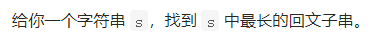
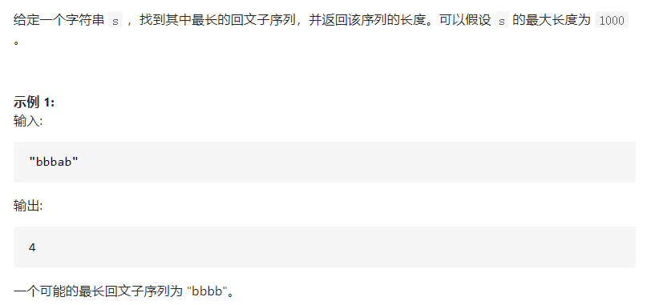
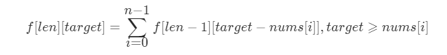
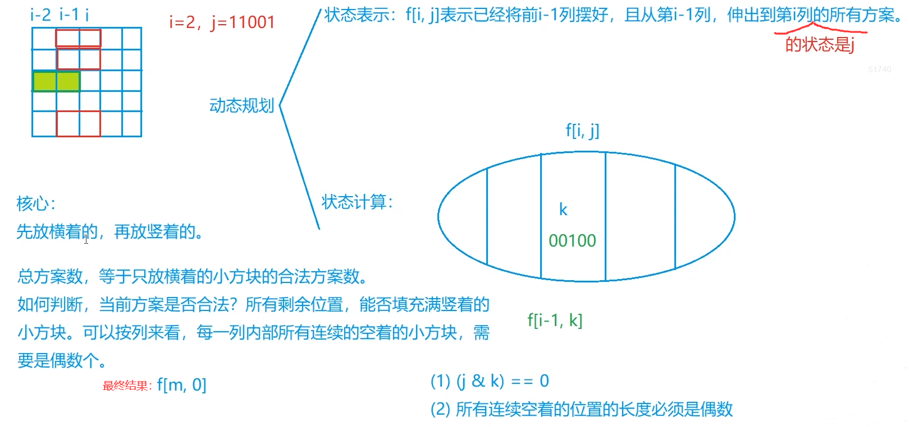

# 闫氏DP分析法——从集合角度思考DP问题

DP问题，本质上是求有限集合中的最值（集合中元素数量一般是指数级别）

一般为求集合中的最小值、最大值、数量或者存不存在

- 为什么用`dp`可以求解？

  > `dp`中的每个状态表示`f[i]`，不是单个元素，而是一个表示满足某个特定状态的**集合**，因此就不用枚举集合中的每一个元素了，而这个状态值，通常代表这个集合的**属性**，属性一般为`max、min、count、isexist`

- `dp`的步骤

  1. 状态表示（化零为整）

     - 集合
     - 属性（一般题目问的是什么，就是什么）

  2. 状态计算（化整为零）

     - 集合的划分

     - 子集通常满足两个性质
       - 不重复（不一定要满足，求数量的时候要满足，但如求极值的时候就不一定）
       - 不遗漏
     - 集合划分的依据
       - 寻找最后一个不同点
  
- `dp`数组下标从0还是从1开始的问题

  - 一般看转移方程中是否有`dp[i - 1]`，有的话为了简化边界，都会从1开始

## 1. 背包问题（选择问题）

- 选择问题的状态表示

  通常第一维为物品，后面的维度是限制，比如说体积的限制、重量的限制、可选择个数的限制等等

- ```c++
  // 下面的v都是Vi的简写，即第i个物品的体积
  // 0-1背包     f[i][j] = max(f[i - 1][j], f[i - 1][j - v] + w);
  // 完全背包     f[i][j] = max(f[i - 1][j], f[i][j - v] + w);
  // 多重背包		f[i][j] = max(f[i - 1][j - v] + w);
  ```
- 背包问题里初始化跟状态表示有关，体积<=j，==j初始化是不一样的

### 1.1 0-1背包

- **状态转移方程**

  F[i, j]只能被划分为两个子集，选择第i个物品，或者不选择。

  其中**F[i - 1,v - C<sub>i</sub>] + W<sub>i</sub>**，即选择第 i 件物品的情况下，需要判断`V[i]`是否小于当前体积，即**v - C<sub>i</sub>**不能为负。


- 空间优化

  优化掉物品一维，只留下限制，但是**限制（即当前的这个维度）的遍历要从后往前遍历**

  

- 优化后的主体代码

  ```C++
  // n为物品数，m为体积
  for(int i = 1; i <= n; i++)
      for(int j = m; j >= v[i]; j--)  
          f[j] = max(f[j], f[j - v[i]] + w[i]);
  ```

### 1.2 完全背包

- 朴素思想的状态转移方程

  

  这里是将`F[i, v]`划分成了k个子集，不是0-1背包中仅仅分成两个子集就行了，第i件物品可以选0件、1件、……k件，直到kC<sub>i</sub> > v。

  如果就按这个状态转移方程，要三层循环

- **优化后的状态方程**

  

  与**0-1背包唯一的不同**就是右边等式第二项中前面是i，不是i-1，因此空间优化的时候要从前往后遍历

  **推导过程**：

  > F[i, v] = max{F[i - 1, v], F[i - 1, v - C<sub>i</sub>] + W<sub>i</sub>, F[i - 1, v - 2C<sub>i</sub>] + 2W<sub>i</sub>, ……} (1)
>
  > F[i, v - C<sub>i</sub>] = max{		  F[i - 1, v - C<sub>i</sub>], 		 F[i - 1, v - 2C<sub>i</sub>] + Wi, 	F[i - 1, v - 3C<sub>i</sub>] + 2W<sub>i</sub>, ……} (2)

  将(2)式加上一个W<sub>i</sub>，则(1)式中等式右边除了第一项F[i - 1, v]之外，后面的式子就等于(2)式+W<sub>i</sub>，即得到优化后的状态方程

  > (2)式的体积比(1)式少了一个C<sub>i</sub>，因此最后(2)式的多项式个数刚好比(1)式少了一个，即后面的刚好对齐

- 空间再优化

  从前往后遍历

  

- 最终主体代码

  ```c++
  // n为物品数，m为体积
  // 注意下面两层循环的次序可以颠倒
  for(int i = 1; i <= n; i++)
      for(int j = v[i]; j <= m; j++)  
          f[j] = max(f[j], f[j - v[i]] + w[i]);
  ```

  

### 1.3 LC相关题目

#### 1.3.1 背包问题

##### (1) 0-1背包

###### Acwing-2. 01背包问题

- 基本

```java
import java.util.*;

class Main{
    static int n, m;
    static int[][] dp;
    static int[] w;
    static int[] v;
    public static void main(String[] args) {
        Scanner input = new Scanner (System.in);
        n = input.nextInt();
        m = input.nextInt();
        v = new int[n + 1];
        w = new int[n + 1];
        dp = new int[n + 1][m + 1];
        for (int i = 1; i <= n; i++) {
            v[i] = input.nextInt();
            w[i] = input.nextInt();
        }
        for (int i = 1; i <= n; i++) {
            for (int j = 0; j <= m; j++) {
                dp[i][j] = dp[i - 1][j];
                if (j >= v[i]) dp[i][j] = Math.max(dp[i][j], dp[i - 1][j - v[i]] + w[i]);
            }
        }
        System.out.println(dp[n][m]);
    }
}
```

- 优化

```java
import java.util.*;

class Main{
    static int n, m;
    static int[] dp;
    static int[] w;
    static int[] v;
    public static void main(String[] args) {
        Scanner input = new Scanner (System.in);
        n = input.nextInt();
        m = input.nextInt();
        v = new int[n + 1];
        w = new int[n + 1];
        dp = new int[m + 1];
        for (int i = 1; i <= n; i++) {
            v[i] = input.nextInt();
            w[i] = input.nextInt();
        }
        for (int i = 1; i <= n; i++) {
            for (int j = m; j >= v[i]; j--) {
                dp[j] = Math.max(dp[j], dp[j - v[i]] + w[i]);
            }
        }
        System.out.println(dp[m]);
    }
}
```

###### 416. 分割等和子集


- 0 - 1背包问题

- ```java
  // 完全当成0-1背包
  class Solution {
      public boolean canPartition(int[] nums) {
          int sum = 0;
          for (int num : nums) {
              sum += num;
          }
          if ((sum & 1) == 1) return false;
          sum /= 2;
          int[] dp = new int[sum + 1];
          for (int i = 1; i <= nums.length; ++ i) {
              for (int j = sum; j >= nums[i - 1]; -- j) {
                  dp[j] = Math.max(dp[j], dp[j - nums[i - 1]] + nums[i - 1]);
              }
          }
          if (dp[sum] == sum) return true;
          else return false;
      }
  }
  ```

- ```java
  class Solution {
      public boolean canPartition(int[] nums) {
          int sum = 0;
          for (int num : nums) {
              sum += num;
          }
          if ((sum & 1) == 1) return false;
          sum /= 2;
          int[] dp = new int[sum + 1];
          // dp[i] 代表方案数，即背包容量为i，装满的方案数
          // dp[0] 代表什么都不选，方案数为1
          dp[0] = 1;
          for (int i = 1; i <= nums.length; ++ i) {
              for (int j = sum; j >= nums[i - 1]; -- j) {
                  dp[j] += dp[j - nums[i - 1]];
              }
          }
          return dp[sum] != 0;
      }
  }
  ```
  
- 

###### 474. 一和零


###### 494. 目标和


##### (2) 完全背包

###### AcWing-3. 完全背包问题

- 朴素做法

```java
import java.util.*;

class Main{
    static int n, m;
    static int[][] dp;
    static int[] w;
    static int[] v;
    public static void main(String[] args) {
        Scanner input = new Scanner (System.in);
        n = input.nextInt();
        m = input.nextInt();
        v = new int[n + 1];
        w = new int[n + 1];
        dp = new int[n + 1][m + 1];
        for (int i = 1; i <= n; i++) {
            v[i] = input.nextInt();
            w[i] = input.nextInt();
        }
        for (int i = 1; i <= n; i++)
            for (int j = 0; j <= m; j++)
                for (int k = 0; k * v[i] <= j; k++) 
                    dp[i][j] = Math.max(dp[i][j], dp[i - 1][j - v[i] * k] + k * w[i]);
        System.out.println(dp[n][m]);
    }
}
```

- 优化

```java
import java.util.*;

class Main{
    static int n, m;
    static int[][] dp;
    static int[] w;
    static int[] v;
    public static void main(String[] args) {
        Scanner input = new Scanner (System.in);
        n = input.nextInt();
        m = input.nextInt();
        v = new int[n + 1];
        w = new int[n + 1];
        dp = new int[n + 1][m + 1];
        for (int i = 1; i <= n; i++) {
            v[i] = input.nextInt();
            w[i] = input.nextInt();
        }
        for (int i = 1; i <= n; i++)
            for (int j = 0; j <= m; j++){
                dp[i][j] = dp[i - 1][j];
                if (j >= v[i]) dp[i][j] = Math.max(dp[i][j], dp[i][j - v[i]] + w[i]);
            }
        System.out.println(dp[n][m]);
    }
}
```

- 最终优化

```java
import java.util.*;

class Main{
    static int n, m;
    static int[] dp;
    static int[] w;
    static int[] v;
    public static void main(String[] args) {
        Scanner input = new Scanner (System.in);
        n = input.nextInt();
        m = input.nextInt();
        v = new int[n + 1];
        w = new int[n + 1];
        dp = new int[m + 1];
        for (int i = 1; i <= n; i++) {
            v[i] = input.nextInt();
            w[i] = input.nextInt();
        }
        for (int i = 1; i <= n; i++) {
            for (int j = v[i]; j <= m; j++) {
                dp[j] = Math.max(dp[j], dp[j - v[i]] + w[i]);
            }
        }
        System.out.println(dp[m]);
    }
}
```

###### 322. 零钱兑换


###### 518. 零钱兑换 II


###### 139. 单词拆分

```java
class Solution {
    public boolean wordBreak(String s, List<String> wordDict) {
        int n = s.length();
        boolean[] dp = new boolean[n + 1];
        dp[0] = true;
        for (int i = 1; i <= n; i++) {
            for (String str : wordDict) {
                if (str.length() <= i && s.substring(i - str.length(), i).equals(str)){
                    // dp[i] |= dp[i - str.length()];
                    dp[i] = dp[i] || dp[i - str.length()];
                }
            }
        }
        return dp[n];
    }
}
```


##### (3) 多重背包 (0-1扩展)

即每个物品有数量限制`s[i]`

###### Acwing-4. 多重背包问题

- 朴素做法

  - 状态转移方程和完全背包的朴素做法差不多

    F [i, j] = max(F[i - 1, j - v[i] * k] + w[i] * k)，k从0到s[i]

  ```java
  import java.util.*;
  
  class Main{
      static int n, m;
      static int[][] dp;
      static int[] w;
      static int[] v;
      static int[] s;
      public static void main(String[] args) {
          Scanner input = new Scanner (System.in);
          n = input.nextInt();
          m = input.nextInt();
          v = new int[n + 1];
          w = new int[n + 1];
          s = new int[n + 1];
          dp = new int[n + 1][m + 1];
          for (int i = 1; i <= n; i++) {
              v[i] = input.nextInt();
              w[i] = input.nextInt();
              s[i] = input.nextInt();
          }
          for (int i = 1; i <= n; i++)
              for (int j = 0; j <= m; j++)
                  for (int k = 0; k * v[i] <= j && k <= s[i]; k++) 
                      dp[i][j] = Math.max(dp[i][j], dp[i - 1][j - v[i] * k] + k * w[i]);
          System.out.println(dp[n][m]);
      }
  }
  ```

- 无法用完全背包的思路优化——类比完全背包的(1)(2)式，(2)式最后多了一项`f[i-1,j-(s+1)v]+sw`

  

- 二进制的优化方式

  将枚举每个s的做法优化成枚举logS

  将s[i]以二进制拆分成不同的个数，即1,2,4,8……，这些个数的物品等价于组成了一个新的物品，并且这些新物品的价值从进制角度来讲可以覆盖掉原本所有的s[i]。时间复杂度从O(nms)优化到O(nm`logs`)

  将多重背包问题就优化成了一个新的等价的0-1背包问题

  每个物品按二进制拆分成多个物品

  ```java
  import java.util.*;
  
  
  class Main{
      static int n, m;
      static int[][] dp;
      static int[] w;
      static int[] v;
      static int[] s;
      // 如何确定len的长度
      // N * logS
      static final int len = 11010;
      public static void main(String[] args) {
          Scanner input = new Scanner (System.in);
          n = input.nextInt();
          m = input.nextInt();
          // 因为s的个数，即物品限定的个数可能很大，比如说设了个2000，那么二进制划分后是可能比物品个数要大的，因此要设大一点
          // 2000划分成二进制的话，到512为止，能组成的和为1023，剩下977，即1,2,4,8,16,32,64,128,256,512,977,共11个
          // N * logs得到len的长度，1000个物品，每个物品可以拆分成11个二进制表示下不同价值的物品，因此新物品的总数就可以算出来
          v = new int[len];
          w = new int[len];
          dp = new int[len][m + 1];
  
          // cnt的值最后可能是很大的，最大可以达到N*logS
          int cnt = 0;
  
          for (int i = 1; i <= n; i++) {
              int a,b,s;
              // a 为单位体积
              // b 为单位价值
              a = input.nextInt();
              b = input.nextInt();
              s = input.nextInt();
              int k = 1;
              // 注意下面的s是会变的！代表的是按二进制划分后剩下的数量，之前一直以为s是不变的，写成了while(k * 2 <= s)
              while (k <= s) {    //若s=2000，k为1,2,4……,512，while共循环10次，错错错，s是会变小的！当k为1024时，1024 <= 977不成立
                  cnt++;
                  v[cnt] = a * k;
                  w[cnt] = b * k;
                  s -= k;
                  k *= 2;
              }
              if (s > 0) {        // 若s=2000，再存一个剩下的977
                  cnt++;
                  v[cnt] = a * s;
                  w[cnt] = b * s;
              }
          }
          // n更新为新的物品的个数
          n = cnt;
  
          for (int i = 1; i <= n; i++) {
              for (int j = 0; j <= m; j++) {
                  dp[i][j] = dp[i - 1][j];
                  if (j >= v[i]) dp[i][j] = Math.max(dp[i][j], dp[i - 1][j - v[i]] + w[i]);
              }
          }
          System.out.println(dp[n][m]);
      }
  }
  ```

- 空间优化

  ```java
  import java.util.*;
  
  
  class Main{
      static int n, m;
      static int[] dp;
      static int[] w;
      static int[] v;
      static int[] s;
      // 如何确定len的长度
      // N * logS
      static final int len = 11010;
      public static void main(String[] args) {
          Scanner input = new Scanner (System.in);
          n = input.nextInt();
          m = input.nextInt();
          // 因为s的个数，即物品限定的个数可能很大，比如说设了个2000，那么二进制划分后是可能比物品个数要大的，因此要设大一点
          // 2000划分成二进制的话，到512为止，能组成的和为1023，剩下977，即1,2,4,8,16,32,64,128,256,512,977,共11个
          // N * logs得到len的长度，1000个物品，每个物品可以拆分成11个二进制表示下不同价值的物品，因此新物品的总数就可以算出来
          v = new int[len];
          w = new int[len];
          dp = new int[m + 1];
  
          // cnt的值最后可能是很大的，最大可以达到N*logS
          int cnt = 0;
  
          for (int i = 1; i <= n; i++) {
              int a,b,s;
              // a 为单位体积
              // b 为单位价值
              a = input.nextInt();
              b = input.nextInt();
              s = input.nextInt();
              int k = 1;
              // 注意下面的s是会变的！代表的是按二进制划分后剩下的数量，之前一直以为s是不变的，写成了while(k * 2 <= s)
              while (k <= s) {    //若s=2000，k为1,2,4……,512，while共循环10次，错错错，s是会变小的！当k为1024时，1024 <= 977不成立
                  cnt++;
                  v[cnt] = a * k;
                  w[cnt] = b * k;
                  s -= k;
                  k *= 2;
              }
              if (s > 0) {        // 若s=2000，再存一个剩下的977
                  cnt++;
                  v[cnt] = a * s;
                  w[cnt] = b * s;
              }
          }
          // n更新为新的物品的个数
          n = cnt;
  
          for (int i = 1; i <= n; i++) {
              for (int j = m; j >= v[i]; j--) {
                  dp[j] = Math.max(dp[j], dp[j - v[i]] + w[i]);
              }
          }
          System.out.println(dp[m]);
      }
  }
  ```


##### (4) 分组背包问题 (0-1扩展)

###### Acwing-9. 分组背包问题

- 物品分组，每个组里面要么不选该组的物品，要么只能选组中的一个物品

- 状态表示有一点不同，之前的`f[i, j]`代表从前i个物品中选，且总体积不大于j的所有选法。而这里的`f[i, j]`代表从前i**组**中选

- 状态转移方程

  

  

  

  ```java
  import java.util.*;
  
  class Main{
      static int n, m;
      static int[] dp;
      static int[][] w;
      static int[][] v;
      static int[] s;
      public static void main(String[] args) {
          Scanner input = new Scanner (System.in);
          n = input.nextInt();
          m = input.nextInt();
          v = new int[n + 1][];
          w = new int[n + 1][];
          dp = new int[m + 1];
          s = new int[n + 1];
          for (int i = 1; i <= n; i++) {
              s[i] = input.nextInt();
              v[i] = new int[s[i] + 1];
              w[i] = new int[s[i] + 1];
              for (int j = 1; j <= s[i]; j++) {
                  v[i][j] = input.nextInt();
                  w[i][j] = input.nextInt();
              }
          }
          for (int i = 1; i <= n; i++) {
              for (int j =m; j >= 0; j--) {
                  for (int k = 1; k <= s[i]; k++){
                      if (v[i][k] <= j)
                          dp[j] = Math.max(dp[j], dp[j - v[i][k]] + w[i][k]);   
                  }
              }
          }
          System.out.println(dp[m]);
      }
  }
  ```

  

## 2. 区间DP

### LC相关题目

- 由小区间的值，推出大区间的值，一般从区间长度开始枚举，即第一层循环是`for(int len = 2;...)`

###### 5. 最长回文子串



- 状态表示：`dp[i][j]`，其中`i、j`就是字符串中的下标，取值 `0 - n - 1`，代表`s[i..j]`是否是回文子串

- 状态计算：之前发现的一个很精妙的转移方程

  - `dp[i][j] = (cs[i] == cs[j]) && dp[i + 1][j - 1];`
  - 由于转移方程的方向问题，由左下角状态转移而来，因此`i`要从大到小遍历，或者说按照区间dp的方式，先遍历len
  - 注意：`dp[i + 1][j - 1]`可能会导致 `i + 1 > j - 1`的情况，因此有两种解决方案，一是特判 `i + 1 == j`的情况，二是将`dp`数组全部初始化为`true`

- ```java
  public class Solution {
      public String longestPalindrome(String s) {
          char[] cs = s.toCharArray();
          int n = cs.length;
          boolean[][] dp = new boolean[n + 1][n + 1];
          for (boolean[] arr : dp) Arrays.fill(arr, true);
          int start = 0;
          int len = 1;
          for (int i = n - 1; i >= 0; i--) {
              for (int j = i + 1; j < n; j++) {
                  // 这里可以选择不把dp全部初始化为true，而是在下面多判断一项
                  // dp[i][j] = cs[i] == cs[j] && (dp[i + 1][j - 1] || i + 1 > j - 1)
                  // 同时遍历的i、j取值也要重新考虑，可以看131. 分割回文串中的dp
                  dp[i][j] = (cs[i] == cs[j]) && dp[i + 1][j - 1];
                  if (dp[i][j] && len < j - i + 1) {
                      start = i;
                      len = j - i + 1;
                  }
              }
          }  
          return s.substring(start, start + len);
      }
  }
  public class Solution {
      public String longestPalindrome(String s) {
          char[] cs = s.toCharArray();
          int n = cs.length;
          boolean[][] dp = new boolean[n + 1][n + 1];
          for (boolean[] arr : dp) Arrays.fill(arr, true);
          int start = 0;
          int maxLen = 1;
          for (int len = 2; len <= n; ++ len) {
              for (int i = 1; i  + len - 1 <= n; ++ i) {
                  int j = i + len - 1;
                  dp[i][j] = cs[i - 1] == cs[j - 1] && dp[i + 1][j - 1];
                  if (dp[i][j]) {
                      start = i - 1;
                      maxLen = len;
                  }
              }
          }
          return s.substring(start, start + maxLen);
      }
  }
  ```
  
- 用dp做这题很慢，中心扩展法或者马拉车算法更高效（其中马拉车算法比较复杂，暂没看）

- 采用中心扩展法

- ```java
  // 这种中心扩展法比较容易想，并且比较容易写
  // 即遍历每个字符时，先找到一段区间内都是该字符的情况，在都是同一字符的该区间基础上再左右扩展
  // 这种写法就包括了下一种写法中回文串是偶数的情况（即中心点在两个数之间，是偶数的话，最中心肯定是两个以上相同的数）
  public class Solution {
      public String longestPalindrome(String s) {
          char[] cs = s.toCharArray();
          int n = cs.length, len = 1, start = 0;
          for (int i = 0; i < n; ++ i) {
              // 这一句是自己想出来的优化，这个优化很关键！
              if (i > 0 && cs[i] == cs[i - 1]) continue;
              int l = i - 1, r = i + 1;
              while (l >= 0 && cs[l] == cs[i]) l--;
              while (r < n && cs[r] == cs[i]) r++;
              while (l >= 0 && r < n && cs[l] == cs[r]) {
                  l--;
                  r++;
              }
              if (r - l - 1 > len) {
                  len = r - l - 1;
                  start = l + 1;
              }
          }
          return s.substring(start, start + len);
      }
  }
  ```

- ```java
  // 另一种中心扩展的方法，是官解和大多数解法的写法，比较麻烦
  // 分别考虑回文子串为奇数和偶数的情况，即中心是在字符上，还是字符之间
  public class Solution {
      public String longestPalindrome(String s) {
          int n = s.length(), start = 0, maxLen = 1;
          for (int i = 0; i < n; ++ i) {
              int len1 = expandAroundCenter(s, i, i);
              int len2 = expandAroundCenter(s, i, i + 1);
              int len = Math.max(len1, len2);
              if (len > maxLen) {
                  maxLen = len;
                  // 这里(len - 1) / 2中 - 1 是为了偶数情况下，i是中心（字符之间）的左边字符，因此减去的一半长应该少1
                  start = i - (len - 1) / 2;
              }
          }
          return s.substring(start, start + maxLen);
      }
  
      public int expandAroundCenter(String s, int left, int right) {
          while (left >= 0 && right < s.length() && s.charAt(left) == s.charAt(right)) {
              left--;
              right++;
          }
          return right - left - 1;
      }
  }
  ```


###### 516. 最长回文子序列



- 状态表示：正常的区间表示`dp[i][j]`表示`s[i..j]`中最长的回文子序列

- 状态计算：根据左右两端的元素是否相等来划分子集，容易得出转移方程

- 如果for循环里采用区间dp的方式，即先遍历长度再遍历左端点坐标，那就是通用的区间dp循环方式

- 初始化，`[i..j]`区间只有1个字符时，最长子序列长度即为1

- ```java
  // 和其他区间DP问题一样，先遍历区间长度len
  class Solution {
      public int longestPalindromeSubseq(String s) {
          char[] cs = s.toCharArray();
          int n = cs.length;
          int[][] dp = new int[n + 1][n + 1];
  
          // 初始化
          for (int i = 0; i < n; i++) dp[i][i] = 1;
          
          for (int len = 2; len <= n; ++ len) {
              for (int i = 0; i + len - 1 < n; ++ i) {
                  int j = i + len - 1;
                  if (cs[i] == cs[j]) dp[i][j] = dp[i + 1][j - 1] + 2;
                  else dp[i][j] = Math.max(dp[i + 1][j], dp[i][j - 1]);
              }
          }
          return dp[0][n - 1];
      }
  }
  ```
  
- 如果不按区间dp的思路来遍历，因为状态转移依靠的是如下图所示的位置，因此可以对i从下往上遍历也可以

- 

- ```java
  class Solution {
      public int longestPalindromeSubseq(String s) {
          char[] cs = s.toCharArray();
          int n = cs.length;
          int[][] dp = new int[n + 1][n + 1];
  
          for (int i = n - 1; i >= 0; -- i) {
              dp[i][i] = 1;
              for (int j = i + 1; j < n; ++ j) {
                  if (cs[i] == cs[j]) {
                      dp[i][j] = dp[i + 1][j - 1] + 2;
                  } else {
                      dp[i][j] = Math.max(dp[i + 1][j], dp[i][j - 1]);
                  }
              }
          }
          return dp[0][n - 1];
      }
  }
  ```


###### 647. 回文子串


- 按照区间DP 5. 最长回文子串和 516. 最长回文子序列中对回文串判断的DP方法

- 经典回文转移方程`dp[i][j] = cs[i] == cs[j] && dp[i + 1][j - 1]`

- ```java
  // 该方法在lc中实测效率并不高
  class Solution {
      public int countSubstrings(String s) {
          char[] cs = s.toCharArray();
          int n = cs.length, ans = n;
  
          boolean[][] dp = new boolean[n + 1][n + 1];
          for (boolean[] arr : dp) Arrays.fill(arr, true);
  
          for (int len = 2; len <= n; ++ len) {
              for (int i = 1; i + len - 1 <= n; ++ i) {
                  int j = i + len - 1;
                  dp[i][j] = cs[i - 1] == cs[j - 1] && dp[i + 1][j - 1];
                  if (dp[i][j]) ans ++;
              }
          }
  
          return ans;
      }
  }
  ```

- 中心扩展法

- ```java
  // 第一种自己比较喜欢的中心扩展
  class Solution {
      public int countSubstrings(String s) {
          char[] cs = s.toCharArray();
          int n = cs.length, ans = 0;
          for (int i = 0; i < n; ++ i) {
              // 每次遍历一个字符时就先加1，即单字符作为回文子串
              ans++;
              int l = i - 1, r = i + 1;
              // 每个字符，只计算当前字符以及之后的字符可能组成的偶数回文串个数，因此左边不再累加
              while (l >= 0 && cs[l] == cs[i]) {
                  if (cs[i] == cs[i - 1]) break;
                  l--;
                  ans++;
              }
              // 以"aaaa"为例，i == 1时，"a,aa,aaa,aaaa"都计算到,i == 2时，"a,aa,aaa"，i == 3时，"a,aa"
              // i == 4时，"a"
              // 每个字符，只计算当前字符以及之后的字符可能组成的偶数回文串个数，因此右边继续累加
              while (r < n && cs[r] == cs[i]) {
                  r++;
                  ans++;
              }
              while (l >= 0 && r < n && cs[l] == cs[r]) {
                  l--;
                  r++;
                  ans++;
              }
          }
          return ans;    
      }
  }
  ```

- ```java
  // 另一种中心扩展法
  class Solution {
      public int countSubstrings(String s) {
          char[] cs = s.toCharArray();
          int n = cs.length, len = 1, start = 0, ans = 0;
          for (int i = 0; i < n; ++ i) {
              ans += expandAroundCenter(s, i, i);
              ans += expandAroundCenter(s, i, i + 1);
          }
          return ans;
      }
  
      public int expandAroundCenter(String s, int left, int right) {
          int res = 0;
          while (left >= 0 && right < s.length() && s.charAt(left) == s.charAt(right)) {
              res++;
              left--;
              right++;
          }
          return res;
      }
  }
  ```


###### 131. 分割回文串


- 同样的回文dp套路
- 加上简单的回溯思路

```java
class Solution {
    List<List<String>> ans;
    boolean[][] dp;

    public List<List<String>> partition(String s) {
        int n = s.length();
        char[] cs = s.toCharArray();
        dp = new boolean[n + 1][n + 1];
        ans = new ArrayList<>();

        // 这边没有把dp数组全部初始化为true，优化了一下转移方程
        for (int len = 1; len <= n; ++ len) {
            for (int i = 1; i + len - 1 <= n; ++ i) {
                int j = i + len - 1;
                dp[i][j] = cs[i - 1] == cs[j - 1] && (i + 1 > j - 1 || dp[i + 1][j - 1]);
            }
        }
        backTrace(cs, new ArrayList<String>(), 1);
        return ans;
    }

    public void backTrace(char[] cs, ArrayList<String> path, int start){
        if (start > cs.length) {
            ans.add(new ArrayList<String>(path));
            return;
        }
        for (int i = start; i <= cs.length; ++ i) {
            if (dp[start][i]) {
                path.add(new String(cs, start - 1, i + 1 - start));
                backTrace(cs, path, i + 1);
                path.remove(path.size() - 1);
            }
        }
    }
}
```


###### 132. 分割回文串II(第二次dp类似LIS变种)


- 在得到回文dp判断数组的基础上，再次使用dp

- 新设dp数组`ans[i]`，代表`s[1..i]`的最少分割次数

- 状态计算：

  - 考虑最后一个不同点，`s[i]`添加进去之后，可能与之前的任意位置`j`之间`[j..i]`形成新的回文子串，即有可能能划分成成 `i - 1`个子集
  - `ans[i] = Math.min(ans[i], ans[j] + 1), if dp[j + 1][i] == true, j∈[1, i - 1]`

- 初始化

  - 如果`dp[1][i] == true`，则`ans[i]`很明显直接为1即可
  - 并且，因为是求最小值，所以一开始将`ans`数组全部初始化为最大值，也可以初始化为`n`，因为最少分割次数最大就是`n - 1`

- ```java
  class Solution {
      public int minCut(String s) {
          char[] cs = s.toCharArray();
          int n = cs.length;
          int[] ans = new int[n + 1];
          boolean[][] dp = new boolean[n + 1][n + 1];
  
          for (int len = 1; len <= n; ++ len) {
              for (int i = 1; i +len - 1 <= n; ++ i) {
                  int j = i + len - 1;
                  dp[i][j] = cs[i - 1] == cs[j - 1] && (i + 1 > j - 1 || dp[i + 1][j - 1]);
              }
          }
  
          Arrays.fill(ans, n);
          // 注意[1..i]是回文串不代表中间所有的[1..j] j < i 都是回文串
          for (int i = 1; i <= n; ++ i) {
              if (dp[1][i]) {
                  ans[i] = 0;
              } else {
                  for (int j = 1; j < i; ++ j) {
                      if (dp[j + 1][i]) {
                          ans[i] = Math.min(ans[i], ans[j] + 1);
                      }
                  }
              }
          }
  
          return ans[n];
      }
  }
  ```

- 用中心扩展法思路解决该题，求最少分割次数，也就是让每个中心扩展出的回文子串最长

- 自己之前几题喜欢用的那种中心扩展法这里会WA

- ```java
  // WA代码
  class Solution {
      public int minCut(String s) {
          char[] cs = s.toCharArray();
          int n = cs.length;
          int[] dp = new int[n];
  
          Arrays.fill(dp, n);
          dp[0] = 0;
          // 中心扩展法
          for (int i = 0; i < n; ++ i) {
              if (i > 0 && cs[i] == cs[i - 1]) continue; 
              int l = i - 1, r = i + 1;
              while (l >= 0 && cs[l] == cs[i]) {
                  // if (cs[i] == cs[i - 1]) break;
                  l--;
              }
              while (r < n && cs[r] == cs[i]) {
                  r++;
              }
              while (l >= 0 && r < n && cs[l] == cs[r]) {
                  l--;
                  r++;
              }
              if (l == -1) dp[r - 1] = 0;
              else {
                  dp[r - 1] = Math.min(dp[r - 1], dp[l] + 1);
              }
          }
          return dp[n - 1];
      }
  }
  ```

- 只能用官解用的那种中心扩展法

- 如果以当前字符为中心的最大回文串左侧为`left`，右侧为`right`，那`cs[left..right]`长度是不需要切割的，只需要在`cs[left - 1]`处切一刀即可，即`dp[left - 1] + 1`。并且注意当`left == 0`时，`dp[right]`直接等于0，即不需要分割

- ```java
  class Solution {
      int[] dp;
      public int minCut(String s) {
          char[] cs = s.toCharArray();
          int n = cs.length;
          dp = new int[n];
  
          Arrays.fill(dp, n);
          // 中心扩展法
          for (int i = 0; i < n; ++ i) {
              expandAroundCenter(cs, i, i);
              expandAroundCenter(cs, i, i + 1);
          }
          return dp[n - 1];
      }
  
      public void expandAroundCenter(char[] cs, int left, int right) {
          while (left >= 0 && right < cs.length && cs[left] == cs[right]) {
              dp[right] = Math.min(dp[right], left == 0 ? 0 : dp[left - 1] + 1);
              left--;
              right++;
          }
      }
  }
  ```


###### 87. 扰乱字符串(状态表示很特别)


- 不同于一般的双序列线性DP，状态表示有3维（一开始以为是线性DP了=-=）

- 状态表示

  - `dp[i][j][k][h] `表示 `T[k..h]、T[k..h] `是否由 `S[i..j]、S[i..j] `变来。由于变换必须长度是一样的，因此这边有个关系` j - i = h - k `，可以把四维数组降成三维。
  - `dp[i][j][len]dp[i][j][len]` 表示从字符串 S 中` i `开始长度为` len` 的字符串是否能变换为字符串 T中 `j`开始长度为 `len`l的字符串

- 初始化

  对于长度是 1 的子串，只有相等才能变过去，相等为 true，不相等为 false。

- 状态计算

  - 对于`dp[i][j][len]`，枚举`len`中每个可能的分割点`k`，即将len长度分为`k`和`len - k`两部分
  - 保持顺序：`dp[i][j][k] && dp[i + k][j + k][len - k]`
  - 交换顺序：`dp[i][j + len - k][k] && dp[i + k][j][len - k]`
    - 这一条可以这么想，第一个序列从i开始，长度为`k`，先写好`dp[i][][k]`，第二个序列从j开始，长度为`len - k`，先写好`dp[][j][len - k]`，再根据对应的长度填好空格，一个是`(j)(起始坐标) + (len - k)(长度)`，另一个是`i(起始坐标) + k(长度)`
  - 两种方案任意一种成立`dp[i][j][len]`就为`true`

- ```java
  class Solution {
      public boolean isScramble(String s1, String s2) {
          if (s1.equals(s2)) return true;
          char[] cs1 = s1.toCharArray(), cs2 = s2.toCharArray();
          int n = s1.length(), m = s2.length();
          if (n != m) {
              return false;
          }
  
          boolean[][][] dp = new boolean[n][n][n + 1];
          // 初始化单个字符的情况
          for (int i = 0; i < n; i++) {
              for (int j = 0; j < n; j++) {
                  dp[i][j][1] = cs1[i] == cs2[j];
              }
          }
  
          // 枚举区间长度 2～n
          for (int len = 2; len <= n; len++) {
              // 枚举 S 中的起点位置
              for (int i = 0; i <= n - len; i++) {
                  // 枚举 T 中的起点位置
                  for (int j = 0; j <= n - len; j++) {
                      // 枚举划分位置
                      for (int k = 1; k < len; k++) {
                          // 第一种情况：S和T中两个子字符串位置不变
                          boolean a = dp[i][j][k] && dp[i + k][j + k][len - k];
                          // 第二种情况，S和T中两个子字符串交换位置
                          boolean b = dp[i][j + len - k][k] && dp[i + k][j][len - k];
                          if (a || b) dp[i][j][len] = true;
                      }
                  }
              }
          }
          return dp[0][0][n];
      }
  }
  ```

- ```java
  // 记忆化dfs的例子，因为中间可以判断词频提前退出，更快
  class Solution {
      // 1代表可以变化，-1代表不能变化，0代表未知
      int[][][] memo;
      String s1, s2;
      public boolean isScramble(String s1, String s2) {
          if (s1.equals(s2)) return true;
          char[] cs1 = s1.toCharArray(), cs2 = s2.toCharArray();
          int n = s1.length(), m = s2.length();
          if (n != m) {
              return false;
          }
          this.s1 = s1;
          this.s2 = s2;
          this.memo = new int[n][n][n + 1];
          return dfs(0, 0, n);
      }
  
      public boolean dfs(int i, int j, int len) {
          if (memo[i][j][len] != 0) return memo[i][j][len] == 1;
          String a = s1.substring(i, i + len), b = s2.substring(j, j + len);
          if (a.equals(b)) {
              memo[i][j][len] = 1;
              return true;
          }
  
          // 这一步优化很关键，如果当前的两个字符串词频不同则直接返回false
          if (!check(a, b)) {
              memo[i][j][len] = -1;
              return false;
          }
  
          for (int k = 1; k < len; k++) {
              boolean case1 = dfs(i, j, k) && dfs(i + k, j + k, len - k);
              boolean case2 = dfs(i, j + len - k, k) && dfs(i + k, j, len - k);
              if (case1 || case2) {
                  memo[i][j][len] = 1;
                  return true;
              }
          }
          memo[i][j][len] = -1;
          return false;
      }
  
      // 这个check函数比用HashMap快
      public boolean check(String s1, String s2) {
          int len = s1.length();
          int[] cnt = new int[26];
          char[] cs1 = s1.toCharArray(), cs2 = s2.toCharArray();
          for (int i = 0; i < len; i++) {
              cnt[cs1[i] - 'a']++;
              cnt[cs2[i] - 'a']--;
          }
          for (int i = 0; i < 26; i++) {
              if (cnt[i] != 0) return false;
          }
          return true;
      }
  }
  ```


###### 312. 戳气球


- 很明显的区间dp问题，但是还是有一些比较关键的细节

- 状态表示：

  - 一般情况下`dp[i][j]`表示`nums[i..j]`得到的所求解，是闭区间，包含 i 下标和 j 下标
  - 本题中`dp[i][j]`表示`nums[i..j]`不包括`i、j`下标所能获得的最大值，即**开区间**
    - 一般将区间分为两半的问题都是闭区间，可以用`[i..k]、[k + 1..j]`来划分
    - 而本题要将区间分成三个部分，其中`k`下标选择的那一部分还是单独一个数，不是一个区间
    - 另有首尾气球的取值问题，为了方便处理边界条件，容易想到在首尾外面分别添加一个1的操作
    - 若取开区间，`dp[0, n + 1]`刚好代表 `1..n`所有原本的n个数能取得的最大价值
    - 设最后一个戳破的气球下标为`k`，

- 状态计算：

  - 枚举每个区间可能的分段点`k`，设首尾添加`1`后的新数组为`vals`

  - 按照寻找最后一次不同点为划分集合的依据，根据最后一个戳爆的气球`k`来划分`[i.j]`

  - 一个易混点，为什么是开区间，还要计算`vals[i] * vals[k] * vals[j]`，即虽然`(i..j)`是开区间，但是为了使得价值最大（金币最多），我们更新这个最大值时，是考虑了`vals[i]`和`vals[j]`的，可以这样想，我们是固定了最后留下来的三个气球中的左右两个，即一个是`vals[i]`，一个是`vals[j]`，那最后一个戳爆的气球就是中间选择的`vals[k]`，而添加了首尾的1之后，最后一次肯定是固定的左右是1，剩下最后一个真正的气球。

  - `dp[i][j]`代表固定`i、j`，在开区间`(i,j)`里找最后一个戳爆的气球的位置，就可以想象成固定`i、j`之后，再固定一个最后戳爆的`k`，等于分别固定了`i、k`和`k、j`，而`(i,k)、(k,j)`两个开区间之间的气球都已经被戳爆了

  - 有没有重复计算的问题？

    > 没有，`dp[i][k]`中虽然计算了一遍`vals[i]`和`vals[k]`，但是那是在戳爆最后一个`(i,k)`区间内的气球时计算的，本来就应该计算一次，`dp[k][j]`同理，而本轮中戳爆的是第`k`个，`vals[i]`、`vals[k]`、`vals[j]`本来就应该再计算一次

  - `dp[i][j] = Math.max(vals[i] * vals[k] * vals[j] + dp[i][k] + dp[k][j]),k ∈[i + 1, j - 1]`

- ```java
  class Solution {
      public int maxCoins(int[] nums) {
          int n = nums.length;
          int[] vals = new int[n + 2];
          vals[0] = 1;
          vals[n + 1] = 1;
          for (int i = 1; i <= n; i++) vals[i] = nums[i - 1];
          int[][] dp = new int[n + 2][n + 2];
          // 初始化
          // 当 i >= j - 1时，dp[i][j] = 0，不用初始化了
  
          // 下面各层for循环里的取值思考了很久
          // len的长度最大就是 n + 2 个数
          for (int len = 3; len <= n + 2; len++) {
              // i是左端点，i的最大值怎么确定？i + len - 1应该是j的位置，而j < n + 2的
              // 因此洗下面写成 i + len - 1 < n + 2也行
              for (int i = 0; i + len <= n + 2; i++) {
                  int j = i + len - 1;
                  // 枚举最后一次戳爆的气球的位置，不考虑左右两侧，k取自[i + 1, j - 1]
                  // 首尾加1的技巧使得结果包含了戳爆原本数组左右两侧气球的情况
                  for (int k = i + 1; k < j; k++) {
                      int tmp = vals[i] * vals[k] * vals[j] + dp[i][k] + dp[k][j];
                      dp[i][j] = Math.max(dp[i][j], tmp);
                  }
              }
          }
  
          return dp[0][n + 1];
      }
  }
  ```

- 另一种感觉上更容易想到的状态表示与计算

  - `dp[i][j]`表示闭区间`[i,j]`范围内气球戳破的最大硬币数量 

  - 那答案就是`dp[1][n]`

  - 状态计算：`dp[i][j] = Math.max(dp[i][j], dp[i][k - 1] + dp[k + 1][j] + nums[i - 1] * nums[k] * nums[j + 1]),k∈[i,j]`

  - k同样也是作为最后一个戳破的气球，戳破k时，获得的硬币数为`nums[i - 1] * nums[k] * nums[j + 1]`

  - 初始化和刚才的就不一样了，`i == j`时（即一个气球），为`nums[i - 1] * nums[i] * nums[i + 1]`

  - 同样也要在首尾插入1，方便初始化原本的首尾

  - ```java
    for(int i = 1;i <= n; i++) f[i][i] = nums[i - 1] * nums[i] * nums[i + 1];//长度为1时
    
    for(int len = 2; len <= n; len++) {
          for(int i = 1; i + len - 1 <= n; i++) {
               int j = i + len - 1;
               for(int k = i; k <= j; k++) {
                   f[i][j] = max(f[i][j], f[i][k-1] + f[k+1][j] + nums[i-1] * nums[k] * nums[j+1]);
               }
          }
    }
    return f[1][n];
    ```

> 一个没来得及看的题解，有机会补看一下
>
> https://leetcode-cn.com/problems/burst-balloons/solution/chao-xiang-xi-hui-su-dao-fen-zhi-dao-dp-by-niu-you/

###### 486. 预测赢家


###### 546. 移除盒子


###### 664. 奇怪的打印机


###### Acwing-282. 石子合并

>  将N堆石子合并成为一堆。
>
> 每次只能合并相邻的两堆，合并的代价为这两堆石子的质量之和，合并后与这两堆石子相邻的石子将和新堆相邻，合并时由于选择的顺序不同，合并的总代价也不相同。
>
> 问题是：找出一种合理的方法，使总的代价最小，输出最小代价。


1. 状态表示

   - f[i, j] 表示将[i, j]合并成一堆的方案的集合
   - 属性为min

2. 状态计算

   - 设s[i]数组为**前缀和**数组，方便计算合并的代价
- f[i, j] = min(f[i, k] + f[k + 1, j] + s[j] - s[i])，其中k属于[i, j-1]

- `f[i, j]`表示一段区间的dp，一般都是先遍历长度，然后遍历左端点，根据长度得到右端点

- 代码实现

  ```java
  import java.util.*;
  
  public class Main {
      static int n;
      static int[] s;
      static int[][] f;
      
      public static void main(String[] args){
          Scanner input = new Scanner(System.in);
          n = input.nextInt();
          s = new int[n + 1];
          f = new int [n + 1][n + 1];
          for (int i = 1; i <= n; i++) {
              s[i] = input.nextInt();
              s[i] += s[i - 1];
          }
          // f[i, j]表示一段区间这样的dp，一般都是先遍历长度，然后遍历左端点，根据长度得到右端点
          // len从2开始遍历，当数组长度为1时，不需要合并石子，即代价为0，初始化默认就是0，不用单独处理
          for (int len = 2; len <= n; len++) {
              for (int i = 1; i + len - 1 <= n; i++) {
                  int j = i + len - 1;
                  // 这里要接初始化
                  f[i][j] = 100000000;
                  for (int k = i; k < j; k++) {
                      // 前缀和求[i-j]的和是s[j]-s[i-1]，别忘了-1
                      f[i][j] = Math.min(f[i][j], f[i][k] + f[k + 1][j] + s[j] - s[i - 1]);
                  }
              }
          }
          System.out.println(f[1][n]);
      }
  }
  ```


###### 1000. 合并石头的最低成本（每次可以合并相邻的k堆）

> 参考题解
>
> https://leetcode-cn.com/problems/minimum-cost-to-merge-stones/solution/yi-dong-you-yi-dao-nan-yi-bu-bu-shuo-ming-si-lu-he/

- 和只能每次合并相邻两堆石子相比又多了一个状态，因此可以考虑在状态转移方程中多加一维！（自己写的时候没有想到，2维没做出来）

- 状态表示：`dp[i][j][k]`表示`stones[i..j]`合并成`k`堆的最低成本

- 当划分子集时卡住了，写了很久还是错的，对于如何分成可以合并成1堆的K堆石子还是迷迷糊糊。

- 一个很**关键的点**是：对于如何判断不能合并成1堆的情况，也没有推导出公式，也就没能推导出划分子集的step长度

- 通过n和k的值来判断能否合成1堆，假定能合成，那么可以每次假定至少存在1堆是由多个石子构成的，那么可以将原本的k堆石子再切割，将假定的那个由多个石子构成的1堆拆分成k堆，那么堆数从原本的`k`变成`k + k - 1（k - 1代表除分割的那堆之外剩余的，k代表被拆分的那堆变成了k堆）`，如果再有某一堆也是由多个石子构成的，重复过程，变成`k + (k - 1) * 2`，即又将一堆变成了k堆，那么个数加`k-1`，得到方程：`k + (k - 1) * a == n`。

  有：`k - 1 + (k - 1) * a == n - 1` ⇒ `(k - 1) * (a + 1) == n - 1`。

  所以对于有解的情况，一定有`(n - 1) % (k - 1) == 0`。

- 划分的方式必须是左右两部分有一部分是合并成`1`堆，另一部分合并成`k-1`堆，原因具体可见题解

- 在划分子集这一步，step可以是`k - 1`而不用1步一步慢慢循环。

  > 因为我们设计的划分是将左部分区间[i, p]合并为1堆，那就一定有`(p - i) % (k - 1) == 0`，结合最初p = i，就可以知道step应该是k-1，这样会涵盖所有**有效**的分界点p。

  ```java
  class Solution {
      // 不用Integer.MAX_VALUE,因为Integer.MAX_VALUE + 正数 会溢出变为负数
      private int MAX_VALUE = 1_000_000_000; 
      public int mergeStones(int[] stones, int k) {
          int n = stones.length;
          //  推导出来的判断公式
          if ((n - 1) % (k - 1) != 0) return -1;
          int[][][] dp = new int[n + 1][n + 1][k + 1];
  
          // 前缀和
          int[] s = new int[n + 1];
          for (int i = 1; i <= n; ++i) s[i] = s[i - 1] + stones[i - 1];
  
          // 初始化
          for (int i = 1; i <= n; ++i) {
              // j肯定要大于i，不然[i,j]无法正常表示一个区间
              for (int j = i; j <= n; ++j) {
                  for (int m = 1; m <= k; ++m) dp[i][j][m] = MAX_VALUE;
              }
              // 单个石子合并成1堆，等于不需要动，成本为0
              dp[i][i][1] = 0;
          }
  
          // 前两层循环和普通的合并石子一样
          for (int len = 2; len <= n; ++len) { // 枚举区间长度
              for (int i = 1; i + len - 1 <= n; ++i) { // 枚举区间起点
                  int j = i + len - 1;
                  // 从2枚举堆数，这个很难想
                  for (int m = 2; m <= k; ++m) { // 枚举堆数
                      // 初始化放这儿效率也没提升=-=
                      // dp[i][j][m] = MAX_VALUE;
                      // p必须<j，不能=j
                      for (int p = i; p < j; p += k - 1) {  // 枚举分界点
                          dp[i][j][m] = Math.min(dp[i][j][m], dp[i][p][1] + dp[p + 1][j][m - 1]);
                      }
                  }
                  // 关键转移方程，堆数为1是由k转换而来的
                  dp[i][j][1] = dp[i][j][k] + s[j] - s[i - 1];
              }
          }
          return dp[1][n][1];
      }
  }
  ```

- 优化

  - 定义`dp[i][j]`为**尽可能多的合并区间[i, j]** 所需的成本，不一定能合并成一堆，但合并完成后剩下的堆数一定小于k

  - 状态转移方程为：`dp[i][j] = min(dp[i][p] + dp[p + 1][j]), i <= p < j`，如果可以继续合并

    `dp[i][j] += sum(i, j)`。

  - 这样的话枚举的区间长度就必须从k开始了，因为长度在`[1，k-1]`之间的区间已经无法进行合并了，它们的`dp[i][j] == 0`。

  ```java
  class Solution {
      public int mergeStones(int[] stones, int k) {
          int n = stones.length;
          if ((n - 1) % (k - 1) != 0) return -1;
          int[][] dp = new int[n + 1][n + 1];
          int[] sum = new int[n + 1];
          for (int i = 1; i <= n; ++i) sum[i] = sum[i - 1] + stones[i - 1];
          for (int len = k; len <= n; ++len) { // 枚举区间长度
              for (int i = 1; i + len - 1 <= n; ++i) { // 枚举区间起点
                  int j = i + len - 1;
                  dp[i][j] = Integer.MAX_VALUE;
                  for (int p = i; p < j; p += k - 1) {  // 枚举分界点
                      dp[i][j] = Math.min(dp[i][j], dp[i][p] + dp[p + 1][j]);
                  }
                  if ((j - i) % (k - 1) == 0) dp[i][j] += sum[j] - sum[i - 1];
              }
          }
          return dp[1][n];
      }
  }
  ```


###### 1246. 删除回文子数组


## 3. 线性DP

只要DP的状态转移是线性的，前一个推后一个，或者后一个推前一个这种，就可以算作是线性DP，背包在二维空间也是线性的


### 3.1 LC相关题目

##### 3.1.1 类似背包的二维多状态DP

###### 403. 青蛙过河


- 也可以尝试记忆化DFS，甚至可以BFS

  > dfs还有两种dfs方法，一种选择是根据k-1,k,k+1，三种选择来dfs，一种选择是根据当前石子下标之后的所有石子，多种选择来dfs 
  >
  > 参见 https://leetcode-cn.com/problems/frog-jump/solution/gong-shui-san-xie-yi-ti-duo-jie-jiang-di-74fw/
  >
  > https://leetcode-cn.com/problems/frog-jump/solution/shou-hua-tu-jie-ji-hao-de-di-gui-ti-man-8kk2z/

- `dp[i][j]`代表可以跳到下标为`i`的石子，并且跳到该石子的这一步，跳跃步长为`j`

- 为什么自己一开始想不到最优解？

  - 状态表示里，自己思考了一会儿，还是想出来了的
  - 主要对于状态表示中如何遍历跳跃步数这一维有问题
  - 只想到完全枚举从1开始的所有可能的跳跃步数，没有考虑到利用之前已经遍历过的石子与当前石子之间的关系
  - **最重要的一点**：没有推出当所处石子编号为`i`时，跳跃步长`k`一定小于等于`i`

- 关键推理

  - 「现在所处的石子编号」为 *i* 时，「上一次跳跃距离」*k* 必定满足 `k ≤ i`。
    - 当青蛙位于第 0 个石子上时，青蛙的上一次跳跃距离限定为 0，之后每次跳跃，青蛙所在的石子编号至少增加 1，而每次跳跃距离至多增加 1。
    - 跳跃 *m* 次后，青蛙「现在所处的石子编号」`i ≥ m`，「上一次跳跃距离」`k ≤ m`，因此 `k ≤ i`。

- 一个自己没想到的优化点

  - 要得到可能的跳跃步数时，可以通过当前石子下标`i`之前的石子，计算两者之间的距离来得到可能的跳跃步数

- 另一个可以优化的点

  - 当第 `i` 个石子与第 `i−1` 个石子距离超过 `i` 时，青蛙必定无法到达终点。
  - 因此我们可以提前检查是否有相邻的石子不满足条件，如果有，我们可以提前返回 `false`。

- 最终优化完毕的代码

  ```java
  class Solution {
      public boolean canCross(int[] stones) {
          int n = stones.length;
          if (stones[1] != 1) return false;
  
          // dp[i][j]代表跳到第i块石子，并且跳到这里的这一步跳了j个单位
          boolean[][] dp = new boolean[n + 1][n + 1];
          dp[0][0] = true;
          dp[1][1] = true;
  
          // 提前预处理优化，判断无法到达终点的情况
          for (int i = 1; i < n; i++) {
              if (stones[i] - stones[i - 1] > i) {
                  return false;
              }
          }
  
          for (int i = 2; i < n; i++) {
              // j从右往左遍历，可以提前退出循环
              for (int j = i - 1; j >= 0; j--) {
                  int len = stones[i] - stones[j];
                  if (len > j + 1) break;
                  boolean flag = dp[j][len - 1] || dp[j][len] || dp[j][len + 1];
                  dp[i][len] = flag;
              }
          }
          
          for (int j = 1; j < n; j++) {
              if (dp[n - 1][j]) return true;
          }
          return false;
      }
  }
  ```

- 自己第一次ac的代码

  ```java
  class Solution {
      public boolean canCross(int[] stones) {
          int n = stones.length;
          if (stones[1] != 1) return false;
          Map<Integer, Integer> hash = new HashMap<>();
          for (int i = 0; i < n; i++) hash.put(stones[i], i);
          // dp[i][j]代表跳到第i块石子，并且跳到这里的这一步跳了j个单位
          boolean[][] dp = new boolean[n + 1][46350];
          dp[0][0] = true;
          dp[1][1] = true;
  
          // 对于如何判断之前的石子上青蛙能否跨过一些石子跳到当前石子上，计算的很麻烦
          // 用set记录了全局的每一次跳的长度和加减1的值
          Set<Integer> step = new HashSet<>();
          step.add(1);
          step.add(2);
  
          for (int i = 2; i < n - 1; i++) {
              // List<Integer> list = new ArrayList<>();
              for (int j : step) {
                  int len = stones[i] - j;
                  if (len < 0) break;
                  if (hash.get(len) != null) {
                      boolean flag = dp[hash.get(len)][j - 1] || dp[hash.get(len)][j] || dp[hash.get(len)][j + 1];
                      dp[i][j] = flag;
                      if (flag) {
                          if (j - 1 > 0) step.add(j - 1);
                          step.add(j);
                          step.add(j + 1);
                      }
                  }
              }
          }
          // 本着想少算一点的想法，把最后一次循环单独拉出来了，可以不用最后再加个循环判断得最终结果，其实没啥用
          for (int j : step) {
              int len = stones[n - 1] - j;
              if (len < 0) break;
              if (hash.get(len) != null) {
                  boolean flag = dp[hash.get(len)][j - 1] || dp[hash.get(len)][j] || dp[hash.get(len)][j + 1];
                  dp[n - 1][j] = flag;
                  if (flag) {
                      return true;
                  }
              }
          }
          return false;
      }
  }
  ```

  ```java
  // 根据自己ac的代码改进枚举跳跃步数，即优化j的遍历
  // j还是代表跳跃的步长，步长经过提点缩小了范围，必定小于等于当前遍历的石子下标i
  // 代码变短了，但是时间变长了
  class Solution {
      public boolean canCross(int[] stones) {
          int n = stones.length;
          if (stones[1] != 1) return false;
          Map<Integer, Integer> hash = new HashMap<>();
          for (int i = 0; i < n; i++) hash.put(stones[i], i);
          // dp[i][j]代表跳到第i块石子，并且跳到这里的这一步跳了j个单位
          boolean[][] dp = new boolean[n + 1][n + 1];
          dp[0][0] = true;
          dp[1][1] = true;
  
          for (int i = 2; i < n; i++) {
              // j <= i，跳跃步长一定小于当前遍历到的石子下标
              for (int j = 1; j <= i; j++) {
                  int len = stones[i] - j;
                  if (len < 0) break;
                  if (hash.get(len) != null) {
                      boolean flag = dp[hash.get(len)][j - 1] || dp[hash.get(len)][j] || dp[hash.get(len)][j + 1];
                      dp[i][j] = flag;
                  }
              }
          }
          
          for (int j = 1; j < n; j++) {
              if (dp[n - 1][j] == true) return true;
          }
          return false;
      }
  }
  ```

  ```java
  // 再次优化j的遍历
  // 没有必要枚举所有跳跃步长的可能性，转换思路，因为一定存在上一个跳跃点才能跳到当前点
  // 因此我们可以遍历之前跳过的点，根据跳过的点来计算出可能的跳跃步长！！！这一步非常关键
  class Solution {
      public boolean canCross(int[] stones) {
          int n = stones.length;
          if (stones[1] != 1) return false;
  
          // dp[i][j]代表跳到第i块石子，并且跳到这里的这一步跳了j个单位
          boolean[][] dp = new boolean[n + 1][n + 1];
          dp[0][0] = true;
          dp[1][1] = true;
  
          for (int i = 2; i < n; i++) {
              for (int j = 0; j < i; j++) {
                  int len = stones[i] - stones[j];
                  // 在下标j处最大的跳跃步长就是j，因此这一步的跳跃步长最长是j + 1，即步长len <= j + 1
                  if (len <= j + 1) {
                      boolean flag = dp[j][len - 1] || dp[j][len] || dp[j][len + 1];
                      dp[i][len] = flag;
                  }
              }
          }
          
          for (int j = 1; j < n; j++) {
              if (dp[n - 1][j]) return true;
          }
          return false;
      }
  }
  ```

  

##### 3.1.2 单序列线性DP

###### 53. 最大子序和（最大连续子串和）

- 简单dp

- `dp[i]`代表以`num[i]`结尾的最大子串和

- ```java
  class Solution {
      public int maxSubArray(int[] nums) {
          int n = nums.length;
          int[] dp = new int[n + 1];
          dp[1] = nums[0];
          for (int i = 2; i <= n; ++ i) {
              dp[i] = Math.max(dp[i - 1] + nums[i - 1], nums[i - 1]);
          }
  
          int ans = Integer.MIN_VALUE;
          for (int i = 1; i <= n; ++ i) {
              ans = Math.max(ans, dp[i]);
          }
          return ans;
      }
  }
  ```

- 进阶——线段树（分治递归写法）

###### 42. 接雨水

- 不算dp的dp，就是用两个数组分别保存下标`i`左边和右边的最大值
- 注意一点：当前`i`下标下左右的最大值是要和当前坐标比较的，和84. 柱状图中最大矩形中`lessFormLeft`定义的是不同的，那里是不和当前坐标比的，不包括当前坐标的值

```java
class Solution {
    public int trap(int[] height) {
        int n = height.length, ans = 0;
        if (n == 0) return 0;
        int[] left = new int[n];
        int[] right = new int[n];
        left[0] = height[0];
        right[n - 1] = height[n - 1];
        for (int i = 1; i < n; i++) left[i] = Math.max(left[i - 1], height[i]);
        for (int i = n - 2; i >= 0; i--) right[i] = Math.max(right[i + 1], height[i]);
        for (int i = 0; i < n; i++) {
            ans += Math.min(left[i], right[i]) - height[i];
        }
        return ans;
    }
}
```


###### 85. 最大矩形

- 和42. 接雨水一样，同样是一道形式上比较非传统的dp
- 这里的dp是省略了一维的，空间进行了压缩，下一轮的循环复用了上一轮的dp数组
- 建议使用单调栈或者使用84.柱状图方法二的做法，在栈 & 队列文件中

```java
class Solution {
    public int maximalRectangle(char[][] matrix) {
        if (matrix.length == 0) {
            return 0;
        }
        int maxArea = 0;
        int cols = matrix[0].length;
        int[] leftLessMin = new int[cols];
        int[] rightLessMin = new int[cols];
        Arrays.fill(leftLessMin, -1); //初始化为 -1，也就是最左边
        Arrays.fill(rightLessMin, cols); //初始化为 cols，也就是最右边
        int[] heights = new int[cols];
        for (int row = 0; row < matrix.length; row++) {
            //更新所有高度
            for (int col = 0; col < cols; col++) {
                if (matrix[row][col] == '1') {
                    heights[col] += 1;
                } else {
                    heights[col] = 0;
                }
            }
            //更新所有leftLessMin
            int boundary = -1; //记录上次出现 0 的位置
            for (int col = 0; col < cols; col++) {
                if (matrix[row][col] == '1') {
                    //和上次出现 0 的位置比较
                    leftLessMin[col] = Math.max(leftLessMin[col], boundary);
                } else {
                    //当前是 0 代表当前高度是 0，所以初始化为 -1，防止对下次循环的影响
                    leftLessMin[col] = -1; 
                    //更新 0 的位置
                    boundary = col;
                }
            }
            //右边同理
            boundary = cols;
            for (int col = cols - 1; col >= 0; col--) {
                if (matrix[row][col] == '1') {
                    rightLessMin[col] = Math.min(rightLessMin[col], boundary);
                } else {
                    rightLessMin[col] = cols;
                    boundary = col;
                }
            }
            
            //更新所有面积
            for (int col = 0; col <= cols - 1; col++) {
                int area = (rightLessMin[col] - leftLessMin[col] - 1) * heights[col];
                maxArea = Math.max(area, maxArea);
            }

        }
        return maxArea;

    }
}
```


###### 300. 最长递增子序列(LIS)


- 状态计算：根据递增子序列中倒数第二个数的情况（不一定是原数组中第i - 1个数）来划分子集，划分的子集有的不一定存在，当`nums[j] >= nums[i]`时，就不存在这个划分的子集。

> DP数组定义：` dp[i] ` 代表以 `nums[i]`为结尾的最长递增子序列长度
>
> Base case：` dp[..] = 1`
>
> 状态转移方程： ` dp[i] = max(dp[i],dp[j]+1) ` （遍历 i 之前的所有 j ，如果 nums[ j ] < nums[ i ]，找出最大的dp[ j ] + 1）
>
> 最终求解： dp数组中最大的那个

- 朴素DP

  ```java
  // 21.2 写
  public int lengthOfLIS(int[] nums) {
    // dp方法
    int[] dp = new int [nums.length];
    Arrays.fill(dp,1);
    for(int i = 1;i<nums.length;i++){
      for(int j=0;j<i;j++){
        if(nums[j]<nums[i])
          dp[i] = Math.max(dp[i],dp[j]+1);	// 等于找出i之前每个dp[j]+1中的最大值
      }
      // res = Math.max(dp[i],res); 这里会出错，错误case：只要一个输入 [1]，应该输出1，但输出为0，因为没进for循环
    }
    // 这里最好不要把下面遍历nums数组找到最大值的过程写到上面的双重for循环里，会出现边界错误，比如，输入为空、输入的值都一样等等
    int res = 0;
    for(int i=0;i<nums.length;i++){
      res = Math.max(dp[i],res);
    }
    return res;
  }
  
  // 21.4.26
  class Solution {
      public int lengthOfLIS(int[] nums) {
          int ans = 0;
          int[] dp = new int[nums.length + 1];
          for (int i = 0; i < nums.length; i++) {
              // 初始化移到这里
              dp[i] = 1;
              for (int j = 0; j < i; j++) {
                  if (nums[j] < nums[i]) {
                      dp[i] = Math.max(dp[i], dp[j] + 1);
                  }
              }
          }
          for (int i = 0; i < nums.length; i++) {
              ans = Math.max(ans, dp[i]);
          }
          return ans;
      }
  }
  ```

- 二分优化

  ```java
  // 21.2写
  public int lengthOfLIS(int[] nums) {
    // 二分
    int res = 0;
    int[] table = new int [nums.length];
    for(int i=0;i<nums.length;i++){
      int l = 0, r = res;
      while(l<r){
        int mid = l+r>>1;
        if(table[mid]>=nums[i])r=mid;
        else l=mid+1;
      }
      if(r==res)res++;
      table[l]=nums[i];
    }
    return res;
  }
  ```

  ```java
  // 21.4.26
  class Solution {
      public int lengthOfLIS(int[] nums) {
          // tail数组记录长度为i的子序列中的最后一个数字
          // 可以用贪心反证的方法证明tail数组一定是严格单调递增的，
          // 如tail[4]代表长度为4的递增子序列中最后一个数，一定小于tail[5]（长度为5的递增子序列中最后一个数）
          int[] tail = new int [nums.length + 1];
          // len代表存在的递增子序列的最大长度，即二分查找的右边界
          int len = 0;
          for (int i = 0; i < nums.length; i++) {
              int l = 0, r = len;
              while (l < r) {
                  int mid = l + r >> 1;
                  // 在tail数组中找第一个大于等于nums[i]的
                  if (tail[mid] >= nums[i]) r = mid;
                  else l = mid + 1;
              }
              // 如果找到的是已经存在的递增子序列长度的最大值，如在长度为[1,2,3,4]的递增子序列，找到可以插在长度为4的后面
              // 那么就生成了长度为5的子序列
              if (r == len) len++;
              // 不然，就更新tail数组
              // 同样如在长度为[1,2,3,4]的递增子序列，找到可以插在长度为2的后面，那么长度为3的子序列最后一个数就要更新为nums[i]
              // 二分查到的就是要插入的这个位置，右半部分的第一位
              tail[r] = nums[i];
          }
          return len;
      }
  }
  ```


###### 368. 最大整除子集(类似LIS变种)

- LIS的变种

- 当我们决策到某一个数 `nums[i] `时（`nums `已排好序），我们无法直接将 `nums[i] `直接接在符合「约数关系」的、最靠近位置 `i `的数后面，而是要检查位置` i `前面的所有符合「约数关系」的位置，找一个已经形成「整除子集」长度最大的数。

- 换句话说，当我们对 `nums` 排好序并从前往后处理时，在处理到 `nums[i] `时，我们希望知道位置` i `之前的下标已经形成的「整除子集」长度是多少，然后从中选一个最长的「整除子集」，将 `nums[i] `接在后面（前提是符合「倍数关系」）。

- 某个状态的转移依赖于与前一个状态的关系。即 `nums[i] `能否接在 `nums[j]` 后面，取决于是否满足 `nums[i] % nums[j] == 0` 条件。

- **定义 `dp[i]`为考虑前 `i` 个数字，且以第 `i` 个数为结尾的最长「整除子集」长度。**（和LIS定义的一样）

- 初始化都为1

- 「倍数/约数关系」具有传递性

  > 当nums[i]与nums[j]是模除关系的话，因为nums[j]已经和整除子集中所有其他的数是模除关系，所以nums[i]与整除子集中所有数也是模除关系。
  >
  > 官解的解释感觉更清晰
  >
  > https://leetcode-cn.com/problems/largest-divisible-subset/solution/zui-da-zheng-chu-zi-ji-by-leetcode-solut-t4pz/
  >
  > 
  >
  > 

- ```java
  // 再开个数组记录方案，这种比较普适，写的还比较简单
  class Solution {
      public List<Integer> largestDivisibleSubset(int[] nums) {
          int maxSize = 0, maxIndex = 0;
          List<Integer> ans = new ArrayList<>();
  
          int[] dp = new int[nums.length + 1];
          int[] path = new int[nums.length + 1];
          Arrays.fill(dp, 1);
          Arrays.sort(nums);
          for (int i = 1; i <= nums.length; i++) {
              // 这个小优化可以，能整除，至少能得2
              for (int j = 1; nums[j - 1] * 2L <= nums[i - 1]; j++) {
                  if (nums[i - 1] % nums[j - 1] == 0) {
                      if (dp[j] + 1 > dp[i]) {
                          dp[i] = dp[j] + 1;
                          path[i] = j;
                      }
                  }
              }
              if (dp[i] > maxSize) {
                  maxSize = dp[i];
                  maxIndex = i;
              }
          }
  
          while (ans.size() != maxSize) {
              ans.add(0, nums[maxIndex - 1]);
              maxIndex = path[maxIndex];
          }
  
          return ans;
      }
  }
  ```

- ```java
  // 一开始用的方法，按倒叙遍历输出子集，逻辑还麻烦一点
  class Solution {
      public List<Integer> largestDivisibleSubset(int[] nums) {
          int maxSize = 0, maxIndex = 0;
          List<Integer> ans = new ArrayList<>();
          if (nums.length == 1) {
              ans.add(nums[0]);
              return ans;
          }
          int[] dp = new int[nums.length + 1];
          Arrays.fill(dp, 1);
          Arrays.sort(nums);
          for (int i = 1; i <= nums.length; i++) {
              // 这个小优化可以
              for (int j = 1; nums[j - 1] * 2L <= nums[i - 1]; j++) {
                  if (nums[i - 1] % nums[j - 1] == 0) {
                      dp[i] = Math.max(dp[i], dp[j] + 1);
                  }
              }
              if (dp[i] > maxSize) {
                  maxSize = dp[i];
                  maxIndex = i;
              }
          }
          for (int i = maxIndex; i >= 1; i--) {
              if (dp[i] == maxSize && nums[maxIndex - 1] % nums[i - 1] == 0) {
                  ans.add(0, nums[i - 1]);
                  maxSize--;
                  maxIndex = i;
              }
          }
          return ans;
      }
  }
  ```

  


###### 376. 摆动序列(不同于LIS)

- 单序列，多状态，单序列二维dp

  - 自己写的低效率dp，时间复杂度O(n ^ 2)

  - `dp[i][j]`代表以`i`为结尾的最长摆动子序列的长度，第二维`[j]`代表该数与子序列中上一个数的差的状态（这里的状态表示和300.最长递增子序列差不多）

  - `j = 0`时，代表`nums[i]`是下降得到的，即`nums[j] - nums[i] < 0`

  - `j = 0`时，代表`nums[i]`是上升得到的，即`nums[j] - nums[i] > 0`

  - ```java
    class Solution {
        public int wiggleMaxLength(int[] nums) {
            int n = nums.length;
            if (n == 1) return 1;
            int[][] dp = new int[n + 1][2];
            // dp[i][0] 代表前一个数与该数的差为负数
            // dp[i][1] 代表前一个数与该数的差为正数
            dp[1][0] = 1;
            dp[1][1] = 1;
            for (int i = 2; i <= n; i++) {
                for (int j = i - 1; j >= 1; j--) {
                    if (nums[j - 1] - nums[i - 1] < 0) {
                        dp[i][0] = Math.max(dp[i][0], dp[j][1] + 1);
                    } else if (nums[j - 1] - nums[i - 1] > 0) {
                        dp[i][1] = Math.max(dp[i][1], dp[j][0] + 1);
                    } else continue;
                }
            }
    
            int ans =  0;
            for (int i = 1; i <= n; i++) {
                int max = Math.max(dp[i][0], dp[i][1]);
                ans = Math.max(ans, max);
            }
            return ans;
        }
    }
    ```

- 同样的单序列二维dp，但是状态表示更简单，更优化

  - `dp[i][j]`**不是**代表以`i`为**结尾**的最长摆动子序列的长度，而是代表`nums[0 - i]`中最长摆动子序列的长度，不一定是以`i`结尾。与300. LIS和368. 不同，和1143. LCS倒是挺像的

  - 第二维`[j]`还是代表该数与子序列中上一个数的差的状态，还是0代表下降，1代表上升

  - ```java
    class Solution {
        public int wiggleMaxLength(int[] nums) {
            int n = nums.length;
            if (n < 2) return n;
            int[][] dp = new int[n][2];
            // 0下降
            dp[0][0] = 1;
            // 1上升
            dp[0][1] = 1;
            for (int i = 1; i < n; i++) {
                if (nums[i] > nums[i - 1]) {
                    dp[i][1] = dp[i - 1][0] + 1;
                    dp[i][0] = dp[i - 1][0];
                } else if (nums[i] < nums[i - 1]) {
                    dp[i][0] = dp[i - 1][1] + 1;
                    dp[i][1] = dp[i - 1][1];
                } else {
                    dp[i][0] = dp[i - 1][0];
                    dp[i][1] = dp[i - 1][1];
                }
            }
            return Math.max(dp[n - 1][0], dp[n - 1][1]);
        }
    }
    ```

- 优化空间，很明显上面的`dp`第`i`轮的状态只和`i - 1`轮有关（即`dp[i]`只和`dp[i - 1]`有关），优化成常数空间

  - ```java
    class Solution {
        public int wiggleMaxLength(int[] nums) {
            int n = nums.length;
            if (n < 2) return n;
            // 下降
            int down = 1;
            // 上升
            int up = 1;
            for (int i = 1; i < n; i++) {
                // 该轮为上升
                if (nums[i] > nums[i - 1]) {
                    up = down + 1;
                } else if (nums[i] < nums[i - 1]) {
                    down = up + 1;
                }
            }
            return Math.max(up, down);
        }
    }
    ```

- > 这个讲的也挺清楚的，对于为什么状态表示可以写成不以i结尾，并且为什么i位置的up、down只与i - 1位置的up、down有关也讲的很清楚
  >
  > https://leetcode-cn.com/problems/wiggle-subsequence/solution/tan-xin-si-lu-qing-xi-er-zheng-que-de-ti-jie-by-lg/
  >
  > 自己认为题目的一点关键之处是，一个摆动序列，至少需要三个点，才能构成一个摆动，若三个点是单调的，那么就是连续上升或下降，每段连续的点，取第一个点作为摆动序列的一员，和取最后一个点作为摆动序列的一员，摆动序列的长度是不变的
  >
  > 
  >
  > 官解讲的也挺好，证明的更严谨一点，而且还有一种贪心的做法
  >
  > https://leetcode-cn.com/problems/wiggle-subsequence/solution/bai-dong-xu-lie-by-leetcode-solution-yh2m/


###### 198. 打家劫舍


- 状态表示

  - `dp[i]` 表示偷窃`[1..i]`（下标从1开始算）现金的最大值

- 状态计算

  - 考虑最后一步的不同点，即第`i`个房子偷不偷的问题
  - 两种可能，第一种，偷，则`dp[i - 2] + nums[i]`
  - 第二种，不偷，则`dp[i - 1]`

- ```java
  class Solution {
      public int rob(int[] nums) {
          int n = nums.length;
          int[] dp = new int [n + 1];
          dp[1] = nums[0];
          for (int i = 2; i <= n; ++ i) {
              dp[i] = Math.max(dp[i - 1], dp[i - 2] + nums[i - 1]);
          }
          return dp[n];
      }
  }
  ```

- 另一种类似376. 摆动序列的状态表示方式，用二维状态，第二维的值为0或者1来判断选没选当前第`i`个房间

  

###### 213. 打家劫舍II


- 状态表示

  - 同打家劫舍I，`dp[i]`表示`[0-i]`下标中可以得到的最高金额

- 状态计算

  - 同样和I一样，但是有一点需要解决：由于数组要绕成一圈，因此这里对于最后一个判断有点问题，它和第一个是连着的，选第一个就不能选最后一个，如何解决？
  - 首尾只能取其一，因此把环拆成两个队列，一个包含首，一个包含尾，比较最大值
  - **通常，对于一些明显不是「增加维度」的新限制条件，我们应当考虑直接将其拎出讨论，而不是多增加一维进行状态记录。**

- ```java
  class Solution {
      public int rob(int[] nums) {
          int n = nums.length;
          if (n == 1) return nums[0];
          // 各少一个，因此每个只有n - 1个元素
          int[] dp1 = new int[n];
          int[] dp2 = new int[n];
          dp1[1] = nums[0];
          dp2[1] = nums[1];
          // 不包含末尾的一个
          for (int i = 2; i < n; ++ i) {
              dp1[i] = Math.max(dp1[i - 1], dp1[i - 2] + nums[i - 1]);
          } 
          // 不包含开头的一个
          for (int i = 2; i < n; ++ i) {
              dp2[i] = Math.max(dp2[i - 1], dp2[i - 2] + nums[i]);
          }
          return Math.max(dp1[n - 1], dp2[n - 1]);
      }
  }
  ```

- 另一种状态表示的方法

  ```java
  class Solution {
      public int rob(int[] nums) {
          int n = nums.length;
          if (n == 0) return 0;
          if (n == 1) return nums[0];
  
          // 第一间「必然不选」的情况
          int[][] f = new int[n][2];
          for (int i = 1; i < n - 1; i++) {
              f[i][0] = Math.max(f[i - 1][0], f[i - 1][1]);
              f[i][1] = f[i - 1][0] + nums[i];
          }
          int a = Math.max(f[n - 2][1], f[n - 2][0] + nums[n - 1]);
          
          // 第一间「允许选」的情况
          f[0][0] = 0; f[0][1] = nums[0];
          for (int i = 1; i < n - 1; i++) {
              f[i][0] = Math.max(f[i - 1][0], f[i - 1][1]);
              f[i][1] = f[i - 1][0] + nums[i];
          }
          int b = Math.max(f[n - 2][0], f[n - 2][1]);
          
          return Math.max(a, b);
      }
  }
  ```

  


###### 740. 删除并获得点数（可当做打家劫舍系列问题）


- 很**关键**的一点没想到，当删除某个`nums[i]`点数之后，可以获得的点数可以是`nums[i] * cnt`，即乘以这个点数的个数

- 因为删除了`nums[i]`，所以要删除所有的`nums[i + 1]`和`nums[i - 1]`，这也意味着之后的情况里不可能在删除其他数的情况下顺带删除`nums[i]`了，前后的数都已经没了，因此可以把每个`nums[i]`的个数给记录下来

- 转化为打家劫舍问题，即不能取相邻的数字

- ```java
  // 时间复杂度为 O(n + m), m为nums中元素的最大值
  class Solution {
      public int deleteAndEarn(int[] nums) {
          int n = nums.length;
          int max = 0;
          for (int num : nums) max = Math.max(max, num);
          int[] sum = new int[max + 1]; 
          for (int i = 0; i < n; ++ i) {
              sum[nums[i]]++;
          }
          int[] dp = new int[max + 1];
          dp[1] = 1 * sum[1];
          for (int i = 2; i <= max; ++ i) {
              dp[i] = Math.max(dp[i - 1], dp[i - 2] + i * sum[i]);
          }
          return dp[max];
      }
  }
  ```

- 另一种计算方式

  ```java
  // 时间复杂度只和n有关, O(nlogn)
  class Solution {
      public int deleteAndEarn(int[] nums) {
          int n = nums.length;
          int[] map = new int[10010];
          for (int num : nums) {
              map[num]++;
          }
          Arrays.sort(nums);
          int size = 1;
          int[] newNums = new int[n];
          newNums[0] = nums[0];
          for (int i = 1; i < n; ++ i) {
              if (nums[i] != newNums[size - 1]) {
                  newNums[size++] = nums[i];
              }
          }
          int[] dp = new int[size + 1];
          dp[1] = newNums[0] * map[newNums[0]];
          for (int i = 2; i <= size; ++ i) {
              if (newNums[i - 1] != newNums[i - 2] + 1) {
                  dp[i] = dp[i - 1] + newNums[i - 1] * map[newNums[i - 1]];
              } else {
                  dp[i] = Math.max(dp[i - 1], dp[i - 2] + newNums[i - 1] * map[newNums[i - 1]]);
              }
          }
          return dp[size];
      }
  }
  ```

- 自己一开始想的状态表示，错了，一维就可以

  - 思路有错误，无法记录之前已经删除的点数可能对`dp[i][j]`造成的影响
  - 以下**错**的代码为记录

  ```java
  // 和443.青蛙过河 和 戳气球 有类似之处
  class Solution {
      public int deleteAndEarn(int[] nums) {
          Arrays.sort(nums);
          int n = nums.length;
          int m = (int)1e4 + 10;
          Set<Integer> set = new HashSet<>();
          for (int num : nums) set.add(num);    
          // dp[i][j]表示以第[i]个数为末尾的，删除的点数为[j]的最大点数方案                                   
          int[][] dp = new int[n + 1][m + 1];
  
          // 初始化
          dp[1][nums[0]] = nums[0];
  
          for (int i = 2; i <= n; ++ i) {
              for (int j : set) {
                  if (j > nums[i- 1]) break;
                  if (nums[i - 1] == j) {
                      for (int k : set) {
                          if (((k != j - 1) && (k != j + 1))) dp[i][j] = Math.max(dp[i][j], dp[i - 1][k] + nums[i - 1]);
                      }
                  } else if (nums[i - 1] == j + 1 || nums[i - 1] == j - 1) {
                      dp[i][j] = dp[i - 1][j];
                  } else {
                      dp[i][j] = dp[i - 1][j] + nums[i - 1];
                  }
              }
          }
          
          int ans = Integer.MIN_VALUE;
          for (int j : set) ans = Math.max(ans, dp[n][j]);
          return ans;
      }
  }
  ```

  


###### 1473. 粉刷房子III


- 自己解决的思路（和官解思路差不多）

  - 状态表示

    - 状态表示没有想对，一开始想用区间dp的思路，`dp[i][j][k]`分别代表`[i..j]`区间内，`[k]`个街区
    - 上述区间dp没有办法判断各个街区涂的是什么颜色，是当成类似于1000. 合并k堆石子来做了，行不通
    - 正确的状态表示：`dp[i][j][k]`表示前`i`个`house`，其中第`i`个`house`涂的颜色为`j`，这`i`个`house`可以分为`k`个街区
    - 这里感觉上有一个很关键的点是，街区的概念，街区是只要和相邻的街区颜色值不一样就行，并不需要全局唯一，是一个线性的关系，如果`[i]`的颜色和`[i - 1]`不同，那就是一个新街区，相同，那就是同一个街区。另一种可参考的思路是模拟dfs暴力搜索来试试参数

  - 状态计算

    - 根据最后一次的不同点，即第`i - 1`个`house`涂成了什么颜色，可以将集合划分为两部分
    - 如果第`i - 1`个`house`涂的颜色也是`j`，`dp[i - 1][j][k]`
    - 如果第`i - 1`个`house`涂的颜色不是`j`，`dp[i][!j][k - 1]`（这里用`!j`来表示颜色中除了`j`之外的所有颜色）
    - 不考虑有的房子已经涂上颜色的话，若下标都算从`1`开始
    - `dp[i][j][k] = min{dp[i - 1][j][k] + cost[i][j], dp[i - 1][t][k - 1] + cost[i][j]}，t∈[1..n]并且≠j`
    - 考虑已经涂上颜色的房子的话，遍历`i`的时候判断一下就行，把计算中`+ cost[i][j]`的部分去掉

  - 初始化

    - 如果第1间房子没有被涂色，初始化`dp[1][j][1] = cost[1][j],j∈[1,n]`
    - 如果第1间房子已经被涂色了，将对应的颜色`dp[1][j][1] = 0`，即不需要花费

  - ```java
    class Solution {
        public int minCost(int[] houses, int[][] cost, int m, int n, int target) {
            // 根据数据范围设定一个max值，如果设成Integer.MAX_VALUE的话，后面因为有+的操作，如果+会变成负数
            // 对min判断有影响
            // 可以使用一个有「累加空间」的值作为「正无穷」
            int max = (int)1e6 + 10;
    
            // [1..i]的houses，第i座house被涂成了j色，[0..i]共分成了k个街区
            int[][][] dp = new int[m + 1][n + 1][m + 1];
    
            // 初始化
            for (int[][] arrs : dp) {
                for (int[] arr : arrs) {
                    Arrays.fill(arr, max);
                }
            }
            // 初始化起始状态
            if (houses[0] == 0) {
                for (int j = 1; j <= n; ++ j) {
                    dp[1][j][1] = cost[0][j - 1];
                }
            } else {
                dp[1][houses[0]][1] = 0;
            }
    
            // 循环主体
            for (int i = 2; i <= m; ++ i) {
                // 根据当前house是否已经被涂色了来决定转移方程是否要加当前的cost
                if (houses[i - 1] == 0) {
                    // 没涂色就可以尝试所有颜色
                    for (int j = 1; j <= n; ++ j) {
                        for (int k = 1; k <= i; ++ k) {
                            dp[i][j][k] = Math.min(dp[i][j][k], dp[i - 1][j][k] + cost[i - 1][j - 1]);
                            // 上一个房子没涂j颜色的情况
                            for (int t = 1; t <= n; ++ t) {
                                if (t == j) continue;
                                dp[i][j][k] = Math.min(dp[i][j][k], dp[i - 1][t][k - 1] + cost[i - 1][j - 1]);
                            }
                        }
                    }
                } else {
                    // 涂色了那就只能有这一种情况
                    int j = houses[i - 1];
                    for (int k = 1; k <= i; ++ k) {
                        dp[i][j][k] = Math.min(dp[i][j][k], dp[i - 1][j][k]);
                        for (int t = 1; t <= n; ++ t) {
                            if (t == j) continue;
                            dp[i][j][k] = Math.min(dp[i][j][k], dp[i - 1][t][k - 1]);
                        }
                    }
                }
            }
    
            int ans = max;
            for (int j = 1; j <= n; ++ j) {
                ans = Math.min(ans, dp[m][j][target]);
            }
            return ans == max ? -1 : ans;
        }
    }
    ```


- 这里的dfs暴力搜索，将参数转变为dp维度的思考过程值得体会

  > https://leetcode-cn.com/problems/paint-house-iii/solution/gong-shui-san-xie-san-wei-dong-tai-gui-h-ud7m/

- 官解中还有一个对`j`遍历`[1..n]`的一个优化，将时间复杂度从`O(m×t×n^2)`优化到了`O(m×t×n)`

  > https://leetcode-cn.com/problems/paint-house-iii/solution/fen-shua-fang-zi-iii-by-leetcode-solutio-powb/
  >
  > 懒了，没有实现，但思想很好理解，就是每次更新`dp[i][j][k]`的时候记录一下当前`[i][k]`情况下的最小值，最小值下标以及次小值（次小值是为了防止颜色相同的情况）

- 一开始尝试用区间dp做，没做出来，记录一下

  ```java
  // 尝试用区间dp的思路去做，失败
  class Solution {
      public int minCost(int[] houses, int[][] cost, int m, int n, int target) {
          // 记录每个区间的左右最后一个房子的颜色
          int[][][] colors = new int[m + 1][m + 1][2];
          // [i..j]区间内，[t]个分区
          int[][][] dp = new int[m + 1][m + 1][m + 1]
          // 价格的前缀和
          int[][] s = new int[n + 1][m + 1];
  
          // 初始化
          for (int[][] arrs : dp) {
              for (int[] arr : arrs) {
                  Arrays.fill(arr, Integer.MAX_VALUE);
              }
          }
          for (int i = 1; i <= n; ++ i) {
              for (int j = 1; j <= m; ++ j) {
                  s[i][j] = s[i][j - 1] + cost[j - 1][i - 1];
              }
          }
          for (int i = 1; i <= m; ++ i) {
              for (int j = 0; j < n; ++ j) {
                  if (cost[i - 1][j] < dp[i][i][1]) {
                      dp[i][i][1] = cost[i - 1][j];
                      colors[i][i][0] = colors[i][i][1] = j + 1;
                  }
              }
          }
          for (int i = 1; i <= m; ++ i) {
              for (int j = i + 1; j <= m; ++ j) {
                  for (int c = 1; c <= n; ++ c) {
                      if (s[c][j] - s[c][i - 1] < dp[i][j][1]) {
                          dp[i][j][1] = s[c][j] - s[c][i - 1];
                          colors[i][j][0] = colors[i][j][1] = c;
                      }
                  }
              }
          }
  
          for (int len = 2; len <= m; ++ len) {
              for (int i = 1; i + len - 1 <= m; ++ i) {
                  int j = i + len - 1;
                  // k为划分点
                  for (int k = i; k < j; ++ k) {
                      // t为街区数
                      for (int t = 2; t <= len; ++ t) {
                          // 无法判断前后两个街区是否是同一种颜色，状态表示错误
                          if (dp[i][k][1] + dp[k + 1][j][t - 1] < dp[i][j][t]){
                              dp[i][j][t] = dp[i][k][1] + dp[k + 1][j][t - 1];
                              // 即使加了一个辅助数组记录[i..j]区间上左右端房子的颜色，也无法进行状态转移
                              // 如示例1给的例子[[1,10],[10,1],[10,1],[1,10],[5,1]]
                              // dp[2][3][2]应该为11，但是得到的是2，因为没有判断[2][2][1]和[3][3][1]是否上的是同一种颜色
                              // 即使加了colors数组来记录，但是也不能得到11这个正确结果，只能知道2是不符合条件的
                              colors[i][j]
                          }
                      }
                  }
              }
          }
          return dp[1][5][2];
      }
  }
  ```

- ```java
  // 如果不存在有的房子已经涂过颜色的情况，那么下面的就是解
  class Solution {
      public int minCost(int[] houses, int[][] cost, int m, int n, int target) {
          int max = (int)1e6 + 10;
  
          // [1..i]的houses，第i座house被涂成了j色，[0..i]共分成了k个街区
          int[][][] dp = new int[m + 1][n + 1][m + 1];
  
          // 初始化
          for (int[][] arrs : dp) {
              for (int[] arr : arrs) {
                  Arrays.fill(arr, max);
              }
          }
          for (int j = 1; j <= n; ++ j) {
              dp[1][j][1] = cost[0][j - 1];
          }
  
          for (int i = 2; i <= m; ++ i) {
              for (int j = 1; j <= n; ++ j) {
                  for (int k = 1; k <= m; ++ k) {
                      dp[i][j][k] = Math.min(dp[i][j][k], dp[i - 1][j][k] + cost[i - 1][j - 1]);
                      for (int t = 1; t <= n; ++ t) {
                          if (t == j) continue;
                          dp[i][j][k] = Math.min(dp[i][j][k], dp[i - 1][t][k - 1] + cost[i - 1][j - 1]);
                      }
                  }
              }
          }
  
          int ans = max;
          for (int j = 1; j <= n; ++ j) {
              ans = Math.min(ans, dp[m][j][target]);
          }
          return ans;
      }
  }
  ```


##### 3.1.3 双序列线性DP

###### 10. 正则表达式匹配


- 经典双序列字符串dp，状态表示很平常，`dp[i][j]`代表字符串序列`s`能否与正则表达式序列`p`匹配

- 状态计算

  - 最关键的判断条件是当前正则表达式序列上的字符是否为`'*'`
  - 如果是，有两种可能，一种是不匹配 * 号前的字符，即`dp[i][j - 2]`，另一种是匹配 * 号前的字符，`dp[i - 1][j]`为`true`的同时，`s[i]`要与`t[j - 1]`相等，或者说`t[j - 1]`要为`'.'`
  - 如果不是，`dp[i - 1][j - 1]`为`true`的同时，`s[i]`要与`t[j]`相等，或者`t[j]`要为`'.'`

- 初始化

  - `dp[0][0] = true`是一个很容易想到的初始化条件，空字符串能被空正则表达式匹配
  - `dp[0][j] = true`当正则表达式序列为任意字符加`'*'`的形式时，出现0次，即不匹配 * 号的情况也是为`true`的

- 自己之前做这题的过程可以参见剑指offer文件第19题

- ```java
  class Solution {
      public boolean isMatch(String s, String p) {
          char[] cs = s.toCharArray();
          char[] cp = p.toCharArray();
          int n = cs.length, m = cp.length;
          boolean[][] dp = new boolean[n + 1][m + 1];
  
          // 初始化
          dp[0][0] = true;
          for (int j = 2; j <= m; ++ j) dp[0][j] = dp[0][j - 2] && cp[j - 1] == '*';
  
          // 状态计算
          for (int i = 1; i <= n; ++ i) {
              for (int j = 1; j <= m; ++ j) {
                  dp[i][j] = cp[j - 1] == '*' ?
                      // 当前正则表达式中字符为'*'
                      // 不匹配 * 和匹配上* 两种可能 
                      dp[i][j - 2] || dp[i - 1][j] && (cs[i - 1] == cp[j - 2] || cp[j - 2] == '.') :
                      //  当前正则表达式中字符不为'*'
                      dp[i - 1][j - 1] && (cs[i - 1] == cp[j - 1] || cp[j - 1] == '.');
              }
          }
  
          return dp[n][m];
      }
  }
  ```


###### 44. 通配符匹配

- 10.正则表达式匹配的简化版，状态表示，状态计算都类似

- 自己曾经写的代码同样可以见LC日记

- ```java
  class Solution {
      public boolean isMatch(String s, String p) {
          char[] cs = s.toCharArray();
          char[] cp = p.toCharArray();
          int n = cs.length, m = cp.length;
          boolean[][] dp = new boolean[n + 1][m + 1];
  
          // 初始化
          dp[0][0] = true;
          for (int j = 1; j <= m; ++ j) {
              if (dp[0][j - 1] == false) break;
              if (cp[j - 1] == '*') {
                  dp[0][j] = true;
              }
          }
  
          // 状态计算
          for (int i = 1; i <= n; ++ i) {
              for (int j = 1; j <= m; ++ j) {
                  dp[i][j] = cp[j - 1] == '*' ?
                      // 不匹配 * 和匹配 *
                      dp[i][j - 1] || dp[i - 1][j] :
                      dp[i - 1][j - 1] && (cs[i - 1] == cp[j - 1] || cp[j - 1] == '?');
              }
          }
  
          return dp[n][m];
      }
  }
  ```


###### 72.编辑距离


- 根据最后一次的操作来划分子集
- s1删除 `dp[i - 1][j] + 1`
- s1插入(插入的就是字母就是`s2[j]`)，那么应该求`dp[i][j - 1] + 1`

```java
class Solution {
    public int minDistance(String word1, String word2) {
        char[] s1 = word1.toCharArray();
        char[] s2 = word2.toCharArray();
        int m = s1.length, n = s2.length;
        // 初始化
        int[][] dp = new int[m + 1][n + 1];
        for (int i = 0; i <= m; i++) dp[i][0] = i;
        for (int j = 0; j <= n; j++) dp[0][j] = j;

        for (int i = 1; i <= m; i++) {
            for (int j = 1; j <= n; j++) {
                if (s1[i - 1] == s2[j - 1]) dp[i][j] = dp[i - 1][j - 1];
                // 替换 dp[i - 1][j - 1] + 1
                // 插入 dp[i][j - 1] + 1
                // 删除 dp[i - 1][j] + 1
                else dp[i][j] = min(dp[i - 1][j], dp[i][j - 1], dp[i - 1][j - 1]) + 1;
            }
        }

        return dp[m][n];
    }
    
    public int min(int a, int b, int c) {
        int tmp = Math.min(a, b);
        return tmp < c ? tmp : c;
    }
}
```

- 
- 和1143.里的解释是一样的，直接判断`if (s1[i - 1] == s2[j - 1]) dp[i][j] = dp[i - 1][j - 1];`就行，因为`dp[i - 1][j - 1]`一定比`dp[i - 1][j], dp[i][j - 1]`小，而这里刚好是求`min`


###### 1143. 最长公共子序列(LCS)


1. 状态表示

   - f[i, j] 代表字符串 A[1-i] 和 B[1-j] 的公共子序列的集合
   - 公共子序列长度的最大值

2. 状态计算

   - 寻找最后一个不同点

     A[i]、B[j]是否包含在子序列里面，可以将f[i, j]划分成四份，可以用00,01,10,11来代表四种情况，即都不在，有一个在，两个都在

     00这种情况` f[i-1][j-1]`

     01:`f[i-1][j]`，10:`f[i][j-1]`；注意这里01、10和这两个f并不是完全对应的，01代表B[j]一定要在子序列里，而`f[i-1][j]`代表A[1 到 i-1]和B[1-j]的公共子序列集合，不一定包含B[j]，即01代表的集合是`f[i-1][j]`所代表集合的子集。但是，注意这里`dp`求的是极值，因此所划分的区间之间是可以重复的，即使01和10用`f[i-1][j]`和`f[i][j-1]`表示，集合的范围扩大了，但是重复计算极值是可以接受的。

- 代码实现

  ```java
  class Solution {
      public int longestCommonSubsequence(String text1, String text2) {
          int len1 = text1.length();
          int len2 = text2.length();
          char[] cs1 = text1.toCharArray();
          char[] cs2 = text2.toCharArray();
          int[][] dp = new int[len1 + 1][len2 + 1];
          for (int i = 1; i <= len1; i++) {
              for (int j = 1; j <= len2; j++) {
                  if (cs1[i - 1] == cs2[j - 1]) dp[i][j] = dp[i - 1][j - 1] + 1;
                  else dp[i][j] = Math.max(dp[i - 1][j], dp[i][j - 1]);
              }
          }
          return dp[len1][len2];
      }
  }
  ```

- `if (cs1[i - 1] == cs2[j - 1]) dp[i][j] = dp[i - 1][j - 1] + 1;`

- y总代码

- 为什么当相等时可以不用判断`dp[i - 1][j]`和`dp[i][j - 1]`与`dp[i - 1][j - 1] + 1`的大小关系？

  > 因为`dp[i - 1][j - 1] + 1`一定满足>=`dp[i - 1][j]`或`dp[i][j - 1]`，这两个最多也就和`dp[i - 1][j - 1] + 1`相等，毕竟只差一个


## 4. 计数类DP（一般从属于背包和线性DP）

- 一般就状态转移方程有+=，其余和线性是一样的

### LC相关题目

###### Acwing-900. 整数划分（不考虑顺序）

- 不考虑顺序，可以直接用完全背包的思路来解（与**377. 组合总和IV**对比）

- 不考虑顺序，正常循环，**先循环物品，再循环容量**

- 朴素DP

- 优化

  得到结果：

  再优化空间：`f[j] = f[j] + f[j - i]`

- 注意完全背包是个最大化问题——最大化价值，而计数类DP这里都是求**个数**，因此虽然思路很像，但是状态转移方程是不一样的

```java
import java.util.*;

class Main {
    public static void main(String[] args) {
        int mod = (int)1e9 + 7;
        Scanner input = new Scanner(System.in);
        int n = input.nextInt();
        int[] dp = new int[n + 1];
        dp[0] = 1;
        for (int i = 1; i <= n; i++) {
            for (int j = i; j <= n; j++) {
                dp[j] = (dp[j] + dp[j - i]) % mod;
            }
        }
        System.out.println(dp[n]);
    }
}
```

- **另一种解法**

  - 

  - 状态计算中

    - 左边代表方案中最小值是1，那么将这个1去掉，得到`f[i - 1][j - 1]`状态

    - 右边代表方案中最小的数都是大于1的，那么将方案中**所有**数都减去1，共减去`j`的值，那么可以得到`f[i - j][j]`状态

  ```java
  import java.util.*;
  
  class Main {
      public static void main(String[] args) {
          int mod = (int)1e9 + 7;
          int ans = 0;
          Scanner input = new Scanner(System.in);
          int n = input.nextInt();
          int[][] dp = new int[n + 1][n + 1];
          dp[0][0] = 1;
          // 这里的i等同于体积
          for (int i = 1; i <= n; i++) {
              // j 和背包问题中的物品、体积并不对应，代表的是整数可以分成的个数
              for (int j = 1; j <= i; j++) {
                  dp[i][j] = (dp[i - 1][j - 1] + dp[i - j][j]) % mod;
              }
          }
          for (int i = 1; i <= n; i++) ans = (ans + dp[n][i]) % mod;
          System.out.println(ans);
      }
  }
  ```

  

###### 377. 组合总和 IV（考虑顺序）

- 数可重复使用，组合考虑顺序，**先循环容量，再循环物品**（与传统完全背包问题的循环方式不一样）

与完全背包类似，但不同

>  给你一个由 **不同** 整数组成的数组 `nums` ，和一个目标整数 `target` 。请你从 `nums` 中找出并返回总和为 `target` 的元素组合的个数。请注意，顺序不同的序列被视作不同的组合。（`nums`中数字都为正数）
>
>  如果给定的数组中含有负数会发生什么？问题会产生何种变化？如果允许负数出现，需要向题目中添加哪些限制条件？

- 简单思路：可以转换成爬楼梯问题，楼梯的阶数一共为`target`，一次可以走的步数为`nums[i]`。 一共有多少种走法？

- 状态表示：

- 状态转移方程

  

  ```java
  class Solution {
      public int combinationSum4(int[] nums, int t) {
          // 因为 nums[i] 最小值为 1，因此构成答案的最大长度为 target
          int len = t;
          int[][] f = new int[len + 1][t + 1];
          f[0][0] = 1;
          int ans = 0;
          for (int i = 1; i <= len; i++) {
              for (int j = 1; j <= t; j++) {
                  for (int u : nums) {
                      if (j >= u) f[i][j] += f[i - 1][j - u];
                  }
              }
              ans += f[i][t];
          }
          return ans;
      }
  }
  ```

- 优化

- 状态表示：定义`f[i]`为凑成总和为`i`的方案数是多少

  

```java
class Solution {
    public int combinationSum4(int[] nums, int target) {
        int[] dp = new int[target + 1];
        // dp[k]代表目标整数为k时的组合个数
        // 如果nums数组中有一个数，使得该数等于dp[k]代表的k这个组合数值，那么dp[k] += dp[0]，此时应该是+1，所以dp[0] = 1
        // 另一种判断dp[0] = 1的思路，dp[0]代表什么都不选，凑成总和为 0 的方案数就为 1
        dp[0] = 1;
        for (int j = 1; j <= target; j++) {
            for (int num : nums) {
                if (j >= num) {
                    dp[j] += dp[j - num];
                }
            }
        }
        return dp[target];
    }
}
```

- 进阶

  > 如果存在负权值，答案可能会有无穷个。因为本身数值能够被选无限次，一旦存在负权，我们可以构造多个总和为 0 的方案，然后在此方案上构造出 `target`。
  >
  > 例如，考虑如下数据：`nums = [-1,1,2] `, `target = 2`，我们构造出无数个总和为 0 的方案：
  >
  > [-1,1]
  > [-1,1,-1,1]
  > [-1,1,-1,1,-1,1]
  > ...
  > 然后在这些方案的基础上，构造出`target`。
  >
  > 因此，如果允许出现负权，需要增加选择数量的限制。
  >
  > 可以考虑在二维解决方案的基础上去做，因为本质是一个「图论的有限步数到达具体节点」的问题，当我们期望从状态`dp[0][0]`到达`dp[m][n]`，但是中间存在总权值为 0 的环，那么我们可以通过进入无数次这样的环，来构成无限种方案。因此直接限制进环次数，或者增加总步数限制，就能从无限集合中解脱出来。


###### 91. 解码方法


- 本题很可能认为是一个回溯问题，但是文中给的数据范围，字符串长度最大为100，如果用回溯，2^100种可能，一定会超时

- 很常见的状态表示
  - `dp[i]`定义为`s[1..i]`的解码方法总数，只和`dp[i - 1]`和`dp[i - 2]`有关
  - 即只要判断当前字符与前一个字符的情况

- 初始化

  - 空字符串只有1种解码方法，那就是解码出一个空字符串，也可以从转移方程推

- 对于该问题的一个**优化**，在字符串前追加一个空格，方便下标，并且可以充当哨兵

- ```java
  class Solution {
      public int numDecodings(String s) {
          int n = s.length();
          if (s.charAt(0) == '0') return 0;
          s = " " + s;
          char[] cs = s.toCharArray();
          int[] dp = new int[n + 1];
          dp[0] = 1;
          for (int i = 1; i <= n; ++ i) {
              // a : 代表「当前位置」单独形成字母
              // b : 代表「当前位置」与「前一位置」共同形成字母
              int a = cs[i] - '0';
              int b = (cs[i - 1] - '0') * 10 + cs[i] - '0';
              if (a >= 1 && a <= 9) dp[i] += dp[i - 1];
              if (b >= 10 && b <= 26) dp[i] += dp[i - 2];
          }
          return dp[n];
      }
  }
  ```


###### 115. 不同的子序列


- 状态表示没什么问题，很常见的，两个字符串序列，`dp[i][j]`表示`s1[1-i]`（可以转变成）（子序列可以是）`s2[1-j]`的集合，和10. 44. 72. 都差不多
- 状态划分也没有什么问题，也是很常见的，判断两个序列最后一个字符是否相等
- 状态计算出现问题，相等情况下遗漏了`dp[i - 1][j]`，即`s1`不需要第`i`个字符，子序列就能出现`s2[1-j]`的情况，而不相等情况下，不是**不需要**第`i`个字符，而是**不能**有第`i`个字符
- 状态初始化其实也没什么问题
  - 题中子序列是指通过删除一些字符且不干扰剩余字符相对位置所组成的新字符串
  - 因此，子序列可以是空字符串。删除所有字符，就得到了空字符串的子序列，因此`dp[k][0] = 1`
  - 也可以这样想，空集是所有字符串的子集

```java
class Solution {
    public int numDistinct(String s, String t) {
        char[] cs = s.toCharArray();
        char[] ct = t.toCharArray();
        int n = s.length();
        int m = t.length();
        // 两个在lc还挺关键的优化
        if (n < m) return 0;
        if (n == m) return s.equals(t) ? 1 : 0;
        int[][] dp = new int[n + 1][m + 1];
        
        // 初始化
        for (int i = 0; i <= n ;i++) dp[i][0] = 1;
        
        for (int i = 1; i <= n; i++) {
            for (int j = 1; j <= m ;j++) {
                // 这一步的状态计算自己写的时候有问题
                // 遗漏了当相等情况下的 dp[i - 1][j]情况
                if (cs[i - 1] == ct[j - 1]) dp[i][j] += dp[i - 1][j - 1] + dp[i - 1][j];
                else dp[i][j] = dp[i - 1][j];
            }
        }
        return dp[n][m];
    }
}
```


###### 629. K个逆序对数组


- 状态表示

  - 本题的状态表示很容易想，和题目给出的条件一样
  - `dp[i][j]`表示`[1...i]`个数，恰好拥有`j`个逆序对的不同数组的个数

- 状态计算

  - 本题的状态计算比较难想到
  - 考虑最后一个不同点，即加入第`i`个数的情况，`[1..i-1]`这`i - 1`个数已经放好，那么第`i`个数有`i`个可以插入的位置
  - 考虑这`i`种不同的插入情况，如果插入在最前面，因为`i`这个数字比前面`i-1`个数都要大，因此会多出`i - 1`个逆序对，即`dp[i - 1][j - (i - 1)]`，接着考虑如果插在第一个数和第二个数中间，那么会多出`i - 2`个逆序对，即`dp[i - 1][j - (i - 2)]`，……一直到最后插入在最后，即会多出`0`个逆序对，即`dp[i - 1][j]`。将上述`i`种情况相加，因此可以得到转移方程
  - 同时要注意到，`j - (i - 1)`必须得 ≥ 0，因此转移方程为
  - 
  - 这种带有求和符号的状态转移方程通常可以和完全背包的推导方法一样，递推相减来消除求和符号
  - 利用上述方程写出`dp[i][j - 1]`的合式，两式相减可以得到优化后的转移方程
  - 
  - 注意，如果 `j < i`，那么最后一项就不存在

- 初始化

  - `dp[i][0] = 1`即`[1..i]`个数，逆序对数量为0时，只能递增排列，因此为1种方案
  - 此外，`n`个数，两两比较，最多有 `(1 + n - 1) * (n - 1) / 2`种可能，可以设为逆序对个数的上边界

- ```java
  class Solution {
      public int kInversePairs(int n, int k) {
          int MOD = (int)1e9 + 7;
          // 包含 1 - n 数字，拥有的最多序对的个数
          // 第1个数和其他n - 1个数有 n - 1 个序对
          // 第2个数和后面的 n - 2个数有 n - 2 个序对
          // (1 + .. n - 1) 求和公式
          int maxK = n * (n - 1) / 2;
          if(k > maxK) return 0;
          int[][] dp = new int[n + 1][k + 1];
  
          // 初始化
          for (int i = 1; i <= n; ++ i) dp[i][0] = 1;
  
          for (int i = 2; i <= n; ++ i) {
              int bound = i * (i - 1) / 2;
              // j <= k 是必要条件，j <= bound 是为了优化加速
              for (int j = 1; j <= k && j <= bound; ++ j) {
                  dp[i][j] = (dp[i - 1][j] + dp[i][j - 1]) % MOD;
                  if (j - i >= 0) dp[i][j] = (dp[i][j] - dp[i- 1][j - i] + MOD) % MOD;
              }
          }
          return dp[n][k];
      }
  }
  ```


###### 1269. 停在原地的方案数


- 状态表示，很容易想到，`dp[i][j]`表示走`i`步可以走到下标为`j`的位置的方案数

- 状态计算：

  - 数组**不是**环形的，也很好计算
  - `dp[i][j] = dp[i - 1][j] + dp[i - 1][j - 1] + dp[i - 1][j + 1]`，其中`i - 1`和`j + 1`必须是在合法下标
  - 很明显，第`i`次循环的值只和第`i - 1`次有关，因此可以简化空间代码
  - 注意在第`i`次循环时，`j`是从小到大遍历的，因此`[j + 1]`的值还是上一层的，即`[i - 1]`的，而`[j - 1]`的值已经被更新过了，是第`i`层的，因此需要提前记录一下，可以只用两个变量即可记录

- 优化的**关键**点，走`i`步，从`0`下标开始最多只能走到下标为`i`的位置，可大大减少循环次数和空间

- ```java
  class Solution {
      public int numWays(int steps, int arrLen) {
          int mod = (int)1e9 + 7;
          // 关键优化
          int maxIndex = Math.min(steps >> 1, arrLen - 1);
          int[] dp = new int[maxIndex + 1];       
          dp[0] = 1;
          int pre = 0, cur = 0;
  
          for (int i = 1; i <= steps; ++ i) {
              // 优化
              int bound = Math.min(maxIndex, i);
              for (int j = 0; j <= bound; ++ j) {
                  // 用两个变量即能记录之前的值
                  cur = dp[j];
                  if (j - 1 >= 0) {
                      dp[j] = (dp[j] + pre) % mod;
                  }
                  if (j + 1 <= maxIndex) {
                      dp[j] = (dp[j] + dp[j + 1]) % mod;
                  }
                  pre = cur;
              }
          }
          return dp[0];
      }
  }
  ```

- 


## 5. 数位统计DP

### LC相关问题

###### 剑指43. 1到n整数中1出现的次数


```java
// 数位dp
class Solution {
    public int countDigitOne(int n) {
        int digit = 1, res = 0;
        int high = n / 10, cur = n % 10, low = 0;
        while(high != 0 || cur != 0) {
            if(cur == 0) res += high * digit;	//下题中的2.1的情况，不过下题是先将high * digit先加上去再分类讨论
            else if(cur == 1) res += high * digit + low + 1;	//下题中2.2的情况
            else res += (high + 1) * digit;		//下题中2.3的情况
            low += cur * digit;
            cur = high % 10;
            high /= 10;
            digit *= 10;
        }
        return res;
    }
} 
```


###### Acwing-338. 计数问题

- 要  求的计数

  - 首先分为两大类，第一大类high部分为` 000/001 `到` high - 1`部分，第二大类`high`部分就是`high`
  - 上一题剑指43中是先以当前遍历到的第i位数字来分类，再计算
  - 这一题是思路差不多，也是以遍历到的第i位数字来计算，但是并没有先分类，而是先把`high * digit`加上去再分类
  - 注意 `high`的值就是代表左半部分可以选的数字的个数，而`0---high-1`的个数刚好是`high`

  - 为1-9的情况：

  - 为0的情况

    - 第二大类没问题，第一大类有前导0的情况不能从0开始

    ```java
    import java.util.*;
    import java.io.*;
    
    class Main {
        // power10计算右边的基数，即右边low部分
        public static int power10(int x) {
            int res = 1;
            while (x-- != 0) {
                res *= 10;
            }
            return res;
        }
        
        // get函数获取当前位置左半部分的数字，即high部分
        public static int get(List<Integer> num, int l, int r) {
            int res = 0;
            for (int i = l; i >= r; i--) res = res * 10 + num.get(i);
            return res;
        }
        
        // 计算从1到n中x出现的次数
        public static int count(int n, int x) {
            if(n == 0) return 0;
            List<Integer> num = new ArrayList<>();
            // 倒着存在num里面，num里面0下标是个位, n - 1下标时最高位
            while (n != 0) {
                num.add(n % 10);
                n /= 10;
            }
            n = num.size();
            
            int res = 0;
            // 0不能放在首位，只能从第二位开始循环
            int start = n - 1;
            if (x == 0) start--;
            // 在num中，如数字987654321
            //     [9,  8,  7,6,5,4,3,2,1]
            // 下标 n-1,n-2,n-3,……       0 
            // i即为当前位置的下标
            for (int i = start; i >= 0; i--) {
                // 只有当 i < n - 1 时，才有第一大类的情况，也即在当前位左边有high
                if (i < n - 1) {
                    res += get(num, n - 1, i + 1) * power10(i);
                    if (x == 0) res -= power10(i);
                }
                
                // 2.2情况
                if (num.get(i) == x) res += get(num, i - 1, 0) + 1;
                // 2.3情况
                else if (num.get(i) > x) res += power10(i);
            }
            
            return res;
        }
        
        public static void main(String[] args) throws IOException {
            BufferedReader buf = new BufferedReader(new InputStreamReader(System.in));
            while (true) {
                String[] vals = buf.readLine().split(" ");
                int a = Integer.valueOf(vals[0]);
                int b = Integer.valueOf(vals[1]);
                if (a == 0 && b == 0) break;
                // java中没法传引用修改值，leetcode中可以直接在class Solution中直接写swap方法，但都是操作的数组！
                // 是通过数组下标来交换两个数的
                if (a > b) {
                    a = a ^ b;
                    b = a ^ b;
                    a = a ^ b;
                }
                for (int i = 0; i < 10; i++) {
                    System.out.print((count(b, i) - count(a - 1, i)) + " ");
                }
                System.out.println();
            }
        }
    }
    ```

    

    


## 6. 状态压缩DP

### LC相关问题

###### Acwing-291. 蒙德里安的梦想




- 先放横着的，再放竖着的。横着的放完，那么竖着的自然只有一种填充方案，就是竖着把剩下的空位置填满。即总方案数等于只放横着的合法方案的个数

- 时间复杂度计算方法：状态表示里共有 m * 2<sup>n</sup> 种状态（m列，每列中每一行都有状态），状态计算里最多也要计算 2<sup>n</sup> 次，因此最终时间复杂度为 m * 2<sup>n</sup> * 2<sup>n</sup>，因此 n，m的值都不会太大，大概在10左右

- 朴素写法

  ```java
  import java.util.*;
  
  public class Main {
      public static void main(String[] args) {
          Scanner sc = new Scanner(System.in);
          int N = 12, M = 1 << N;
          //st = state/status状态数组
          boolean[] st = new boolean[M];
          long[][] f = new long[N][M];
  
          //先计算任意一个数的空白存在情况，为j | k来做准备
          while (true) {
              // 题目给的输入是当n,m都为0的时候结束，不然就输出当n行m列时的个数，因此n=m==0时跳出true的循环
              int n = sc.nextInt();
              int m = sc.nextInt();
              if (m == 0 && n == 0) break;
              // 枚举每一种状态，状态指每一列中各行的状态，即判断该列中如果每行凸出的格子为该二进制代表的情况，是否合法
              // 如[10010]代表第一行凸出一个，第4行凸出一个，该状态是不合法的
              // 合法代表该状态下连续的0应该是偶数个
              for (int i = 0; i < 1 << n; i++) {
                  // cnt计算状态中每组连续0的个数
                  int cnt = 0;
                  st[i] = true;
                  // 判断当前状态是否合法
                  // 不断将当前枚举到的状态右移，计算连续0个数
                  for (int j = 0; j < n; j++) {
                      // 状态当前位为1
                      if ((i >> j & 1) == 1) {
                          // 奇数个0，状态不合法
                          if ((cnt & 1) == 1) {
                              st[i] = false;
                          }
                          // 重置cnt，为计算下一组连续0个数准备
                          cnt = 0;
                      } else {
                          // 当前连续0个数加1
                          cnt++;
                      }
                  }
                  if ((cnt & 1) == 1) st[i] = false;//状态中最后一组连续0的个数也要判断
              }
              
              // 因为输入中有多组n,m的值，都要给出结果，复用了f[][]数组，因此要复位
              for (int i = 0; i < N; i++) {
                  for (int j = 0; j < M; j++) {
                      f[i][j] = 0;
                  }
              }
  
              f[0][0] = 1; // base case，一个横的小矩形都不放，方案个数为1
              // 先枚举每列，再对每列枚举每个状态，再枚举前一列每个状态
              for (int i = 1; i <= m; i++) {
                  for (int j = 0; j < 1 << n; j++) {
                      for (int k = 0; k < 1 << n; k++) {
                          // 合法的要求：
                          // 1 上一列和这一列之间的横的小矩形凸出的那块不能重叠 ——> j & k == 0
                          // 2 状态合法，即连续0的个数为偶数
                          // 为什么是 (j | k)？
                          // 这一列的状态由j确定，上一列的状态由k确定，用 j | k 得到的是上一列的空行情况
                          // 不是第i列的空行情况，是第i-1列，即由k确定状态的那一列真正的剩下的空格情况
                          // 因为此时已经得到了j，就已经知道了j的上一列，即k的所有行的覆盖情况
                          // 而只知道j，是不知道当前第i列除状态为1以外的其他位的情况的
                          // 以1代表该格子被横着放的小矩形覆盖
                          // [……1,1,?]
                          // [……0,1,1]
                          // [……1,1,?]
                          // [……0,0,?]
                          // [……1,1,?]
                          if (st[(j | k)] == true && (j & k) == 0 ) {
                              f[i][j] += f[i - 1][k];
                          }
                      }
                  }
              }
              // 注意这里的f[][]数组，f[1][]就代表把原矩形中第一列(下标为0)摆好了，第二列(下标为1)凸出来的方案
              // 因此结果返回f[m][0]就可以了。原矩形m列都摆好了
              System.out.println(f[m][0]);
          }
      }
  }
  ```

- 预处理加速

  ```java
  import java.util.*;
  
  public class Main {
      public static void main(String[] args) {
          Scanner sc = new Scanner(System.in);
          int N = 12, M = 1 << N;
          boolean[] st = new boolean[M];
          long[][] f = new long[N][M];
          List<List<Integer>> state = new ArrayList<>();
          
          // 二维list的初始化还需要手动一个个加上去
          for (int i = 0; i < M; i++) state.add(new ArrayList<>());
  
          while (true) {
              int n = sc.nextInt();
              int m = sc.nextInt();
              if (m == 0 && n == 0) break;
              for (int i = 0; i < 1 << n; i++) {
                  int cnt = 0;
                  st[i] = true;
                  for (int j = 0; j < n; j++) {
                      if ((i >> j & 1) == 1) {
                          if ((cnt & 1) == 1) {
                              st[i] = false;
                          }
                          cnt = 0;
                      } else {
                          cnt++;
                      }
                  }
                  if ((cnt & 1) == 1) st[i] = false;
              }
              
              // 预处理
              for (int j = 0; j < 1 << n; j++) {
                  state.get(j).clear();
                  for (int k = 0; k < 1 << n; k++) {
                      if ((j & k) == 0 && st[j | k] == true) {
                          state.get(j).add(k);
                      }
                  }
              }
              
              for (int i = 0; i < N; i++) {
                  for (int j = 0; j < M; j++) {
                      f[i][j] = 0;
                  }
              }
  
              f[0][0] = 1; 
              for (int i = 1; i <= m; i++) {
                  for (int j = 0; j < 1 << n; j++) {
                      for (int k : state.get(j)) {
                          f[i][j] += f[i - 1][k];
                      }
                  }
              }
              System.out.println(f[m][0]);
          }
      }
  }
  ```

  


###### Acwing-91. 最短Hamilton路径


- 不一定是要按标号的顺序走，可以是0,4,2,3这样，因此暴力的解法，时间复杂度为`O(n! * n)`，`n!`种排列，每种排列要计算路径的权之和


- i是一个二进制数，每一位为1就代表了走过该位代表的点，从低位到高位（从右往左）分别代表第1、2、……个点

- ```java
  import java.util.*;
  
  class Main{
      static int N = 20, M = 1 << N;
      static int[][] w = new int[N][N];
      // f[i][j]代表到达j节点，经过二进制i代表的点
      static int[][] f = new int[M][N];
      public static void main(String[] args) {
          Scanner input = new Scanner(System.in);
          int n = input.nextInt();
          for (int i = 0; i < n; i++) 
              for (int j = 0; j < n; j++) 
                  w[i][j] = input.nextInt();
          
          for (int[] arr : f) Arrays.fill(arr, 1_000_000_000);
          // f[1][0]代表从0到0，经过了0b001，即经过了0的长度，为0，其余的都设为最大值
          f[1][0] = 0;
          // 枚举经过的点可以表示成的二进制位数
          for (int i = 0; i < 1 << n; i++) {
              // 枚举走到的终点
              for (int j = 0; j < n; j++) {
                  // 经过的点必定要包含终点
                  if (((i >> j) & 1) == 1) {
                      // 枚举倒数第二位经过的点
                      for (int k = 0; k < n; k++) {
                          // (i - (1 << j))代表已经去除了终点，判断第k个点是否为1，是1就可以作为倒数第二个点
                          if (((i - (1 << j) >> k) & 1) == 1) {
                              f[i][j] = Math.min(f[i][j], f[i - (1 << j)][k] + w[j][k]);
                          }
                      }
                  }
              }
          }
          System.out.println(f[(1 << n) - 1][n - 1]);
      }
  }
  ```


###### 1723. 完成所有工作的最短时间

- 21.5.8每日一题，待完善


## 7. 树形DP

树形DP的题用记忆化dfs来写，符合树的递归结构

### LC相关问题

###### Acwing-285. 没有上司的舞会


```java
//假设幸福值一样并且每个上司最多俩员工的话，这道题就变成树状问题的打家劫舍III
//此题幸福值不同且是多叉树，问题的难度就增加了，增加到了多叉树的遍历上。本质上还是打家劫舍问题
//需要建图，然后深度遍历累加值即可

import java.io.*;
import java.lang.*;
import java.util.*;

class Main{
    static int n = 0, N = 6010;
    static int[] Happy = new int[N];//幸福值
    static int[] h = new int[N];//邻接表形式的图存储,h[k]存储的是节点k可以走到的节点组成的单链表的头结点的下标，h[]采用的是头插法，最后一条边作为头，h要初始化为全-1
    // 每一条边都有个idx来标识该边，idx为-1时代表到单链表的末尾了
    static int[] e = new int[N], ne = new int[N];//图的单链表
    // e[]保存边，下标为idx的边，值为边的终点
    // ne[]保存单链表中下一条边的idx
    static int idx = 1;
    static int[][] f = new int[N][2];//状态数组
    static boolean[] st = new boolean[N];
    static void add(int a, int b){//建表，添加一条边，a -> b，a指向b
        e[idx] = b; ne[idx] = h[a]; h[a] = idx++;  
    }
    static void dfs(int u){
        f[u][1] = Happy[u];
        for(int i = h[u]; i != -1; i = ne[i]){
            int j = e[i];
            dfs(j);
            f[u][0] += Math.max(f[j][0], f[j][1]);
            f[u][1] += f[j][0];
        }
    }

    public static void main(String[] args)throws Exception{
        BufferedReader buf = new BufferedReader(new InputStreamReader(System.in));
        n = Integer.valueOf(buf.readLine());
        for(int i = 1; i <= n; ++i){//存储幸福值
            Happy[i] = Integer.valueOf(buf.readLine());
        }
        Arrays.fill(h, -1);
        int m = n - 1;
        while( m -- != 0 ) {
            String[] info = buf.readLine().split(" ");
            int a = Integer.valueOf(info[0]);
            int b = Integer.valueOf(info[1]);
            add(b, a);//因为b是上司因此需要把a连接到b的后面
            st[a] = true;//表示当前节点有父节点
        }
        //计算得到根节点
        int u = 1;
        while(st[u]){
            u++;
        }
        dfs(u);
        System.out.print(Math.max(f[u][0], f[u][1]));
    }
}
```


###### 337. 打家劫舍 III


- 状态表示和Acwing-285. 没有上司的舞会是一样的，二维`dp`，第二维代表是否选择树中的当前节点，0代表不选，1代表选

- ```java
  class Solution {
      public int rob(TreeNode root) {
          if(root == null)return 0;
          int[] ans = dfs(root);
          return Math.max(ans[0], ans[1]);
      }
      public int[] dfs(TreeNode root){
          int[] res = new int[2];
          if(root == null)return res;
          int[] left = dfs(root.left);
          int[] right = dfs( root.right );
          // 不选当前节点
          res[0] = Math.max(left[0], left[1]) + Math.max(right[0],right[1]);
          // 选根节点
          res[1] = root.val + left[0] + right[0];
          return res;
      }
  }
  ```

- 


## 8. 记忆化搜索


###### Acwing-901. 滑雪

- 二维矩阵，数值代表高度，只能从高的地方向上下左右四个方向滑，求最长滑雪长度

- 

- ```java
  import java.io.*;
  class Main {
      static int N = 310;
      static int[][] a = new int[N][N];
      // 一般将记忆化搜索的初始化设为-1，代表没有搜索过，这里设为默认值0也可以
      static int[][] f = new int[N][N];
      static int n, m;
      static int dp(int x, int y) {
          if (f[x][y] != 0) return f[x][y];
  
          f[x][y] = 1;
          int[] dx = {-1, 0, 1, 0}, dy = {0, 1, 0, -1};
          for (int i = 0; i < 4; i++) {
              int xi = x + dx[i], yi = y + dy[i];
              if (xi < n && xi >= 0 && yi < m && yi >= 0 && a[xi][yi] < a[x][y]) {
                  f[x][y] = Math.max(f[x][y], dp(xi, yi) + 1);
              }
          }
          return f[x][y];
      }
      public static void main(String[] args) throws IOException {
          BufferedReader cin = new BufferedReader(new InputStreamReader(System.in));
          String[] s = cin.readLine().split(" ");
          n = Integer.parseInt(s[0]);
          m = Integer.parseInt(s[1]);
  
          for (int i = 0; i < n; i++) {
              s = cin.readLine().split(" ");
              for (int j = 0; j < m; j++) {
                  a[i][j] = Integer.parseInt(s[j]);
              }
          }
          int res = 0;
          for (int i = 0; i < n; i++) {
              for (int j = 0; j < m; j++) {
                  res = Math.max(res, dp(i, j));
              }
          }
          System.out.println(res);
      }
  }
  ```

- 


## 9. 前缀和问题


### LC相关问题


###### 363. 矩形区域不超过K的最大数值和


- 一看就能知道可以用前缀和的思路来解决

- 自己写的传统的前缀和思路——O(m^2 * n^2)

  ```java
  class Solution {
      public int maxSumSubmatrix(int[][] matrix, int k) {
          int m = matrix.length;
          int n = matrix[0].length;
          // 初始化前缀和数组
          int[][] prefix = new int[m + 1][n + 1];
          for (int i = 1; i <= m; i++) {
              for (int j = 1; j <= n; j++) {
                  prefix[i][j] = matrix[i - 1][j - 1] + prefix[i - 1][j] + prefix[i][j - 1] - prefix[i - 1][j - 1];
              }
          }
  
          int ans = Integer.MIN_VALUE;
          for (int i = 1; i <= m; i++) {
              for (int j = 1; j <= n; j++) {
                  for (int p = i; p <= m; p++) {
                      for (int q = j; q <= n; q++) {
                          int area = prefix[p][q] - prefix[p][j - 1] - prefix[i - 1][q] + prefix[i - 1][j - 1];
                          if (area <= k) {
                              ans = Math.max(ans, area);
                          }
                      }
                  }
              }
          }
          return ans;
      }
  }
  ```

- 官解，通过枚举上下边界，在上下边界中构造每一列能形成的矩形，效率比自己写的高不了多少

  - `TreeSet`是有序集合，`ceiling`函数是取天花板上的最小值，`floor`函数是取地板下的最大值，类似于二分查找，nlogn

  - > 三叶题解做法，和官解的思路一致，但讲的更由浅入深，过程也比较清楚
    >
    > https://leetcode-cn.com/problems/max-sum-of-rectangle-no-larger-than-k/solution/gong-shui-san-xie-you-hua-mei-ju-de-ji-b-dh8s/

  ```java
  class Solution {
      public int maxSumSubmatrix(int[][] matrix, int k) {
          int ans = Integer.MIN_VALUE;
          int m = matrix.length, n = matrix[0].length;
          for (int i = 0; i < m; ++i) { // 枚举上边界
              int[] sum = new int[n];
              for (int j = i; j < m; ++j) { // 枚举下边界
                  for (int c = 0; c < n; ++c) {
                      sum[c] += matrix[j][c]; // 更新每列的元素和
                  }
                  TreeSet<Integer> sumSet = new TreeSet<Integer>();
                  sumSet.add(0);
                  int s = 0;
                  for (int v : sum) {
                      s += v;
                      // sumSet.add(s)放这里就不行
                      // ceiling函数，得 >= 参数的最小值
                      // 这里是利用前缀和的特性，前缀和可以大矩形的值减去小矩形的值
                      // s - k 就是保证最终矩形值 <= k 时，即取到最大时
                      // 可以减去的小矩形的最小值
                      Integer ceil = sumSet.ceiling(s - k);
                      if (ceil != null) {
                          ans = Math.max(ans, s - ceil);
                      }
                      // sumSet.add(s)必须放在最后，因为sumSet存储的是当前遍历到的矩形的所有之前的前缀和矩形值
                      // 这些值不能包含当前的矩形的值
                      sumSet.add(s);
                  }
              }
          }
          return ans;
      }
  }
  ```

- 另一种dp思路，确定左右边界，通过最大子串和优化

  > 参考：
  >
  > https://leetcode-cn.com/problems/max-sum-of-rectangle-no-larger-than-k/solution/363-ju-xing-qu-yu-bu-chao-guo-k-de-zui-d-5a5r/
  >
  > https://leetcode-cn.com/problems/max-sum-of-rectangle-no-larger-than-k/solution/javacong-bao-li-kai-shi-you-hua-pei-tu-pei-zhu-shi/

  ```java
  class Solution {
      public int maxSumSubmatrix(int[][] matrix, int k) {
          if (matrix == null || matrix.length == 0 || matrix[0].length == 0)
              return 0;
          
          int row = matrix.length;
          int col = matrix[0].length;
       
          int res = Integer.MIN_VALUE;
          
          // 固定左右边界
          for (int i = 0; i < col; i++) {// 枚举左边界
              int[] sum = new int[row];
              for (int j = i; j < col; j++) {// 枚举右边界
                  // 只针对行进行求和
                  for (int r = 0; r < row; r++) {
                      sum[r] += matrix[r][j];
                  }
  
                  int dp = 0;
                  int max = sum[0];
                  for (int n : sum) {
                      // 之前的和都比现在的小了，那还要干嘛
                      dp = Math.max(n, dp + n);
                      // 更新max
                      max = Math.max(dp, max);
                      // 如果发现最大的已经为k了，直接返回k
                      if (max == k)
                          return max;
                  }
  
                  if (max < k) {
                      res = Math.max(max, res);
                  }
                  else {
                      // 暴力做法，分别枚举左边界和右边界
                      for (int a = 0; a < row; a++) {
                          int currSum = 0;
                          for (int b = a; b < row; b++) {
                              currSum += sum[b];
                              if (currSum <= k)
                                  res = Math.max(currSum, res);
                          }
                      }
                      // 如果发现最大的已经为k了，直接返回k
                      if (res == k) return res;
                  }
              }
          }
          return res;
      }
  }
  // 等价代码
  class Solution {
      public int maxSumSubmatrix(int[][] matrix, int k) {
          int rows = matrix.length, cols = matrix[0].length, max = Integer.MIN_VALUE;
          // O(cols ^ 2 * rows)
          for (int l = 0; l < cols; l++) { // 枚举左边界
              int[] rowSum = new int[rows]; // 左边界改变才算区域的重新开始
              for (int r = l; r < cols; r++) { // 枚举右边界
                  for (int i = 0; i < rows; i++) { // 按每一行累计到 dp
                      rowSum[i] += matrix[i][r];
                  }
                  max = Math.max(max, dpmax(rowSum, k));
                  if (max == k) return k; // 尽量提前
              }
          }
          return max;
      }
      // 在数组 arr 中，求不超过 k 的最大值
      private int dpmax(int[] arr, int k) {
          // 最大连续子串和
          int rollSum = arr[0], rollMax = rollSum;
          // O(rows)
          for (int i = 1; i < arr.length; i++) {
              if (rollSum > 0) rollSum += arr[i];
              else rollSum = arr[i];
              if (rollSum > rollMax) rollMax = rollSum;
          }
          if (rollMax <= k) return rollMax;
  
          // 矩形区域的最大和一定 > k了
          // O(rows ^ 2)
          int max = Integer.MIN_VALUE;
          // 暴力做法，枚举左边界和右边界
          for (int l = 0; l < arr.length; l++) {
              int sum = 0;
              for (int r = l; r < arr.length; r++) {
                  sum += arr[r];
                  if (sum > max && sum <= k) max = sum;
                  // 这句不能删，因为虽然矩形区域的最大和一定 > k，但是可能存在一个矩形区域的和恰好为k的（该矩形区域和k非最大）
                  if (max == k) return k; // 尽量提前
              }
          }
          return max;
      }
  }
  ```

  

