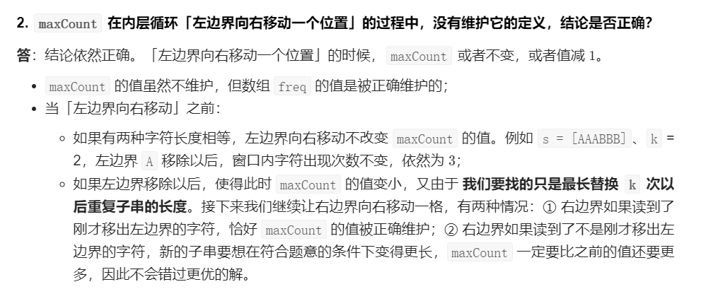
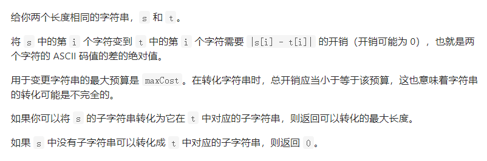

### 双指针

#### 中等题

###### 11. 盛最多水的容器

- 在两端指针移动的过程中不断消去不可能成为最大值的状态

- 每次比较移动短板指针的指向位置

  - 如果移动长板，移动后的可盛水矩形底变短了，高只能≤原高，因此不可能面积变大
  - 如果移动短板，移动后的可盛水矩形底变短了，但高可能>=原高，因此面积可能会增大

  > 一个很明白的理解每步如何减小搜索空间的题解
  >
  > https://leetcode-cn.com/problems/container-with-most-water/solution/on-shuang-zhi-zhen-jie-fa-li-jie-zheng-que-xing-tu/

```java
class Solution {
    public int maxArea(int[] height) {
        int l = 0, r = height.length - 1;
        int ans = 0;
        while (l < r) {
            if (height[l] < height[r]) {
                ans = Math.max(ans, height[l] * (r - l));
                l++;
            }
            else {
                ans = Math.max(ans, height[r] * (r - l));
                r--;
            }
        }
        return ans;
    }
}
```


###### 15. 三数之和

- ```java
  class Solution {
      public List<List<Integer>> threeSum(int[] nums) {
          List<List<Integer>> ans = new ArrayList<>();
          Arrays.sort(nums);
          if (nums.length < 3) return ans;
          if (nums[0] > 0 || nums[nums.length - 1] < 0) return ans;
          for (int i = 0; i < nums.length - 2; i++) {
              int j = i + 1, k = nums.length - 1;
              int target = -nums[i];
              if (nums[i] > 0) break;
              // 下面这两个得是continue，不能是break
              if (nums[k - 1] + nums[k] < target) continue;
              if (nums[j] + nums[j + 1] > target) continue;
              if (i > 0 && nums[i] == nums[i - 1]) continue;
              while (j < k) {
                  if (nums[j] + nums[k] < target) {
                      j++;
                  } else if (nums[j] + nums[k] > target) {
                      k--;
                  } else {
                      List<Integer> tmp = new ArrayList<>();
                      tmp.add(nums[i]);
                      tmp.add(nums[j]);
                      tmp.add(nums[k]);
                      ans.add(tmp);
                      j++;
                      k--;
                      while (j < k && nums[j] == nums[j - 1]) j++;
                      while (j < k && nums[k] == nums[k + 1]) k--;
                  }
              }
          }
          return ans;
      }
  }
  ```

- 


###### 16. 最接近的三数之和

- ```java
  class Solution {
      public int threeSumClosest(int[] nums, int target) {
          Arrays.sort(nums);
          int ans = nums[0] + nums[1] + nums[2];
          for (int i = 0; i < nums.length - 2; ++ i) {
              if (i > 1 && nums[i] == nums[i - 1]) continue;
              int j = i + 1, k = nums.length - 1;
              int min = nums[i] + nums[j] + nums[j + 1];
              if (min > target) {
                  if (Math.abs(target - min) < Math.abs(target - ans)) {
                      ans = min;
                      continue;
                  }
              }
              int max = nums[i] + nums[k - 1] + nums[k];
              if (max < target) {
                  if (Math.abs(target - max) < Math.abs(target - ans)) {
                      ans = max;
                      continue;
                  }
              }
              while (j < k) {
                  int sum = nums[i] + nums[j] + nums[k];
                  if (Math.abs(target - sum) < Math.abs(target - ans)) {
                      ans = sum;
                  }
                  if (sum == target) return target;
                  else if (sum < target) {
                      j++;
                      while (j < k && nums[j] == nums[j - 1]) j++;
                  }
                  else if (sum > target) {
                      k--;
                      while (j < k && nums[k] == nums[k + 1]) k--;
                  }
              }
          }
          return ans;
      }
  }
  ```

- 


###### 18. 四数之和

- 如果当前情况下最小值大于`target`，后面的和不可能更小的
- 但如果当前情况下最大值小于`target`，后面的和是有可能更大的

- ```java
  class Solution {
      List<List<Integer>> ans = new ArrayList<List<Integer>>();
      public List<List<Integer>> fourSum(int[] nums, int target) {
          Arrays.sort(nums);
          int n = nums.length;
          if (n <= 3) return ans;
          if (nums[0] + nums[1] + nums[2] + nums[3] > target) return ans;
          if (nums[n - 1] + nums[n - 2] + nums[n - 3] + nums[n - 4] < target) return ans;
          for (int i = 0; i < n - 3; ++ i){
              if (i > 0 && nums[i] == nums[i - 1]) continue;
              if (nums[i] + nums[i + 1] + nums[i + 2] + nums[i + 3] > target) break;
              if (nums[i] + nums[n - 1] + nums[n - 2] + nums[n - 3] < target) continue;
              for (int j = i + 1; j < n - 2; ++ j){
                  if(j > i + 1 && nums[j] == nums[j - 1]) continue;
                  int t = target - nums[i] - nums[j];
                  int k = j + 1;
                  int l = n - 1;
                  // 曾经以为下面的优化语句因为上面的两个break，continue而不会有效果
                  // 应该是想错了，下面是有用的
                  if (nums[i] + nums[j] + nums[k] + nums[k + 1] > target) break;
                  if (nums[i] + nums[j] + nums[l - 1] + nums[l] < target) continue;
                  while (k < l){
                      if (nums[k] + nums[l] < t){
                          k++;
                          while(k < l && nums[k] == nums[k - 1]) k++;
                      }
                      else if (nums[k] + nums[l] > t){
                          l--;
                          while(k < l && nums[l] == nums[l + 1]) l--;
                      }
                      else{
                          List<Integer> tmp = new ArrayList<Integer>();
                          tmp.add(nums[i]);
                          tmp.add(nums[j]);
                          tmp.add(nums[k]);
                          tmp.add(nums[l]);
                          ans.add(tmp);
                          k++;
                          l--;
                          while(k < l && nums[k] == nums[k - 1]) k++;
                          while(k < l && nums[l] == nums[l + 1]) l--;
                      }
                  }
              }
          }
          return ans;
      }
  }
  ```

- 


###### 633. 平方数之和

```java
class Solution {
    public boolean judgeSquareSum(int c) {
        int i = 0;
        int j = (int)Math.sqrt(c);
        while (i <= j) {
            int sum = i * i + j * j;
            if (sum > c) j--;
            else if (sum < c) i++;
            else return true;
        }
        return false;
    }
}
```


#### 困难题

###### 42. 接雨水

- 双指针写法的一些关键
  - 在某个位置`i`处，它能存的水，取决于它左右两边的最大值中较小的一个。
  - 当我们从左往右处理到left下标时，左边的最大值left_max对它而言是可信的，但right_max对它而言是不可信的。left是从左边依次推过来的，所以左边的最大值可以确定就是left_max
  - 当我们从右往左处理到right下标时，右边的最大值right_max对它而言是可信的，但left_max对它而言是不可信的。right是从右边依次推过来的，所以右边的最大值可以确定就是right_max
  - 由于left与right中间的点还没有遍历到，因此对于left，right_max可能会更大，对于right，left_max可能会更大。
  - 对于位置`left`而言，它左边最大值一定是left_max，右边最大值“大于等于”right_max，这时候，如果`left_max<right_max`成立，那么它就知道自己能存多少水了（左边最大值一定小于右边最大值了）。无论右边将来会不会出现更大的right_max，都不影响这个结果。
  - 所以当`left_max<right_max`时，我们就希望去处理left下标，反之，我们希望去处理right下标。

```java
class Solution {
    public int trap(int[] height) {
        int l = 0, r = height.length - 1, ans = 0;
        int lMax = 0, rMax = 0;
        while (l < r) {
            lMax = Math.max(lMax, height[l]);
            rMax = Math.max(rMax, height[r]);
            if (lMax < rMax) {
                ans += lMax - height[l++];
            } else {
                ans += rMax - height[r--];
            }
        }
        return ans;
    }
}
```


### 滑动窗口

###### 3. 无重复字符的最长子串


- 数组实现

  ```java
  class Solution {
      public int lengthOfLongestSubstring(String s) {
          int ans = 0, l = 0, r = 0, cnt = 0;
          char[] cs = s.toCharArray();
          int[] window = new int[128];
          while (r < cs.length) {
              if (window[cs[r]] == 0) cnt ++;
              window[cs[r]] ++;
              while (r - l + 1 > cnt) {
                  window[cs[l]] --;
                  if (window[cs[l]] == 0) cnt --;
                  l ++;
              }
              ans = Math.max(ans, r - l + 1);
              r ++;
          }
          return ans;
      }
  }
  ```

  ```java
  // 另一种while条件
  class Solution {
      public int lengthOfLongestSubstring(String s) {
          int ans = 0, l = 0, r = 0;
          char[] cs = s.toCharArray();
          int[] window = new int[128];
          while (r < cs.length) {
              window[cs[r]] ++;
              while (window[cs[r]] > 1) {
                  window[cs[l]] --;
                  l ++;
              }
              ans = Math.max(ans, r - l + 1);
              r ++;
          }
          return ans;
      }
  }
  ```

  

###### 76. 最小覆盖子串


- 数组实现

  ```java
  class Solution {
      public String minWindow(String s, String t) {
          char[] cs = s.toCharArray();
          char[] ct = t.toCharArray();
          int[] map = new int[128];
          int[] window = new int[128];
          int l = 0, r = 0, valid = 0, need = 0, minLen = cs.length, start = 0, end = 0;
  
          for (int i = 0; i < ct.length; i++) {
              if (map[ct[i]] == 0) need++;
              map[ct[i]]++;
          }
  
          while (r < cs.length) {
              window[cs[r]]++;
              if (window[cs[r]] == map[cs[r]]) {
                  valid++;
                  while (valid == need) {
                      if (window[cs[l]] == map[cs[l]]) {
                          valid--;
                          if (r - l + 1 <= minLen) {
                              minLen = r - l + 1;
                              start = l;
                              end = r + 1;
                          }
                      }
                      window[cs[l]]--;
                      l++;
                  }
              }
              r++;
          }
          return s.substring(start, end);
      }
  }
  ```

- Map实现

  ```java
  class Solution {
      public String minWindow(String s, String t) {
          char[] cs = s.toCharArray();
          char[] ct = t.toCharArray();
          Map<Character,Integer> window = new HashMap<>();
          Map <Character,Integer> need = new HashMap<>();
          for(int i = 0; i < ct.length; i++) need.put(ct[i], need.getOrDefault(ct[i],0) + 1);
          int l = 0, r = 0, valid = 0, minLen = Integer.MAX_VALUE, start = 0, end = 0;
          while (r < cs.length) {
              window.put(cs[r], window.getOrDefault(cs[r],0) + 1);
              if (need.get(cs[r]) != null && window.get(cs[r]).equals(need.get(cs[r]))) {
                  valid++;
                  while (valid == need.size()) {
                      if (need.get(cs[l]) != null && window.get(cs[l]).equals(need.get(cs[l]))) {
                          valid--;
                          if (r - l + 1 < minLen) {
                              minLen = r - l + 1;
                              start = l;
                              end = r + 1;
                          }
                      }
                      window.put(cs[l], window.getOrDefault(cs[l],0) - 1);
                      l++;
                  }
              }
              r++;
          }
          return s.substring(start, end);
      }
  }
  ```

  


###### 209. 长度最小的子数组


- ```java
  class Solution {
      public int minSubArrayLen(int target, int[] nums) {
          int l = 0, r = 0, n = nums.length, ans = n, sum = 0, max = 0;
          for (int num : nums) max += num;
          if (max < target) return 0;
          while (r < n) {
              sum += nums[r];
              while (sum >= target) {
                  ans = Math.min(ans, r - l + 1);
                  sum -= nums[l];
                  l ++;
              }
              r ++;
          }
          return ans;
      }
  }
  ```

- 


###### 228E.汇总区间

```java

```


###### 395. 至少有K个重复字符的最长子串


- 多次滑动窗口的方法
  - 滑动窗口算法中一般是按窗口中含有的**不同字符的个数**作为滑动的依据

- ```java
  class Solution {
      public int longestSubstring(String s, int k) {
          int ans = 0;
          int[] cnt = new int[128];
          char[] cs = s.toCharArray();
          int n = 0;
          for (char c : cs) {
              if (cnt[c] == 0) n++;
              cnt[c] ++;
          }
          // n记录了原字符串中共有多少个不同的字符
          // 遍历所有滑动窗口内的可能的不同字符数，从滑动窗口内只有1个不同字符...到滑动窗口内有n个不同字符
          for (int i = 1; i <= n; ++ i) {
              ans = Math.max(ans, kDistinctSubArray(cs, k, i));
          }
          return ans;
      }
  	
      // 在字符串中用滑动窗口找所有的满足窗口内只有distinct个不同字符的所有可能
      public int kDistinctSubArray(char[] cs, int k, int distinct) {
          int l = 0, r = 0, res = 0, valid = 0, windowDistinct = 0;
          int[] window = new int[128];
          while (r < cs.length) {
              if (window[cs[r]] == 0) windowDistinct ++;
              window[cs[r]] ++;
              if (window[cs[r]] == k) valid ++;
              while (windowDistinct > distinct) {
                  if (window[cs[l]] == k) valid --;
                  window[cs[l]] --;
                  if (window[cs[l]] == 0) windowDistinct --;
                  l ++;
              }
              // 如果所有不同字符的个数都不少于k了，则得到一种子串内所有字符个数都不少于k的可能
              if (windowDistinct == distinct && distinct == valid) res = Math.max(res, r - l + 1);
              r ++;
          }
          return res;
      }
  }
  ```

- 分治法

  - 用字符串中频次小于k的字母来递归划分字符串

- ```java
  class Solution {
      public int longestSubstring(String s, int k){
          if (s.length() < k) return 0;
  
          Map<Character, Integer> cnt = new HashMap<>();
          for (int i = 0; i < s.length(); i++){
              cnt.put(s.charAt(i), cnt.getOrDefault(s.charAt(i), 0) + 1);
          }
  
          for (char c: cnt.keySet()){
              if (cnt.get(c) < k){
                  int res = 0;
                  for (String t : s.split(String.valueOf(c))){
                      res = Math.max(res, longestSubstring(t, k));
                  }
                  return res;
              }
          }
  
          return s.length();
      }
  }
  ```

- 


###### 424. 替换后的最长重复字符


- 该题比较特殊，窗口的大小，一定不会缩小，只会保持不便或者扩大（因为要求的是最大窗口的长度）

- 如果当前窗口的大小，比历史窗口中出现次数最多的字母次数` maxCnt + k `还大，则证明 k 不足以将当前窗口全部替换成同一个字母。所以窗口左移

- `maxCnt`记录的是 "使窗口达到当前长度时，窗口内各个字符重复次数的最大值"，只有在当前窗口内出现某个字符重复次数达到新高时，才需要扩充窗口大小，并在扩充前更新`maxCnt`。

- 如果长度为 `L` 的子串不符合题目的要求，那么左边界固定，长度更长的子串也不符合题目的要求。

- 

- ```java
  class Solution {
      public int characterReplacement(String s, int k) {
          int l = 0, r = 0, ans = 0, maxCnt = 0;
          char[] cs = s.toCharArray();
          int[] window = new int[128];
          while (r < cs.length) {
              window[cs[r]] ++;
              // maxCnt记录历史窗口中已经出现过的最大值
              maxCnt = Math.max(maxCnt, window[cs[r]]);
              // 不用在l++的时候更新maxCnt的原因
              // 窗口不会缩小！只会平移尝试或者扩大，如果历史上最大的maxCnt + k都不能将[l..r]的子串替换成同一个字母的
              // 那么只能平移
              // 即此时的窗口大小在以前的某一次必然是可以成功全部替换为同一个字母的
              // 下面这个写成if也没问题
              while (r - l + 1 > k + maxCnt) {
                  // 说明此时k次替换不够用，窗口不能扩大，只能平移试一试，因此进入循环，l++
                  window[cs[l]] --;
                  l ++;
                  // 进入while循环则窗口平移
                  // 不进入该循环则窗口扩大右移
              }
              ans = Math.max(ans, r - l + 1);
              r ++;
              // 想得到比以前更长的子串，maxCnt必须要比以前的值大，不然窗口大小是一定的（[l..r]只会平移），k是一定的
              // 没法不进入上一个while循环，要想不满足上一个while循环条件，只能maxCnt变大
          }
          return ans;
      }
  }
  ```
  
- 


###### 438. 找到字符串中所有字母异位词


- ```java
  class Solution {
      public List<Integer> findAnagrams(String s, String p) {
          List<Integer> ans = new ArrayList<>();
          char[] cs = s.toCharArray();
          char[] cp = p.toCharArray();
          int[] map = new int[128];
          int[] window = new int[128];
          int l = 0, r = 0, valid = 0, need = 0;
          for (char c : cp) {
              if (map[c] == 0) need ++;
              map[c] ++;
          }
          while (r < cs.length) {
              window[cs[r]] ++;
              if (window[cs[r]] == map[cs[r]]) {
                  valid ++;
              }
              while (valid >= need) {
                  if (window[cs[l]] == map[cs[l]]) {
                      valid --;
                      if (r - l + 1 == cp.length) ans.add(l);
                  }
                  window[cs[l]] --;
                  l ++;
              }
              r ++;
          }
          return ans;
      }
  }
  ```

- 


###### 567. 字符串的排列


- 数组实现

  ```java
  class Solution {
      public boolean checkInclusion(String s1, String s2) {
          int[] map = new int[128];
          int[] window = new int[128];
          char[] cs1 = s1.toCharArray();
          char[] cs2 = s2.toCharArray();
          int l = 0, r = 0, valid = 0, cnt = 0;
          for (char c : cs1) {
              if (map[c] == 0) cnt ++;
              map[c] ++;
          }
          while (r < cs2.length) {
              window[cs2[r]] ++;
              if (map[cs2[r]] != 0 && window[cs2[r]] == map[cs2[r]]) {
                  valid ++;
                  while (valid >= cnt) {
                      if (r - l + 1 == cs1.length) return true;
                      if (map[cs2[l]] != 0 && window[cs2[l]] == map[cs2[l]]) {
                          valid --;
                      }
                      window[cs2[l]] --;
                      l ++;
                  }
              }
              r ++;
          }
          return false;
      }
  }
  ```

  

- Map实现

  ```java
  class Solution {
      public boolean checkInclusion(String s1, String s2) {
          Map<Character, Integer> map = new HashMap<>();
          Map<Character, Integer> window = new HashMap<>();
          char[] cs1 = s1.toCharArray();
          char[] cs2 = s2.toCharArray();
          for (char c : cs1) {
              map.put(c, map.getOrDefault(c, 0) + 1);
          }
          int l = 0, r = 0, valid = 0;
          while (r < cs2.length) {
              window.put(cs2[r], window.getOrDefault(cs2[r], 0) + 1);
              if (map.get(cs2[r]) != null && window.get(cs2[r]).equals(map.get(cs2[r]))) {
                  valid++;
                  while (valid >= map.size()) {
                      if (r - l + 1 == cs1.length) return true;
                      if (map.get(cs2[l]) != null && window.get(cs2[l]).equals(map.get(cs2[l]))) {
                          valid--;
                      }
                      window.put(cs2[l], window.getOrDefault(cs2[l], 0) - 1);
                      l++;
                  }
              }
              r++;
          }
          return false;
      }
  }
  ```

  


###### 992. K个不同整数的子数组


- 以每个`r`下标为固定右侧，可以求得每次滑动窗口时，最多有k个不同整数的子串的情况

  > 如`[1,2,1,2]`，即`r`为3时，可以得到右侧边界固定，左侧边界依次移动的不同情况`[1,2,1,2]、[2,1,2]、[1,2]、[2]; (即为r - l + 1)`，而当`r`为4，即指向最后一个数时，`l`会先移动到下标`3`处，确保最多只有2个不同整数，得`[2,3]、[3]`，当`r`等于0、1、2时也会得到结果，将最多有k个不同整数子串的情况减去最多有k - 1个不同整数子串的情况，即得到恰好为k个不同整数的情况

- 数组实现

  ```java
  // 滑动窗口双指针适合求滑动窗口字符频次的情况，可以是窗口区间内的不同字符的频次情况frequency的极值情况
  // 而滑动窗口中各value值的极值情况是用单调队列来实现的
  // maxKsubArray()函数求得是最多有k个不同整数的子数组的个数
  class Solution {
      public int subarraysWithKDistinct(int[] nums, int k) {
          return maxKsubArray(nums, k) - maxKsubArray(nums, k - 1);
      }
  
      public int maxKsubArray(int[] nums, int k) {
          int l = 0, r = 0, n = nums.length, res = 0, valid = 0;
          int[] map = new int[n + 1];
          while (r < n) {
              if (map[nums[r]] == 0) valid ++;
              map[nums[r]] ++;
              while (valid > k) {
                  map[nums[l]] --;
                  if (map[nums[l]] == 0) valid --;
                  l++;
              }
              res += r - l + 1;
              r++;
          }
          return res;
      }
  }
  ```

- Map实现

- ```java
  class Solution {
      public int subarraysWithKDistinct(int[] nums, int k) {
          return maxKsubArray(nums, k) - maxKsubArray(nums, k - 1);
      }
  
      public int maxKsubArray(int[] nums, int k) {
          int l = 0, r = 0, n = nums.length, res = 0;
          Map<Integer, Integer> window = new HashMap<>();
          while (r < n) {
              window.put(nums[r], window.getOrDefault(nums[r], 0) + 1);
              while (window.size() > k) {
                  window.put(nums[l], window.getOrDefault(nums[l], 0) - 1);
                  if (window.get(nums[l]) == 0) window.remove(nums[l]);
                  l++;
              }
              res += r - l + 1;
              r++;
          }
          return res;
      }
  }
  ```

- 


###### 1004. 最大连续1的个数III


- 和424是一类题

- 类似424写法

  ```java
  class Solution {
      public int longestOnes(int[] nums, int k) {
          int l = 0, r = 0, maxCnt = 0, ans = 0;
          int one = 0;
          while (r < nums.length) {
              if (nums[r] == 1) one ++;
              maxCnt = Math.max(maxCnt, one);
              while (r - l + 1 > maxCnt + k) {
                  if (nums[l] == 1) one --;
                  l ++;
              }
              ans = Math.max(ans, r - l + 1);
              r ++;
          }
          // 直接return r - l;也可以，不用记录ans
          return ans;
      }
  }
  ```

- 另一种写法

  - 更快一点
  - 把「最多可以把 K 个 0 变成 1，求仅包含 1 的最长子数组的长度」转换为 「找出一个最长的子数组，该子数组内最多允许有 K 个 0 」。
  - 滑动窗口的限制条件是：窗口内最多有 K 个 0。

  ```java
  class Solution {
      public int longestOnes(int[] nums, int k) {
          int l = 0, r = 0, maxCnt = 0, ans = 0;
          int zero = 0;
          while (r < nums.length) {
              if (nums[r] == 0) zero ++;
              while (zero > k) {
                  if (nums[l] == 0) zero --;
                  l ++;
              }
              ans = Math.max(ans, r - l + 1);
              r ++;
          }
          return ans;
      }
  }
  ```

  


###### 1208. 尽可能使字符串相等



- 常规滑动窗口

- ```java
  class Solution {
      public int equalSubstring(String s, String t, int maxCost) {
          int l = 0, r = 0, ans = 0, diff = 0;
          char[] cs = s.toCharArray();
          char[] ct = t.toCharArray();
          while (r < cs.length) {
              diff += Math.abs(cs[r] - ct[r]);
              while (diff > maxCost) {
                  diff -= Math.abs(cs[l] - ct[l]);
                  l ++;
              }
              ans = Math.max(ans, r - l + 1);
              r ++;
          }
          return ans;
      }
  }
  ```

- 和424. 1004. 是同一类问题

- 维持窗口大小单调不减，要么不变要么扩张

  ```java
  class Solution {
      public int equalSubstring(String s, String t, int maxCost) {
          int l = 0, r = 0, diff = 0;
          char[] cs = s.toCharArray();
          char[] ct = t.toCharArray();
          while (r < cs.length) {
              diff += Math.abs(cs[r] - ct[r]);
              // 这里的if是关键，因为不用缩小窗口大小，因此这里只用执行一次
              if (diff > maxCost) {
                  diff -= Math.abs(cs[l] - ct[l]);
                  l ++;
              }
              r ++;
          }
          return r - l;
      }
  }
  ```

  


###### 1493. 删掉一个元素以后全为1的最长子数组


- 等价于可以将1个0替换成1，得到替换后最长连续1的个数，这个个数再减去1就是答案
- 和424. 1004. 也属于同一类型

- ```java
  class Solution {
      public int longestSubarray(int[] nums) {
          int l = 0, r = 0, n = nums.length, ans = 0, window = 0;
          // 以下并不需要特判
          // for (int i = 0; i < n; ++ i) {
          //     if (nums[i] == 1) one ++;
          // }
          // if (one == n) return n - 1;
          // if (one == 0) return 0;
          while (r < n) {
              if (nums[r] == 1) window ++;
              while (r - l + 1 > window + 1) {
                  if (nums[l] == 1) window --;
                  l ++;
              }
              ans = Math.max(ans, r - l + 1);
              r ++;
          }
          return ans - 1;
      }
  }
  ```

- 

