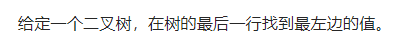
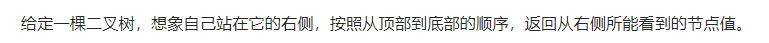

### 树的基本遍历

###### 


### 判断树类型

###### 98. 验证二叉搜索树

- 中序遍历一定是递增的

- 递归DFS实现中序遍历

  ```java
  class Solution {
      TreeNode pre = null;
      public boolean isValidBST(TreeNode root) {
          if (root == null) return true;
          if (!isValidBST(root.left)) return false;
          if (pre != null && root.val <= pre.val) return false;
          pre = root;
          return isValidBST(root.right);
      }
  }
  ```

- 非递归中序遍历判断是否为递增序列

  ```java
  class Solution {
      public boolean isValidBST(TreeNode root) {
          TreeNode pre = null;
          Deque<TreeNode> stack = new ArrayDeque<>();
          while (root != null || !stack.isEmpty()) {
              if (root != null) {
                  stack.push(root);
                  root = root.left;
              } else {
                  root = stack.pop();
                  if (pre != null && root.val <= pre.val) {
                      return false;
                  }
                  pre = root;
                  root = root.right;
              }
          }
          return true;
      }
  }
  ```

  

  


###### 牛客网. 判断是否是完全二叉树

- 层序遍历判断

  - 根据左右子树来判断
  - 有左右子树，直接加入队列
  - 有左子树无右子树，队列后面的节点必须全部是叶子节点
  - 无左子树有右子树，不可能是完全二叉树

- ```java
      public boolean isValidComplete(TreeNode root) {
          Deque<TreeNode> queue = new ArrayDeque<>();
          if (root == null) return false;
          queue.offer(root);
          boolean bottom = false;
          while (!queue.isEmpty()) {
              TreeNode top = queue.poll();
              if (bottom) {
                  while (!queue.isEmpty()) {
                      if (top.left != null || top.right != null) return false;
                      top = queue.poll();
                  }
              }
              if (top.left == null && top.right != null) return false;
              if (top.left != null && top.right != null) {
                  queue.offer(top.left);
                  queue.offer(top.right);
              }
              if (top.left != null && top.right == null) {
                  bottom = true;
                  queue.offer(top.left);
              }
          }
          return true;
      }
  ```


### 树的每层最左最右问题

###### 513. 找树左下角的值



- DFS按照前序遍历的顺序，中-左-右直接更新

  ```java
  class Solution {
      int ans = 0, maxLevel = -1;
      public int findBottomLeftValue(TreeNode root) {
          dfs(root, 0);
          return ans;
      }
  
      public void dfs(TreeNode root, int level) {
          // 是新的一行，第一次进入新的一行，肯定是该行最左边的值
          // 结果只要最后的一行最左边的值，每到新的一行覆盖原来的ans就行
          if (level > maxLevel) {
              ans = root.val;
              maxLevel = level;
          }
          if (root.left != null) dfs(root.left, level + 1);
          if (root.right != null) dfs(root.right, level + 1);
      }
  }
  ```

- BFS队列实现

  ```java
  class Solution {
      public int findBottomLeftValue(TreeNode root) {
          int ans = 0;
          Deque<TreeNode> queue = new ArrayDeque<>();
          queue.offer(root);
          while (!queue.isEmpty()) {
              int cnt = queue.size();
              boolean first = true;
              while (cnt -- > 0) {
                  TreeNode top = queue.poll();
                  if (first) {
                      ans = top.val;
                      first = false;
                  }
                  if (top.left != null) queue.offer(top.left);
                  if (top.right != null) queue.offer(top.right);
              }
          }
          return ans;
      }
  }
  ```

- 也可以在BFS队列中用一个小技巧，先`offer`进来右节点，再左节点，然后在`cnt == 0`的情况下，更新答案


###### 199. 二叉树的右视图



- DFS直接更新每层最右边的节点

  ```java
  class Solution {
      List<Integer> ans = new ArrayList<>();
      public List<Integer> rightSideView(TreeNode root) {
          if (root == null) return ans;
          dfs(root, 0);
          return ans;
      }
  
      public void dfs(TreeNode root, int level) {
          // 每次进入新的一层，要把ans的大小扩大1
          if (level >= ans.size()) {
              ans.add(root.val);
          } else {
              // 中-左-右的遍历顺序，最后一次更新的结果就是每层最右边的值
              ans.set(level, root.val);
          }
          if (root.left != null) dfs(root.left, level + 1);
          if (root.right != null) dfs(root.right, level + 1);
      }  
  }
  ```

- BFS队列实现

  ```java
  class Solution {
      public List<Integer> rightSideView(TreeNode root) {
          List<Integer> ans = new ArrayList<>();
          if (root == null) return ans;
          Deque<TreeNode> queue = new ArrayDeque<>();
          queue.offer(root);
          while (!queue.isEmpty()) {
              int cnt = queue.size();
              while (cnt -- > 0) {
                  TreeNode top = queue.poll();
                  if (top.left != null) queue.offer(top.left);
                  if (top.right != null) queue.offer(top.right);
                  if (cnt == 0) ans.add(top.val);
              }
          }
          return ans;
      }
  }
  ```

  

