树的递归，返回的值

- 子树根节点
- 如果答案跟树的根节点没关系，可以设一个全局变量作为答案，但递归的时候还是以子树根节点为参数遍历


### 树的基本遍历

###### 144. 二叉树的前序遍历

```java
class Solution {
    public List<Integer> preorderTraversal(TreeNode root) {
        List<Integer> ans = new ArrayList<>();
        Deque<TreeNode> stack = new ArrayDeque<>();
        while (root != null || !stack.isEmpty()) {
            if (root != null) {
                ans.add(root.val);
                stack.push(root);
                root = root.left;
            } else {
                root = stack.poll();
                root = root.right;
            }
        }
        return ans;
    }
}
```


###### 94. 二叉树的中序遍历

```java
class Solution {
    public List<Integer> inorderTraversal(TreeNode root) {
        List<Integer> ans = new ArrayList<>();
        Deque<TreeNode> stack = new ArrayDeque<>();
        while (root != null || !stack.isEmpty()) {
            if (root != null) {
                stack.push(root);
                root = root.left;
            } else {
                root = stack.poll();
                ans.add(root.val);
                root = root.right;
            }
        }
        return ans;
    }
}
```


###### 145. 二叉树的后序遍历

- 多一个`pre`记录前一个输出的节点

- 两个 `||`条件
- `root = null`
- `stack.push(root)`要出现两次

```java
class Solution {
    public List<Integer> postorderTraversal(TreeNode root) {
        List<Integer> ans = new ArrayList<>();
        Deque<TreeNode> stack = new ArrayDeque<>();
        TreeNode pre = null;

        while (root != null || !stack.isEmpty()) {
            if (root != null) {
                stack.push(root);
                root = root.left;
            } else {
                root = stack.poll();
                if (root.right == null || root.right == pre) {
                    ans.add(root.val);
                    pre = root;
                    root = null;
                } else {
                    stack.push(root);
                    root = root.right;
                }
            }
        }
        return ans;    
    }
}
```


###### 102. 二叉树的层序遍历

- DFS遍历

  ```java
  class Solution {
      List<List<Integer>> ans = new ArrayList<>();
      public List<List<Integer>> levelOrder(TreeNode root) {
          if (root == null) return ans;
          dfs(root, 0);
          return ans;
      }
  
      public void dfs(TreeNode root ,int level) {
          if (level >= ans.size()) ans.add(new ArrayList<>());
          ans.get(level).add(root.val);
          if (root.left != null) dfs(root.left, level + 1);
          if (root.right != null) dfs(root.right, level + 1);
      }
  }
  ```

- BFS遍历

  ```java
  class Solution {
      public List<List<Integer>> levelOrder(TreeNode root) {
          List<List<Integer>> ans = new ArrayList<>();
          if (root == null) return ans;
          Deque<TreeNode> queue = new ArrayDeque<>();
          queue.offer(root);
          while (!queue.isEmpty()) {
              int cnt = queue.size();
              List<Integer> list = new ArrayList<>();
              while (cnt -- > 0) {
                  TreeNode top = queue.poll();
                  list.add(top.val);
                  if (top.left != null) queue.offer(top.left);
                  if (top.right != null) queue.offer(top.right);
              }
              ans.add(list);
          }
          return ans;
      }
  }
  ```

  

###### 107. 二叉树的层序遍历II（把102结果倒一下）

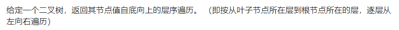

- DFS遍历再倒序结果

  ```java
  class Solution {
      List<List<Integer>> ans = new ArrayList<>();
      public List<List<Integer>> levelOrderBottom(TreeNode root) {
          if (root == null) return ans;
          dfs(root, 0);
          Collections.reverse(ans);
          return ans;
      }
  
      public void dfs(TreeNode root, int level) {
          if (level >= ans.size()) ans.add(new ArrayList());
          ans.get(level).add(root.val);
          if (root.left != null) dfs(root.left, level + 1);
          if (root.right != null) dfs(root.right, level + 1);
      }
  }
  ```

- BFS遍历

  ```java
  class Solution {
      public List<List<Integer>> levelOrderBottom(TreeNode root) {
          List<List<Integer>> ans = new ArrayList<>();
          if (root == null) return ans;
          Deque<TreeNode> queue = new ArrayDeque<>();
          queue.offer(root);
          while (!queue.isEmpty()) {
              int cnt = queue.size();
              List<Integer> list = new ArrayList<>();
              while (cnt -- > 0) {
                  TreeNode top = queue.poll();
                  list.add(top.val);
                  if (top.left != null) queue.offer(top.left);
                  if (top.right != null) queue.offer(top.right);
              }
              ans.add(0, list);
          }
          return ans;
      }
  }
  ```


###### 103. 二叉树的锯齿形层序遍历

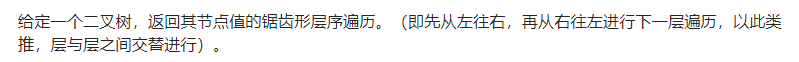

- DFS遍历

  ```java
  class Solution {
      List<List<Integer>> ans = new ArrayList<>();
      public List<List<Integer>> zigzagLevelOrder(TreeNode root) {
          if (root == null) return ans;
          dfs(root, 0);
          return ans;
      }
  
      public void dfs(TreeNode root, int level) {
          if (level >= ans.size()) ans.add(new ArrayList<>());
          if ((level & 1) == 0) ans.get(level).add(root.val);
          else ans.get(level).add(0, root.val);
          if (root.left != null) dfs(root.left, level + 1);
          if (root.right != null) dfs(root.right, level + 1);
      }
  }
  ```

- BFS遍历

  ```java
  class Solution {
      public List<List<Integer>> zigzagLevelOrder(TreeNode root) {
          List<List<Integer>> ans = new ArrayList<>();
          if (root == null) return ans;
          Deque<TreeNode> queue = new ArrayDeque<>();
          queue.offer(root);
          int level = 0;
          while (!queue.isEmpty()) {
              int cnt = queue.size();
              List<Integer> list = new ArrayList<>();
              while (cnt -- > 0) {
                  TreeNode top = queue.poll();
                  if ((level & 1) == 0) list.add(top.val);
                  else list.add(0, top.val);
                  if (top.left != null) queue.offer(top.left);
                  if (top.right != null) queue.offer(top.right);
              }
              ans.add(list);
              level ++;
          }
          return ans;
      }
  }
  ```

  

###### 105. 从前序与中序遍历序列构造二叉树

```java
class Solution {
    Map<Integer, Integer> map = new HashMap<>();
    public TreeNode buildTree(int[] preorder, int[] inorder) {
        for (int i = 0; i < preorder.length; ++ i) map.put(inorder[i], i);
        return helper(preorder, inorder, 0, 0, inorder.length - 1);
    }

    public TreeNode helper(int[] preorder, int[] inorder, int root, int start, int end) {
        if (start > end) return null;
        int inRootIdx = map.get(preorder[root]);
        TreeNode rootNode = new TreeNode(preorder[root]);
        rootNode.left = helper(preorder, inorder, root + 1, start, inRootIdx - 1);
        rootNode.right = helper(preorder, inorder, root + inRootIdx - start + 1, inRootIdx + 1, end);
        return rootNode;
    }
}
```


###### 106. 从中序与后序遍历序列构造二叉树

```java
class Solution {
    Map<Integer, Integer> map = new HashMap<>();
    public TreeNode buildTree(int[] inorder, int[] postorder) {
        for (int i = 0; i < inorder.length; ++ i) map.put(inorder[i], i);
        return helper(postorder, inorder, postorder.length - 1, 0, inorder.length - 1);
    }

    public TreeNode helper(int[] postorder, int[] inorder, int root, int start, int end) {
        if (start > end) return null;
        int inRootIdx = map.get(postorder[root]);
        TreeNode rootNode = new TreeNode(postorder[root]);
        rootNode.left = helper(postorder, inorder, root - (end - inRootIdx) - 1, start, inRootIdx - 1);
        rootNode.right = helper(postorder, inorder, root - 1, inRootIdx + 1, end);
        return rootNode;
    }
}
```


###### 889. 根据前序和后序遍历构造二叉树

- 分别记录前序、后序遍历的左右子树的边界
- 不唯一

```java
class Solution {
    Map<Integer, Integer> map = new HashMap<>();
    public TreeNode constructFromPrePost(int[] pre, int[] post) {
        for (int i = 0; i < post.length; ++ i) map.put(post[i], i);
        return helper(pre, post, 0, pre.length - 1, 0, post.length - 1);
    }

    public TreeNode helper(int[] pre, int[] post, int preL, int preR, int postL, int postR) {
        if (preL > preR || postL > postR) return null;
        TreeNode rootNode = new TreeNode(pre[preL]);
        // 与有中序序列主要的不同点在此
        if (preL == preR) return rootNode;
        int leftRoot = map.get(pre[preL + 1]);
        rootNode.left = helper(pre, post, preL + 1, preL + 1 + leftRoot - postL, postL, leftRoot);
        rootNode.right = helper(pre, post, preL + 1 + leftRoot - postL + 1, preR, leftRoot + 1, postR - 1);
        return rootNode;
    }
}
```


### 寻找树中节点问题

###### 235. 二叉搜索树的最近公共祖先

```java
class Solution {
    public TreeNode lowestCommonAncestor(TreeNode root, TreeNode p, TreeNode q) {
        if (root == p || root == q) return root;
        if (root.val < p.val && root.val < q.val) return lowestCommonAncestor(root.right, p, q);
        if (root.val > p.val && root.val > q.val) return lowestCommonAncestor(root.left, p, q);
        else return root;
    }
}
```


###### 236. 二叉树的最近公共祖先

- 递归函数传入的要寻找的两个节点

- 两个节点的公共节点只有两大类情况

  - 两个节点在不同的子树上，即没有祖孙关系，这种情况应该返回这两个子树上一层的共有根节点
  - 两个节点在同一个子树上，即一个节点是另一个节点的祖先，这种情况应该返回祖先

- 递归在当前节点的左右子树上查找这两个节点

  - 如果左右子树都分别找到了，那么最近公共祖先就是当前`root`节点
  - 如果左右子树只有一个子树中能找到`p`或者`q`中的一个，那么最近公共祖先就是最先返回的节点
  
  ```java
  class Solution {
      public TreeNode lowestCommonAncestor(TreeNode root, TreeNode p, TreeNode q) {
          if (root == null || root == p || root == q) return root;
          TreeNode left = lowestCommonAncestor(root.left, p, q);
          TreeNode right = lowestCommonAncestor(root.right, p, q);
          if (left != null && right != null) return root;
          return left != null ? left : right;
      }
  }
  ```
  
  


#### 树的每层最左最右问题

###### 513. 找树左下角的值


- DFS按照前序遍历的顺序，中-左-右直接更新

  ```java
  class Solution {
      int ans = 0, maxLevel = -1;
      public int findBottomLeftValue(TreeNode root) {
          dfs(root, 0);
          return ans;
      }
  
      public void dfs(TreeNode root, int level) {
          // 是新的一行，第一次进入新的一行，肯定是该行最左边的值
          // 结果只要最后的一行最左边的值，每到新的一行覆盖原来的ans就行
          if (level > maxLevel) {
              ans = root.val;
              maxLevel = level;
          }
          if (root.left != null) dfs(root.left, level + 1);
          if (root.right != null) dfs(root.right, level + 1);
      }
  }
  ```

- BFS队列实现

  ```java
  class Solution {
      public int findBottomLeftValue(TreeNode root) {
          int ans = 0;
          Deque<TreeNode> queue = new ArrayDeque<>();
          queue.offer(root);
          while (!queue.isEmpty()) {
              int cnt = queue.size();
              boolean first = true;
              while (cnt -- > 0) {
                  TreeNode top = queue.poll();
                  if (first) {
                      ans = top.val;
                      first = false;
                  }
                  if (top.left != null) queue.offer(top.left);
                  if (top.right != null) queue.offer(top.right);
              }
          }
          return ans;
      }
  }
  ```

- 也可以在BFS队列中用一个小技巧，先`offer`进来右节点，再左节点，然后在`cnt == 0`的情况下，更新答案

- 上面的情况是类似于左视图的时候才用得着，这里，只需要记录最后一层的最左边节点的值，因此直接返回最后一次的队列头结点的值即可

  ```java
  class Solution {
      public int findBottomLeftValue(TreeNode root) {
          Deque<TreeNode> queue = new ArrayDeque<>();
          queue.offer(root);
          while (!queue.isEmpty()) {
              root = queue.poll();
              if (root.right != null) queue.offer(root.right);
              if (root.left != null) queue.offer(root.left);
          }
          return root.val;
      }
  }
  ```

  


- DFS直接更新每层最右边的节点

  ```java
  class Solution {
      List<Integer> ans = new ArrayList<>();
      public List<Integer> rightSideView(TreeNode root) {
          if (root == null) return ans;
          dfs(root, 0);
          return ans;
      }
  
      public void dfs(TreeNode root, int level) {
          // 每次进入新的一层，要把ans的大小扩大1
          if (level >= ans.size()) {
              ans.add(root.val);
          } else {
              // 中-左-右的遍历顺序，最后一次更新的结果就是每层最右边的值
              ans.set(level, root.val);
          }
          if (root.left != null) dfs(root.left, level + 1);
          if (root.right != null) dfs(root.right, level + 1);
      }  
  }
  ```

- 另一种DFS（根—右—左的方式，这样可以保证每一层先遍历到的是最右边的节点）

  ```java
  class Solution {
      List<Integer> ans = new ArrayList<>();
      public List<Integer> rightSideView(TreeNode root) {
          dfs(root, 0);
          return ans;
      }
  
      public void dfs(TreeNode root, int level) {
          if (root == null) return;
          if (level >= ans.size()) {
              ans.add(root.val);
          }
          dfs(root.right, level + 1);
          dfs(root.left, level + 1);
      }  
  }
  ```
  
- BFS队列实现

  ```java
  class Solution {
      public List<Integer> rightSideView(TreeNode root) {
          List<Integer> ans = new ArrayList<>();
          if (root == null) return ans;
          Deque<TreeNode> queue = new ArrayDeque<>();
          queue.offer(root);
          while (!queue.isEmpty()) {
              int cnt = queue.size();
              while (cnt -- > 0) {
                  TreeNode top = queue.poll();
                  if (top.left != null) queue.offer(top.left);
                  if (top.right != null) queue.offer(top.right);
                  if (cnt == 0) ans.add(top.val);
              }
          }
          return ans;
      }
  }
  ```


### 判断树类型

###### 100. 相同的树（两棵树是否相同）

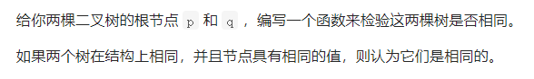

- 递归

  ```java
  class Solution {
      public boolean isSameTree(TreeNode p, TreeNode q) {
          if (p == null && q == null) return true;
          if (p == null || q == null) return false;
          return p.val == q.val && isSameTree(p.left, q.left) && isSameTree(p.right, q.right);
      }
  }
  ```

- BFS层序遍历判断

  ```java
  class Solution {
      public boolean isSameTree(TreeNode p, TreeNode q) {
          Deque<TreeNode> queue = new LinkedList<>();
          queue.offer(p);
          queue.offer(q);
          while (!queue.isEmpty()) {
              TreeNode first = queue.poll();
              TreeNode second = queue.poll();
              if (first == null && second == null) continue;
              if (first == null || second == null || first.val != second.val) return false;
              queue.offer(first.left);
              queue.offer(second.left);
              queue.offer(first.right);
              queue.offer(second.right);
          }
          return true;
      }
  }
  ```

- 利用栈判断

  - `LinkedList`可以保存`null`值

  ```java
  class Solution {
      public boolean isSameTree(TreeNode p, TreeNode q) {
          if (p == null && q == null) return true;
          if (p == null || q == null) return false;
          Deque<TreeNode> stack1 = new LinkedList<>();
          Deque<TreeNode> stack2 = new LinkedList<>();
          stack1.push(p);
          stack2.push(q);
          while (!stack1.isEmpty() || !stack2.isEmpty()) {
              TreeNode first = stack1.pop();
              TreeNode second = stack2.pop();
              if (first == null && second == null) continue;
              if (first == null || second == null || first.val != second.val) return false;
              stack1.push(first.left);
              stack1.push(first.right);
              stack2.push(second.left);
              stack2.push(second.right);
          }
          return true;
      }
  }
  ```


###### 101. 对称二叉树（一棵树是否对称）

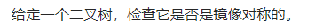

- 递归

  ```java
  class Solution {
      public boolean isSymmetric(TreeNode root) {
          if (root == null) return true;
          return isMirror(root.left, root.right);
      }
  
      public boolean isMirror(TreeNode left, TreeNode right) {
          if (left == null && right == null) return true;
          if (left == null || right == null) return false;
          return left.val == right.val && isMirror(left.left, right.right) && isMirror(left.right, right.left);
      }
  }
  ```

- BFS迭代

  ```java
  class Solution {
      public boolean isSymmetric(TreeNode root) {
          if (root == null) return true;
          Deque<TreeNode> queue = new LinkedList<>();
          queue.offer(root);
          queue.offer(root);
          while (!queue.isEmpty()) {
              TreeNode first = queue.poll();
              TreeNode second = queue.poll();
              if (first == null && second == null) continue;
              if (first == null || second == null || first.val != second.val) return false;
              queue.offer(first.left);
              queue.offer(second.right);
              queue.offer(first.right);
              queue.offer(second.left);
          }
          return true;
      }
  }
  ```

  

###### 110. 平衡二叉树（是否平衡）

- 得到高度的辅助函数中，可以用负数来传递该子树已经不满足AVL树的定义，从而提前返回

- 如果自顶向下每次计算树高的话，会有很多重复计算

  ```java
  class Solution {
      public boolean isBalanced(TreeNode root) {
          return helper(root) != -1;
      }
  
      public int helper(TreeNode root) {
          if (root == null) return 0;
          int left = helper(root.left);
          int right = helper(root.right);
          if (left == -1 || right == -1 || Math.abs(left - right) > 1) return -1;
          return Math.max(left, right) + 1;
      }
  }
  ```

  

###### 226. 翻转二叉树（单颗树左右子树翻转）

- 普通递归实现

  - 得先用两个变量先记录左右子树翻转后的结果，不能直接修改原来的左右子树，不然会覆盖

  ```java
  class Solution {
      public TreeNode invertTree(TreeNode root) {
          if (root == null || (root.left == null && root.right == null)) return root;
          TreeNode left = invertTree(root.right);
          TreeNode right = invertTree(root.left);
          root.left = left;
          root.right = right;
          return root;
      }
  }
  ```

- 可以只记录一个子树即可，相当于`swap`左右子树

  ```java
  class Solution {
      public TreeNode invertTree(TreeNode root) {
          if (root == null || (root.left == null && root.right == null)) return root;
          TreeNode rightTree = root.right;
          root.right = invertTree(root.left);
          root.left = invertTree(rightTree);
          return root;
      }
  }
  ```

  


###### 牛客网. 判断是否是完全二叉树

- 层序遍历判断

  - 根据左右子树来判断
  - 有左右子树，直接加入队列
  - 有左子树无右子树，队列后面的节点必须全部是叶子节点
  - 无左子树有右子树，不可能是完全二叉树

- ```java
      public boolean isValidComplete(TreeNode root) {
          Deque<TreeNode> queue = new ArrayDeque<>();
          if (root == null) return false;
          queue.offer(root);
          boolean bottom = false;
          while (!queue.isEmpty()) {
              TreeNode top = queue.poll();
              if (bottom) {
                  while (!queue.isEmpty()) {
                      if (top.left != null || top.right != null) return false;
                      top = queue.poll();
                  }
              }
              if (top.left == null && top.right != null) return false;
              if (top.left != null && top.right != null) {
                  queue.offer(top.left);
                  queue.offer(top.right);
              }
              if (top.left != null && top.right == null) {
                  bottom = true;
                  queue.offer(top.left);
              }
          }
          return true;
      }
  ```


###### 剑指26. 树的子结构 & 面试题 04.10. 检查子树

- 如果空子树可以判定为所有树的子树的话（面试题 04.10）

  ```java
  class Solution {
      public boolean checkSubTree(TreeNode t1, TreeNode t2) {
          if (t2 == null) return true;
          if (t1 == null) return false;
          if (t1.val == t2.val) {
              return checkSubTree(t1.left, t2.left) && checkSubTree(t1.right, t2.right);
          } else {
              return checkSubTree(t1.left, t2) || checkSubTree(t1.right, t2);
          }
      }
  }
  ```

- 如果约定空树不是任意一个树的子结构的话

  ```java
  class Solution {
      // 该函数作用，遍历A中每个节点
      public boolean isSubStructure(TreeNode A, TreeNode B) {
          // A为空时，代表已经遍历完了A的这部分子树
          // B为空时，代表B为空树，约定空树不是任意一个树的子结构
          if (A == null || B == null) return false;
          return isValid(A, B) || isSubStructure(A.left, B) || isSubStructure(A.right, B);
      }
  
      // 该函数作用，以当前节点为根，B是否可能是A的子树
      public boolean isValid(TreeNode A, TreeNode B) {
          if (B == null) return true;
          if (A == null) return false;
          return A.val == B.val && isValid(A.left, B.left) && isValid(A.right, B.right);
      }
  }
  ```

  

###### 1367. 二叉树中的列表

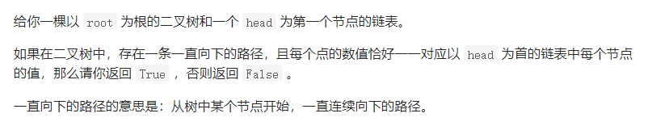

- 和子结构题思路是一样的

  - 分为两个递归函数，一个用来遍历根节点，另一个用来判断是否以当前节点为根是否满足条件

  ```java
  class Solution {
      // 遍历树的节点，分别以遍历到的节点作为根
      public boolean isSubPath(ListNode head, TreeNode root) {
          // 空列表一律判true
          if (head == null) return true;
          // 已经遍历完当前部分的子树
          if (root == null) return false;
          return isValid(head, root) || isSubPath(head, root.left) || isSubPath(head, root.right);
      }
  
      // 以当前节点为根，判断
      public boolean isValid(ListNode head, TreeNode root) {
          if (head == null) return true;
          if (root == null) return false;
          return head.val == root.val && (isValid(head.next, root.left) || isValid(head.next, root.right));
      }
  }
  ```

  

### 树中最大最小值问题

###### 104. 二叉树的最大深度

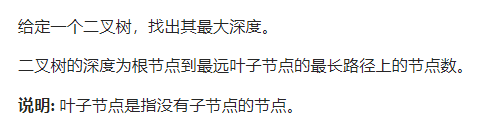

- 常规最大最小问题写法

  ```java
  class Solution {
      int ans = 0;
      public int maxDepth(TreeNode root) {
          dfs(root, 0);
          return ans;
      }
      
      public void dfs(TreeNode root, int level) {
          if (root == null) {
              ans = Math.max(ans, level);
              return;
          }
          dfs(root.left, level + 1);
          dfs(root.right, level + 1);
      }
  }
  ```

- 另一种递归

  - 递归函数返回的是以当前节点为根节点的子树的最大深度

  ```java
  class Solution {
      public int maxDepth(TreeNode root) {
          if (root == null) return 0;
          int left = maxDepth(root.left);
          int right = maxDepth(root.right);
          return Math.max(left, right) + 1;
      }
  }
  ```

  

###### 543. 二叉树的直径

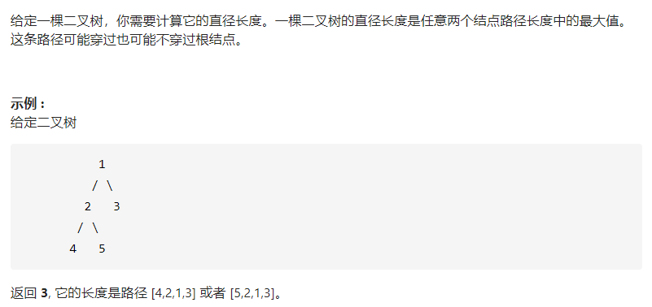

- 必须要注意路径可能不穿过根节点，因此无法通过递归函数的返回值就得到结果

- 考虑在根据递归遍历每一个根节点的同时，更新一个全局的答案值即可

  - 以每个节点为中心点计算最长路径

  - 递归函数为上一层服务，返回的是当前节点`root`左右子树中较长的路径加上子树节点到`root`节点的那条边

  ```java
  class Solution {
      int ans = 0;
      public int diameterOfBinaryTree(TreeNode root) {
          if (root == null) return 0;
          helper(root);
          return ans;
      }
  
      public int helper(TreeNode root) {
          // 为空，路径长就为0
          // 不为空，路径长为经过root.left节点左右子树中的较长路径加1
          int left = root.left != null ? helper(root.left) + 1 : 0;
          int right = root.right != null ? helper(root.right) + 1 : 0;
  
          ans = Math.max(ans, left + right);
          return Math.max(left, right);
      }
  }
  ```
  


###### 687. 最长同值路径

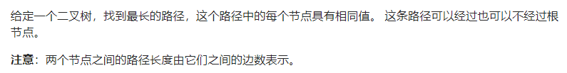

- 和543同属一个套路

  - `dfs`函数在更新题目结果时，是以当前节点为中心，左右扩散得到最长同值路径
  - 但是`dfs`返回值只是左边或者右边中，两个方向中的最长同值路径，这个路径包括当前根节点

  ```java
  class Solution {
      int ans = 0;
      public int longestUnivaluePath(TreeNode root) {
          if (root == null) return 0;
          dfs(root);
          return ans;
      }
  
      public int dfs(TreeNode root) {
          if (root.left == null && root.right == null) return 0;
          int left = root.left != null ? dfs(root.left) + 1 : 0;
          int right = root.right != null ? dfs(root.right) + 1 : 0;
          if (root.left != null && root.left.val != root.val) left = 0;
          if (root.right != null && root.right.val != root.val) right = 0;
          ans = Math.max(ans, left + right);
          return Math.max(left, right);
      }
  }
  ```


###### 124. 二叉树中的最大路径和

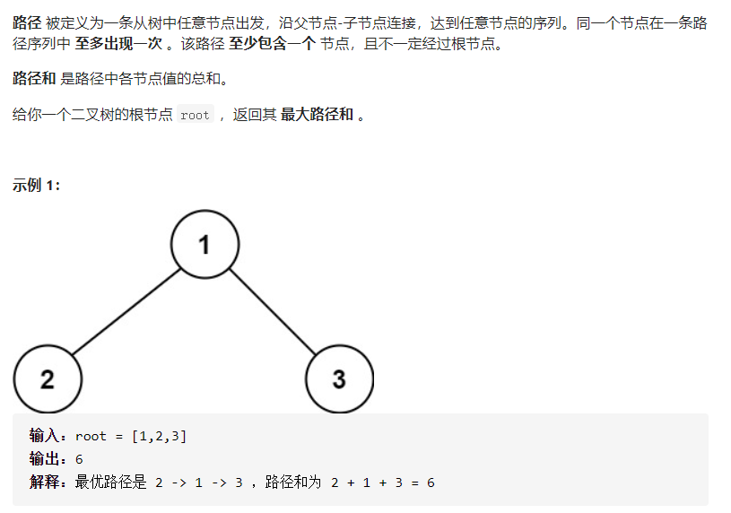

- 与543. 687.虽然思路有类似，但细节上还是有差别的

  - 首先是`? :`三元表达式中，不用提前加上`root.val`了
  - 其次，如果左右子树递归函数的返回值小于0，为了求最大值应该忽略
  - 递归`dfs`函数的返回值代表当前节点左边或者右边，一个方向上的最大路径和（包括当前节点）
  - 在`dfs`函数里面，以当前节点为中心，左右扩散得到以当前节点为中心的最大路径和

  ```java
  class Solution {
      int ans = Integer.MIN_VALUE;
      public int maxPathSum(TreeNode root) {
          dfs(root);
          return ans;
      }
  
      public int dfs(TreeNode root) {
          int left = root.left != null ? dfs(root.left): 0;
          int right = root.right != null ? dfs(root.right): 0;
          left = Math.max(0, left);
          right = Math.max(0, right);
          int sum = root.val + left + right;
          ans = Math.max(ans, sum);
          return Math.max(left, right) + root.val;
      }
  }
  ```

  


###### 1372*. 二叉树中的最长交错路径

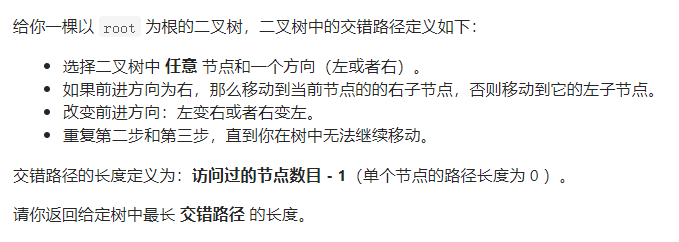

- 有点绕，似乎还有疑问，似懂非懂，待接着细看

- 在遍历节点`dfs`的时候加上一个状态表示是来自左子树还是右子树

  - `dfs`递归函数返回的结果是以当前`root`节点的父节点，其中父节点到本节点的方式是`isLeft`为前提下，**父节点**可以到达的最长交错路径，所以在主函数中`dfs`的返回值不用保存，因为它的值是假设原本的`root`根节点上面还有一个根节点，以该节点出发的最长交错路径，
  - 也因此`r = dfs(root.right, false);`得到的结果，就是以函数形参`root`为出发节点的最长交错路径，一个为先向左，一个为先向右

  ```java
  class Solution {
      int ans = 0;
      public int longestZigZag(TreeNode root) {
          dfs(root, false);
          return ans;
      }
      public int dfs(TreeNode root, boolean isLeft) {
          if (root == null) return 0;
          int r = dfs(root.right, false);
          int l = dfs(root.left, true);
          int max = Math.max(l, r);
          ans = Math.max(ans, max);
          if (isLeft) return r + 1;
          else return l + 1;
      }
  }
  ```

  


### 二叉搜索树系列

###### 98. 验证二叉搜索树

- 中序遍历一定是递增的

- 递归DFS实现中序遍历

  ```java
  class Solution {
      TreeNode pre = null;
      public boolean isValidBST(TreeNode root) {
          if (root == null) return true;
          if (!isValidBST(root.left)) return false;
          if (pre != null && root.val <= pre.val) return false;
          pre = root;
          return isValidBST(root.right);
      }
  }
  ```

- 非递归中序遍历判断是否为递增序列

  ```java
  class Solution {
      public boolean isValidBST(TreeNode root) {
          TreeNode pre = null;
          Deque<TreeNode> stack = new ArrayDeque<>();
          while (root != null || !stack.isEmpty()) {
              if (root != null) {
                  stack.push(root);
                  root = root.left;
              } else {
                  root = stack.pop();
                  if (pre != null && root.val <= pre.val) {
                      return false;
                  }
                  pre = root;
                  root = root.right;
              }
          }
          return true;
      }
  }
  ```

- 另一种递归实现

  - `root`节点的值要和整个左子树和右子树所有节点比较
  - 在递归函数中添加参数来记录最大最小信息
  - 对于左子树，根节点应该是最大值，对于右子树，根节点应该是最小值

  ```java
  class Solution {
      public boolean isValidBST(TreeNode root) {
          return helper(root, null, null);
      }
  
      public boolean helper(TreeNode root, TreeNode min, TreeNode max) {
          if (root == null) return true;
          if (min != null && root.val <= min.val) return false;
          if (max != null && root.val >= max.val) return false;
          return helper(root.left, min, root) && helper(root.right, root, max);
      }
  }
  ```


###### 700. 二叉搜索树中的搜索

```java
class Solution {
    public TreeNode searchBST(TreeNode root, int val) {
        if (root == null || root.val == val) return root;
        return root.val > val ? searchBST(root.left, val) : searchBST(root.right, val);
    }
}
```


###### 701. 二叉搜索树中的插入操作

```java
class Solution {
    public TreeNode insertIntoBST(TreeNode root, int val) {
        if (root == null) return new TreeNode(val);
        if (root.val > val) root.left = insertIntoBST(root.left, val);
        else root.right = insertIntoBST(root.right, val);
        return root;
    }
}
```


###### 450. 删除二叉搜索树中的节点

- 修改删除节点的值，用右子树的最小值覆盖

  ```java
  class Solution {
      public TreeNode deleteNode(TreeNode root, int key) {
          // 没找到key节点
          if (root == null) return null;
          if (root.val == key) {
              // 包含key节点左右子树都为null，即返回null的情况
              if (root.left == null) return root.right;
              if (root.right == null) return root.left;
              TreeNode minNode = getMin(root.right);
              // 主要是下面不同，这里是覆盖了值
              root.val = minNode.val;
              root.right = deleteNode(root.right, minNode.val);
          } else if (root.val > key) {
              root.left = deleteNode(root.left, key);
          } else {
              root.right = deleteNode(root.right, key);
          }
          return root;
      }
  
      public TreeNode getMin(TreeNode node) {
          while (node.left != null) node = node.left;
          return node;
      }
  }
  ```

- 修改删除节点的指针

  ```java
  class Solution {
      public TreeNode deleteNode(TreeNode root, int key) {
          // 没找到key节点
          if (root == null) return null;
          if (root.val == key) {
              // 包含key节点左右子树都为null，即返回null的情况
              if (root.left == null) return root.right;
              if (root.right == null) return root.left;
              // 这里是修改了指针，更好
              TreeNode successor = getMin(root.right);
              successor.right = deleteMin(root.right);
              successor.left = root.left;
              return successor;
          } else if (root.val > key) {
              root.left = deleteNode(root.left, key);
          } else {
              root.right = deleteNode(root.right, key);
          }
          return root;
      }
  
      // 返回右子树中最小的节点
      public TreeNode getMin(TreeNode node) {
          if (node.left == null) return node;
          return getMin(node.left);
      }
  
      // 在右子树中删除最小的节点，最小的节点不可能有左子树，可能还有右子树，有的话接上去
      public TreeNode deleteMin(TreeNode node) {
          if (node.left == null) return node.right;
          node.left = deleteMin(node.left);
          return node;
      }
  }
  ```

  

### 树中的回溯问题

###### 113. 路径总和II

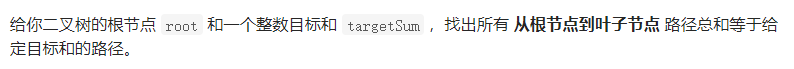

- 回溯写法

  ```java
  class Solution {
      List<List<Integer>> ans = new ArrayList<>();
      public List<List<Integer>> pathSum(TreeNode root, int targetSum) {
          if (root == null) return ans;
          dfs(root, targetSum, new ArrayList<>());
          return ans;
      }
  
      public void dfs(TreeNode root, int target, List<Integer> path) {
          if (root.left == null && root.right == null) {
              if (target == root.val) {
                  path.add(root.val);
                  ans.add(new ArrayList<>(path));
                  path.remove(path.size() - 1);
              }
              return;
          }
          path.add(root.val);
          if (root.left != null) dfs(root.left, target - root.val, path);
          if (root.right != null) dfs(root.right, target - root.val, path);
          path.remove(path.size() - 1);
      }
  }
  ```

- 另一种回溯写法，主要是一些前后关系

  ```java
  class Solution {
      List<List<Integer>> ans = new ArrayList<>();
      public List<List<Integer>> pathSum(TreeNode root, int targetSum) {
          if (root == null) return ans;
          dfs(root, targetSum, new ArrayList<>());
          return ans;
      }
  
      public void dfs(TreeNode root, int target, List<Integer> path) {
          path.add(root.val);
          target -= root.val;
          if (root.left == null && root.right == null) {
              if (target == 0) ans.add(new ArrayList<>(path));
              return;
          }
          if (root.left != null) {
              dfs(root.left, target, path);
              path.remove(path.size() - 1);
          }
          if (root.right != null) {
              dfs(root.right, target, path);
              path.remove(path.size() - 1);
          }
      }
  }
  ```

- 以前写的一种比较精简的写法

  ```java
  class Solution {
      List<List<Integer>> ans;
  
      public List<List<Integer>> pathSum(TreeNode root, int target) {
          ans = new ArrayList<>();
          if (root == null) return ans;
          dfs(root, new ArrayList<>(), target);
          return ans;
      }
  
      public void dfs(TreeNode root, ArrayList<Integer> path, int target) {
          path.add(root.val);
          target -= root.val;        
          if (root.left == null && root.right == null) {
              if (target == 0) {
                  ans.add(new ArrayList<>(path));
              }
          }
          if (root.left != null) dfs(root.left, path, target);
          if (root.right != null) dfs(root.right, path, target);
          // 自动回溯，不需要再把target加上去
          path.remove(path.size() - 1);
      }
  }
  ```

  

###### 129. 求根节点到叶节点数字之和

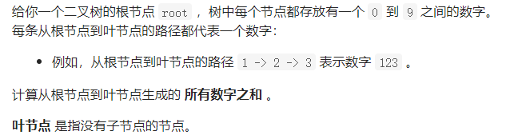

```java
class Solution {
    int ans = 0;
    public int sumNumbers(TreeNode root) {
        dfs(root, 0);
        return ans;
    }

    public void dfs(TreeNode root, int sum) {
        sum = sum * 10 + root.val;
        if (root.left == null && root.right == null) {
            ans += sum;
            return;
        }
        if (root.left != null) dfs(root.left, sum);
        if (root.right != null) dfs(root.right, sum);
    }
}
```

