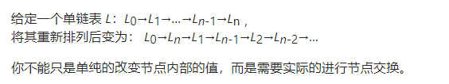
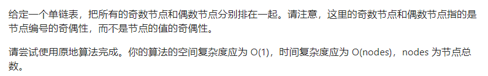

### 定位节点类型


###### 876. 链表的中间节点

- ```java
   // 偶数的话slow走到右半边的第一个
  class Solution {
      public ListNode middleNode(ListNode head) {
          ListNode slow = head;
          ListNode fast = head;
          while (fast != null && fast.next != null) {
              fast = fast.next.next;
              slow = slow.next;
          }
          return slow;
      }
  }
  ```

- ```java
   // 偶数的话slow走到左半边的最后一个
  class Solution {
      public ListNode middleNode(ListNode head) {
          ListNode slow = head;
          ListNode fast = head;
          while (fast.next != null && fast.next.next != null) {
              slow = slow.next;
              fast = fast.next.next;
          }
          return slow;
      }
  }
  ```

- 


### 移动链表类型

###### 61. 旋转链表(右移k位)

- ```java
  // 先连接成环再断开
  class Solution {
      public ListNode rotateRight(ListNode head, int k) {
          if (head == null) return null;
          ListNode tail = head;
          int len = 1;
          while (tail.next != null) {
              len++;
              tail = tail.next;
          }
          k = k % len;
          tail.next = head;
          for (int i = 0; i < len - k; i++) {
              tail = tail.next;
          }
          head = tail.next;
          tail.next = null;
          return head;
      }
  }
  ```

- ```java
  class Solution {
      public ListNode rotateRight(ListNode head, int k) {
          if (head == null) return head;
          ListNode tail = head;
          int len = 1;
          while (tail.next != null) {
              len++;
              tail = tail.next;
          }
          k = k % len;
          ListNode slow = head, fast = head;
          for (int i = 0; i < k; i++) fast = fast.next;
          while (fast.next != null) {
              slow = slow.next;
              fast = fast.next;
          }
          tail.next = head;
          head = slow.next;
          slow.next = null;
          return head;
      }
  }
  ```

- 


###### 143. 重排链表(一前一后)



- ```java
  // 递归
  class Solution {
      public void reorderList(ListNode head) {
          if (head == null || head.next == null) return;
          ListNode p = head;
          // 找到本轮要重排的节点的前一个
          while (p.next.next != null) {
              p = p.next;
          }
          ListNode insertNode = p.next;
          p.next = null;
          insertNode.next = head.next;
          head.next = insertNode;
          reorderList(insertNode.next);
      }
  }
  ```

- ```java
  class Solution {
      public void reorderList(ListNode head) {
          if (head == null || head.next == null) return; 
          ListNode fast = head;
          ListNode slow = head;
          // 偶数取左半边的最后一个
          while (fast.next != null && fast.next.next != null) {
              fast = fast.next.next;
              slow = slow.next;
          }
  
          ListNode second = slow.next;
          slow.next = null;
          second = reverseList(second);
          ListNode firstNext;
          ListNode secondNext;
          while (head != null && second != null) {
              firstNext = head.next;
              secondNext = second.next;
              head.next = second;
              second.next = firstNext;
              head = firstNext;
              second = secondNext;
          }
      }
  
      public ListNode reverseList(ListNode head) {
          if (head == null || head.next == null) return head;
          ListNode p = reverseList(head.next);
          head.next.next = head;
          head.next = null;
          return p;
      }
  }
  ```

- 


###### 328. 奇偶链表



- ```java
  class Solution {
      public ListNode oddEvenList(ListNode head) {
          if (head == null) return head;
          ListNode odd = head;
          ListNode even = head.next;
          ListNode tmp = even;
          while (odd.next != null && even.next != null) {
              odd.next = even.next;
              odd = odd.next;
              even.next = odd.next;
              even = even.next;
          }
          odd.next = tmp;
          return head;
      }
  }
  ```

- 


### 反转链表类型

###### 206.反转链表I

- ```java
  // 递归
  class Solution {
      public ListNode reverseList(ListNode head) {
          if (head == null || head.next == null) return head;
          ListNode next = reverseList(head.next);
          head.next.next = head;
          head.next = null;
          return next;
      }
  }
  ```

- ```java
  // 迭代，修改每个节点的前后指针
  class Solution {
      public ListNode reverseList(ListNode head) {
          ListNode pre = null;
          ListNode curr = head;
          while (curr != null) {
              ListNode next = curr.next;
              curr.next = pre;
              pre = curr;
              curr = next;
          }
          return pre;
      }
  }
  ```

- ```java
  // 迭代，头插法
  class Solution {
      public ListNode reverseList(ListNode head) {
          if (head == null) return head;
          ListNode dummy = new ListNode();
          dummy.next = head;
          ListNode pre = dummy;
          ListNode cur = pre.next;
          ListNode next;
          while (cur.next != null) {
              next = cur.next;
              cur.next = next.next;
              next.next = pre.next;
              pre.next = next;
          }
          return dummy.next;
      }
  }
  ```

- 

###### 92.反转链表II

- ```java
  // 头插法，三指针
  class Solution {
      public ListNode reverseBetween(ListNode head, int left, int right) {
          ListNode dummyHead = new ListNode ();
          dummyHead.next = head;
          ListNode pre = dummyHead;
          for (int i = 0; i < left - 1; i++) pre = pre.next;
          ListNode cur = pre.next;
          ListNode next;
          // cur 指向已经反转过的链表中的最后一个，并且cur.next就是下一个需要反转的节点
          // next 指向cur的下一个节点，即本轮要被反转的节点
          // pre 指向头插位置的前一个节点，永远指向反转过的链表中第一个节点的前一个位置
          for (int i = 0; i < right - left; i++) {
              next = cur.next;
              cur.next = next.next;
              next.next = pre.next;
              pre.next = next;
          }
          return dummyHead.next;
      }
  }
  ```

- 

###### 25.K个一组翻转链表


### 删除节点类型

###### 剑指18.删除链表的节点


###### 83.删除排序链表中的重复元素

- ```java
  // tail 代表当前有效链表的结尾
  // head 代表当前遍历到的节点
  // 每次是把重复元素中的最后一个加入结果
  class Solution {
      public ListNode deleteDuplicates(ListNode head) {
          ListNode dummy = new ListNode();
          ListNode tail = dummy;
          while (head != null) {
              // 进入循环时，确保了 head 不会与上一节点相同
              if (head.next == null || head.val != head.next.val) {
                  tail.next = head;
                  tail = tail.next;
              }
              // 如果 head 与下一节点相同，跳过相同节点
              // 今天的解法和昨天的解法唯一不同就在这句话
              // while (head.next != null && head.val == head.next.val) head = head.next;
              head = head.next;
          }
          tail.next = null;
          return dummy.next;
      }
  }
  ```

- 

###### 82.删除排序链表中的重复元素II

- ```java
  // tail 代表当前有效链表的结尾
  // head 代表当前遍历到的节点
  class Solution {
      public ListNode deleteDuplicates(ListNode head) {
          ListNode dummy = new ListNode();
          ListNode tail = dummy;
          while (head != null) {
              // 进入循环时，确保了 head 不会与上一节点相同
              if (head.next == null || head.val != head.next.val) {
                  tail.next = head;
                  tail = head;
              }
              // 如果 head 与下一节点相同，跳过相同节点
            	// 此时head指向相同节点中的最后一个
              while (head.next != null && head.val == head.next.val) head = head.next;
            	// head跳到下一个节点，该节点不会与上一轮节点的值相同
              head = head.next;
          }
          tail.next = null;
          return dummy.next;
      }
  }
  ```

- 