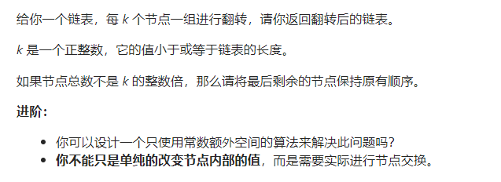

什么情况下考虑添加哨兵？


### 定位节点类型


###### 876. 链表的中间节点

- ```java
   // 偶数的话slow走到右半边的第一个
  class Solution {
      public ListNode middleNode(ListNode head) {
          ListNode slow = head;
          ListNode fast = head;
          while (fast != null && fast.next != null) {
              fast = fast.next.next;
              slow = slow.next;
          }
          return slow;
      }
  }
  ```

- ```java
   // 偶数的话slow走到左半边的最后一个
  class Solution {
      public ListNode middleNode(ListNode head) {
          ListNode slow = head;
          ListNode fast = head;
          while (fast.next != null && fast.next.next != null) {
              slow = slow.next;
              fast = fast.next.next;
          }
          return slow;
      }
  }
  ```


### 判断链表类型

###### 141. 环形链表


```java
public class Solution {
    public boolean hasCycle(ListNode head) {
        ListNode slow = head, fast = head;
        while (fast != null && fast.next != null) {
            slow = slow.next;
            fast = fast.next.next;
            if (slow == fast) return true;
        }
        return false;
    }
}
```


###### 142. 环形链表II


```java
public class Solution {
    public ListNode detectCycle(ListNode head) {
        ListNode slow = head, fast = head;
        if (head == null || head.next == null) return null;
        boolean isCycle = false;
        while (fast != null && fast.next != null) {
            fast = fast.next.next;
            slow = slow.next;
            if (slow == fast) {
                isCycle = true;
                break;
            }
        }
        if (!isCycle) return null;
        fast = head;
        while (slow != fast) {
            slow = slow.next;
            fast = fast.next;
        }
        return slow;
    }
}
```


###### 160. 相交链表


```java
public class Solution {
    public ListNode getIntersectionNode(ListNode headA, ListNode headB) {
        ListNode l1 = headA, l2 = headB;
        while (l1 != l2) {
            l1 = l1 == null ? headB : l1.next;
            l2 = l2 == null ? headA : l2.next;
        }
        return l1;
    }
}
```


###### 234. 回文链表

- 优化：可以在双指针遍历的时候直接把前半段的链表用修改前后指针的方式来反转链表，然后直接开始判断（待补充）

```java
class Solution {
    public boolean isPalindrome(ListNode head) {
        ListNode slow = head, fast = head;
        if (head == null || head.next == null) return true;
        while (fast.next != null && fast.next.next != null) {
            fast = fast.next.next;
            slow = slow.next;
        }
        ListNode second = slow.next;
        slow.next = null;
        second = reverseList(second);
        // 奇数也没关系，前面的判断都是合法的就行
        // [1,2,3]、[1,2]
        while (second != null) {
            if (head.val != second.val) return false;
            head = head.next;
            second = second.next;
        }
        return true;
    }

    public ListNode reverseList(ListNode head) {
        if (head == null || head.next == null) return head;
        ListNode p = reverseList(head.next);
        head.next.next = head;
        head.next = null;
        return p;
    }
}
```


### 重排链表类型

###### 21. 合并两个有序链表

- 正常归并

  ```java
  class Solution {
      public ListNode mergeTwoLists(ListNode l1, ListNode l2) {
          ListNode dummy = new ListNode();
          ListNode tail = dummy;
          while (l1 != null && l2 != null) {
              if (l1.val <= l2.val) {
                  tail.next = l1;
                  l1 = l1.next;
              } else {
                  tail.next = l2;
                  l2 = l2.next;
              }
              tail = tail.next;
          }
          tail.next = l1 != null ? l1 : l2;
          return dummy.next;
      }
  }
  ```

- 递归

  ```java
  class Solution {
      public ListNode mergeTwoLists(ListNode l1, ListNode l2) {
          if (l1 == null) return l2;
          if (l2 == null) return l1;
          if (l1.val <= l2.val) {
              l1.next = mergeTwoLists(l1.next, l2);
              return l1;
          } else {
              l2.next = mergeTwoLists(l1, l2.next);
              return l2;
          }
      }
  }
  ```

###### 23. 合并K个升序链表


- 时间复杂度都是`O(nklogk)`，`n`代表每个链表可能的最大长度

  > 归并的时间复杂度计算：链表数组长度为k，归并一列的时间复杂度为`O(klogk)`，单个链表的长度最大为`n`，因此再乘以个`n`就行

- 堆排

  ```java
  class Solution {
      public ListNode mergeKLists(ListNode[] lists) {
          PriorityQueue<ListNode> heap = new PriorityQueue<>((a,b) -> {return a.val - b.val;});
          for (ListNode node : lists) {
              if (node != null) heap.offer(node);
          }
          ListNode dummy = new ListNode();
          ListNode tail = dummy;
          while (!heap.isEmpty()) {
              ListNode top = heap.poll();
              tail.next = top;
              tail = tail.next;
              if (top.next != null) heap.offer(top.next);
          }
          tail.next = null;
          return dummy.next;
      }
  }
  ```

- 归并

  - 在链表数组里同样使用分治思想，不断将链表数组分为两半，类似2路归并

  ```java
  class Solution {
      public ListNode mergeKLists(ListNode[] lists) {
          if (lists == null || lists.length == 0) return null;
          return merge(lists, 0, lists.length - 1);
      }
  
      public ListNode merge(ListNode[] lists, int l, int r) {
          if (l >= r) return lists[l];
          int mid = l + r >> 1;
          ListNode first = merge(lists, l, mid);
          ListNode second = merge(lists, mid + 1, r);
          return mergeTwoLists(first, second);
      }
  
      public ListNode mergeTwoLists(ListNode first, ListNode second) {
          ListNode dummy = new ListNode();
          ListNode tail = dummy;
          while (first != null && second != null) {
              if (first.val < second.val) {
                  tail.next = first;
                  first = first.next;
              } else {
                  tail.next = second;
                  second = second.next;
              }
              tail = tail.next;
          }
          tail.next = first != null ? first : second;
          return dummy.next;
      }
  }
  ```


###### 24. 两两交换链表中的节点

- 递归

  ```java
  class Solution {
      public ListNode swapPairs(ListNode head) {
          if (head == null || head.next == null) return head;
          ListNode next = head.next;
          head.next = swapPairs(next.next);
          next.next = head;
          return next;
      }
  }
  ```

- 迭代

  ```java
  class Solution {
      public ListNode swapPairs(ListNode head) {
          ListNode dummy = new ListNode(-1, head);
          ListNode curr = dummy;
          while (curr.next != null && curr.next.next != null) {
              ListNode first = curr.next;
              ListNode second = first.next;
              first.next = second.next;
              curr.next = second;
              second.next = first;
              curr = first;
          }
          return dummy.next;
      }
  }
  ```


###### 61. 旋转链表(右移k位)

- 最后必须先连接成环

- ```java
  // 先连接成环再断开
  class Solution {
      public ListNode rotateRight(ListNode head, int k) {
          if (head == null) return null;
          ListNode tail = head;
          int len = 1;
          while (tail.next != null) {
              len++;
              tail = tail.next;
          }
          k = k % len;
          tail.next = head;
          for (int i = 0; i < len - k; i++) {
              tail = tail.next;
          }
          head = tail.next;
          tail.next = null;
          return head;
      }
  }
  ```

- ```java
  class Solution {
      public ListNode rotateRight(ListNode head, int k) {
          if (head == null) return head;
          ListNode tail = head;
          int len = 1;
          while (tail.next != null) {
              len++;
              tail = tail.next;
          }
          k = k % len;
          ListNode slow = head, fast = head;
          for (int i = 0; i < k; i++) fast = fast.next;
          while (fast.next != null) {
              slow = slow.next;
              fast = fast.next;
          }
          // 必须先连接成环
          tail.next = head;
          head = slow.next;
          slow.next = null;
          return head;
      }
  }
  ```
  


###### 86. 分隔链表（以值分界）


```java
class Solution {
    public ListNode partition(ListNode head, int x) {
        ListNode first = new ListNode(), ret = first;
        ListNode second = new ListNode(), tmp = second;
        while (head != null) {
            if (head.val < x) {
                first.next = head;
                first = first.next;
            } else {
                second.next = head;
                second = second.next;
            }
            head = head.next;
        }
        first.next = tmp.next;
        second.next = null;
        return ret.next;
    }
}
```


###### 109. 有序链表转换二叉搜索树


- 双指针找中点，递归建树

  - 递归函数左闭右开

  ```java
  class Solution {
      public TreeNode sortedListToBST(ListNode head) {
          if (head == null) {
              return null;
          }
          return helper(head, null);
      }
      public TreeNode helper(ListNode head, ListNode tail){
          if (head == tail) return null;
          ListNode slow = head, fast = head;
          // 注意下面双指针找中点，右边界不是null，是tail
          while (fast != tail && fast.next != tail) {
              fast = fast.next.next;
              slow = slow.next;
          }
          TreeNode root = new TreeNode(slow.val);
          root.left = helper(head, slow);
          root.right = helper(slow.next, tail);
          return root;
      }
  }
  ```

- 按中序遍历的顺序优化

  - 用一个`globalHead`节点记录全局中序遍历已经到达的节点位置

  ```java
  class Solution {
      ListNode globalHead;
      public TreeNode sortedListToBST(ListNode head) {
          globalHead = head;
          int len = 0;
          while (head != null) {
              len ++;
              head = head.next;
          }
          return buildTree(0, len - 1);
      }
  
      public TreeNode buildTree(int left, int right) {
          // 下面的递归退出条件不能忘
          if (left > right) return null;
          int mid = left + right >> 1;
          TreeNode root = new TreeNode();
          root.left = buildTree(left, mid - 1);
          root.val = globalHead.val;
          globalHead = globalHead.next;
          root.right = buildTree(mid + 1, right);
          return root;
      }
  }
  ```


###### 143. 重排链表（一首一尾）


- 递归

  ```java
  // 递归
  class Solution {
      public void reorderList(ListNode head) {
          if (head == null || head.next == null) return;
          ListNode p = head;
          // 找到本轮要重排的节点的前一个
          while (p.next.next != null) {
              p = p.next;
          }
          ListNode insertNode = p.next;
          p.next = null;
          insertNode.next = head.next;
          head.next = insertNode;
          reorderList(insertNode.next);
      }
  }
  // 二刷递归，这个函数返回值为void还有点麻烦
  class Solution {
      public void reorderList(ListNode head) {
          if (head == null || head.next == null) return;
          ListNode node = head;
          while (node.next.next != null) node = node.next;
          ListNode curr = node.next;
          node.next = null;
          curr.next = head.next;
          reorderList(head.next);
          head.next = curr;
      }
  }
  ```

- 找中点，反转右半部分再合并

  - 注意这里的合并不是有序链表合并那一套

  ```java
  class Solution {
      public void reorderList(ListNode head) {
          if (head == null || head.next == null) return; 
          ListNode fast = head;
          ListNode slow = head;
          // 偶数取左半边的最后一个
          while (fast.next != null && fast.next.next != null) {
              fast = fast.next.next;
              slow = slow.next;
          }
  
          ListNode second = slow.next;
          slow.next = null;
          second = reverseList(second);
          ListNode firstNext;
          ListNode secondNext;
          while (head != null && second != null) {
              firstNext = head.next;
              secondNext = second.next;
              head.next = second;
              second.next = firstNext;
              head = firstNext;
              second = secondNext;
          }
      }
  
      public ListNode reverseList(ListNode head) {
          if (head == null || head.next == null) return head;
          ListNode p = reverseList(head.next);
          head.next.next = head;
          head.next = null;
          return p;
      }
  }
  ```

  ```java
  // n刷
  class Solution {
      public void reorderList(ListNode head) {
          if (head == null || head.next == null) return;
          ListNode slow = head, fast = head;
          while (fast.next != null && fast.next.next != null) {
              fast = fast.next.next;
              slow = slow.next;
          }
          ListNode second = slow.next;
          slow.next = null;
          second = reverseList(second);
          mergeTwoList(head, second);
      }
  
      public ListNode reverseList(ListNode head) {
          if (head == null || head.next == null) return head;
          ListNode p = reverseList(head.next);
          head.next.next = head;
          head.next = null;
          return p;
      }
  
      // 这里的写法注意一下，两个Next节点最好是在循环里每次赋值，然后移动first和second的位置
      public void mergeTwoList(ListNode first, ListNode second) {
          ListNode firstNext, secondNext;
          while (first != null && second != null) {
              firstNext = first.next;
              secondNext = second.next;
              first.next = second;
              second.next = firstNext;
              first = firstNext;
              second = secondNext;
          }
      }
  }
  ```


###### 147. 对链表进行插入排序

- 常规插入排序

  ```java
  class Solution {
      public ListNode insertionSortList(ListNode head) {
          ListNode dummy = new ListNode(-1, head);
          if (head.next == null) return head;
          ListNode curr = head.next;
          head.next = null;
          while (curr != null) {
              ListNode next = curr.next;
              ListNode prev = dummy;
              // 要插入的位置为已排序部分的最后一个节点后面
              // 判断节点.next的值的时候一定要先判断该next节点存在不存在
              while (prev.next != null && prev.next.val <= curr.val) prev = prev.next;
              curr.next = prev.next;
              prev.next = curr;
              curr = next;
          }
          return dummy.next;
      }
  }
  ```

- 加上一点小优化

  - 如果当前节点的值≥`tail`节点的值，就无需再从链表头开始遍历了，直接接在尾部

  ```java
  class Solution {
      public ListNode insertionSortList(ListNode head) {
          ListNode dummy = new ListNode(-1, head);
          if (head.next == null) return head;
          ListNode curr = head.next, tail = head;
          tail.next = null;
          while (curr != null) {
              ListNode next = curr.next;
              // 下面这个if就是主要的优化
              if (curr.val >= tail.val) {
                  tail.next = curr;
                  tail = tail.next;
                  // 这个置null不能忘
                  tail.next = null;
                  curr = next;
                  continue;
              }
              ListNode prev = dummy;
              while (prev.next != null && prev.next.val <= curr.val) prev = prev.next;
              if (prev.next == null) tail = curr;
              curr.next = prev.next;
              prev.next = curr;
              curr = next;
          }
          return dummy.next;
      }
  }
  ```

  

###### 148. 排序链表


- 普通的归并排序

  - 找中间节点的前一个，可以直接考虑2个节点的情况，可以很方便判断出`fast.next != null && fast.next.next != null`的条件
  - 注意`sortList`函数应该返回排好序后的头结点，然后再`merge`这两个排好序的链表，不是直接`merge(head, tmp)`
  - `merge`函数里面两点注意
    - `tail`不要忘了移动
    - 下面接上剩余的链表时，用`if`就可以了，不像数组归并里是用`while`再循环加入

  ```java
  class Solution {
      public ListNode sortList(ListNode head) {
          if (head == null || head.next == null) return head;
          ListNode slow = head;
          ListNode fast = head;
          while (fast.next != null && fast.next.next != null) {
              fast = fast.next.next;
              slow = slow.next;
          }
          ListNode tmp = slow.next;
          slow.next = null;
          ListNode first = sortList(head);
          ListNode second = sortList(tmp);
          return merge(first, second);
      }
  
      public ListNode merge(ListNode first, ListNode second) {
          ListNode dummy = new ListNode();
          ListNode tail = dummy;
          while (first != null && second != null) {
              if (first.val <= second.val) {
                  tail.next = first;
                  first = first.next;
              } else {
                  tail.next = second;
                  second = second.next;
              }
              tail = tail.next;
          }
          // 简写 tail.next = first != null ? first : second;
          if (first != null) tail.next = first;
          if (second != null) tail.next = second;
          return dummy.next;
      }
  }
  ```

- `bottom-up`归并排序

  - 链表的迭代归并比较麻烦
  - 大概思路是根据本轮归并的长度，按顺序在链表中划分出两个符合长度（或者个数不够了）的链表，将它们合并，将合并之后的链表再前后串连

  ```java
  class Solution {
      public ListNode sortList(ListNode head) {
          if (head == null || head.next == null) return head;
          int length = 0;
          ListNode node = head;
          while (node != null) {
              length ++;
              node = node.next;
          }
          ListNode dummy = new ListNode(-1, head);
          for (int len = 1; len < length; len = len * 2) {
              ListNode prev = dummy, curr = dummy.next;
              // 每次合并两个链表
              while (curr != null) {
                  // 第一个链表的头结点
                  ListNode head1 = curr;
                  // 循环 len - 1 次
                  for (int i = 1; i < len && curr.next != null; ++ i) {
                      curr = curr.next;
                  }
                  // 第二个链表的头结点
                  ListNode head2 = curr.next;
                  // 将第一个链表尾部置null
                  curr.next = null;
                  curr = head2;
                  // 多一个条件,curr可能为null
                  for (int i = 1; i < len && curr != null && curr.next != null; ++ i) {
                      curr = curr.next;
                  }
                  // next指向可能存在的下一对要合并的链表的头结点
                  ListNode next = null;
                  if (curr != null) {
                      next = curr.next;
                      // 将第二个链表尾部置null
                      curr.next = null;
                  }
                  ListNode merged = merge(head1,head2);
                  // prev 记录上一轮两个链表合并之后的尾部
                  prev.next = merged;
                  // 这里应该只能用这个方法遍历得到尾部，因为不知道前面最后一次合并的时候是两个链表都有，还是只有一个
                  // 或者第二个不满足len个
                  while (prev.next != null) prev = prev.next;
                  curr = next;
              }
          }
          return dummy.next;
      }
  
      public ListNode merge(ListNode first, ListNode second) {
          ListNode dummy = new ListNode();
          ListNode tail = dummy;
          while (first != null && second != null) {
              if (first.val <= second.val) {
                  tail.next = first;
                  first = first.next;
              } else {
                  tail.next = second;
                  second = second.next;
              }
              tail = tail.next;
          }
          tail.next = first != null ? first : second;
          return dummy.next;
      }
  }
  ```

- 快排版本

  - `quickSort(start, end)`快速排序`[start,end)`部分的节点
  - 维护两个指针，一个在左边头插，一个在右边尾插
  - 本来的节点是`[start,end)`，后来以`start`的值作为分界，划分成了三部分`[head,start)`、`start本身`和`[start + 1, end)`
  - 这里左闭右开和109. 的思路一致

  ```java
  class Solution {
      public ListNode sortList(ListNode head) {
          return quickSort(head, null);
      }
  
      // quickSort函数排的范围是[start, end)
      public ListNode quickSort(ListNode start, ListNode end) {
          if (start == end || start.next == end) return start;
          // curr 要从start.next开始遍历
          ListNode head = start, tail = start, curr = start.next;
          while (curr != end) {
              ListNode next = curr.next;
              if (curr.val < start.val) {
                  curr.next = head;
                  head = curr;
              } else {
                  tail.next = curr;
                  tail = curr;
              }
              curr = next;
          }
          // 这一步不能忘
          tail.next = end;
          // 以start的值为划分，start之前的都是小于它的，start之后的都是大于它的
          // [head..start)
          // [start + 1,end)
          ListNode ret = quickSort(head, start);
          start.next = quickSort(start.next, end);
          return ret;
      }
  }
  ```

- 堆排序

  - 很简单的思路，就是将节点全部丢入优先队列（小根堆）中，然后依次取出堆顶即可

  ```java
  class Solution {
      public ListNode sortList(ListNode head) {
          PriorityQueue<ListNode> heap = new PriorityQueue<>((a,b) -> (a.val - b.val));
          while (head != null) {
              heap.offer(head);
              head = head.next;
          }
          ListNode dummy = new ListNode();
          ListNode tail = dummy;
          while (!heap.isEmpty()) {
              ListNode top = heap.poll();
              tail.next = top;
              tail = tail.next;
          }
          tail.next = null;
          return dummy.next;
      }
  }
  ```


###### 328. 奇偶链表


- 和86那样分别维护两个链表不同，这里是在同一个链表里维护两个链表序列

- ```java
  class Solution {
      public ListNode oddEvenList(ListNode head) {
          if (head == null) return head;
          ListNode odd = head;
          ListNode even = head.next;
          ListNode tmp = even;
          while (odd.next != null && even.next != null) {
              odd.next = even.next;
              odd = odd.next;
              even.next = odd.next;
              even = even.next;
          }
          odd.next = tmp;
          return head;
      }
  }
  ```

- 二刷

  ```java
  class Solution {
      public ListNode oddEvenList(ListNode head) {
          if (head == null || head.next == null) return head;
          ListNode odd = head, even = odd.next;
          ListNode tmp = even;
          while (odd.next != null && even.next != null) {
              odd.next = even.next;
              odd = odd.next;
              even.next = odd.next;
              even = even.next;
          }
          odd.next = tmp;
          return head;
      }
  }
  ```

  


### 反转链表类型

###### 206. 反转链表I

- ```java
  // 递归
  class Solution {
      public ListNode reverseList(ListNode head) {
          if (head == null || head.next == null) return head;
          ListNode next = reverseList(head.next);
          head.next.next = head;
          head.next = null;
          return next;
      }
  }
  ```

- ```java
  // 迭代，修改每个节点的前后指针
  // 此方法一般适用于反转整个链表，因为无法记录反转区间的上一个节点
  // 在25. 方法二中可以设一个头结点，然后将函数定义为反转head之后的k个节点，也可以实现部分反转
  class Solution {
      public ListNode reverseList(ListNode head) {
          ListNode pre = null;
          ListNode curr = head;
          while (curr != null) {
              ListNode next = curr.next;
              curr.next = pre;
              pre = curr;
              curr = next;
          }
          return pre;
      }
  }
  ```
  
- ```java
  // 迭代，头插法
  class Solution {
      public ListNode reverseList(ListNode head) {
          if (head == null) return head;
          ListNode dummy = new ListNode();
          dummy.next = head;
          ListNode pre = dummy;
          ListNode cur = pre.next;
          ListNode next;
          while (cur.next != null) {
              next = cur.next;
              cur.next = next.next;
              next.next = pre.next;
              pre.next = next;
          }
          return dummy.next;
      }
  }
  ```

- 

###### 92. 反转链表II(区间反转)

- ```java
  // 头插法，三指针
  class Solution {
      public ListNode reverseBetween(ListNode head, int left, int right) {
          ListNode dummyHead = new ListNode ();
          dummyHead.next = head;
          ListNode pre = dummyHead;
          for (int i = 0; i < left - 1; i++) pre = pre.next;
          ListNode cur = pre.next;
          ListNode next;
          // cur 指向已经反转过的链表中的最后一个，并且cur.next就是下一个需要反转的节点
          // next 指向cur的下一个节点，即本轮要被反转的节点
          // pre 指向头插位置的前一个节点，永远指向反转过的链表中第一个节点的前一个位置
          for (int i = 0; i < right - left; i++) {
              next = cur.next;
              cur.next = next.next;
              next.next = pre.next;
              pre.next = next;
          }
          return dummyHead.next;
      }
  }
  ```

- 修改一下变量名，更清晰准确一点

  ```java
  class Solution {
      public ListNode reverseBetween(ListNode head, int left, int right) {
          ListNode dummyHead = new ListNode (-1, head);
          ListNode prev = dummyHead;
          for (int i = 0; i < left - 1; i++) prev = prev.next;
          ListNode tail = prev.next;
  
          for (int i = 0; i < right - left; i++) {
              ListNode curr = tail.next;
              tail.next = curr.next;
              curr.next = prev.next;
              prev.next = curr;
          }
          return dummyHead.next;
      }
  }
  ```

  

###### 25. K个一组翻转链表



- 迭代方法

  - 方法一：先计算出链表的长度，然后将长度`k`个一组分组，再用`for`循环遍历

    - 翻转采用头插法

    - `prev`指向上一组K个节点的最后位置
    - `tail`指向本组K个节点中已经翻转过的最后位置
    - `next` 指向本次需要翻转的节点（这个变量名最好改成`curr`）

    ```java
    class Solution {
        public ListNode reverseKGroup(ListNode head, int k) {
            ListNode dummy = new ListNode(-1), prev = dummy, tail = head, next;
            int len = 0;
            dummy.next = head;
            while (head != null) {
                len ++;
                head = head.next;
            }
            head = dummy.next;
            for (int i = 0; i < len / k; ++ i) {
                // 头插法，第一个节点不用翻转，循环k - 1次
                for (int j = 0; j < k - 1; ++ j) {
                    next = tail.next;
                    tail.next = next.next;
                    next.next = prev.next;
                    prev.next = next;
                }
                // tail指向本轮K个节点翻转后的最后位置，即下一轮的prev
                // 将tail重新指向下一轮的第一个节点
                prev = tail;
                tail = tail.next;
            }
            return dummy.next;
        }
    }
    ```

  - 方法二：单独写一个函数来反转K个节点

    - 函数定义为反转参数`root`之后的k个节点，并且返回k个节点反转之后的尾节点作为下一次调用的参数
    - 反转采用修改节点的前后指针方法

    ```java
    class Solution {
        public ListNode reverseKGroup(ListNode head, int k) {
            ListNode dummy = new ListNode(-1);
            dummy.next = head;
            ListNode cur = dummy;
            while (cur != null) {
                cur = reverse(cur, k);
            }
            return dummy.next;
        }
        // reverse 的作用是将 root 后面的 k 个节点进行翻转
        public ListNode reverse(ListNode root, int k) {
            // 检查 root 后面是否有 k 个节点
            int u = k;
            ListNode cur = root;
            while (u-- > 0 && cur != null) cur = cur.next;
            if (cur == null) return null;
    
            // 进行翻转
            ListNode tail = cur.next;
            ListNode a = root.next, b = a.next;
            // 当需要翻转 k 个节点时，中间就有 k - 1 个 next 指针需要翻转
            while (k-- > 1) {
                ListNode c = b.next;
                b.next = a;
                a = b;
                b = c;
            }
            root.next.next = tail;
            // root.next此时为k个节点反转后的最后一个，即为下一轮调用函数的参数，因此返回其值
            ListNode ret = root.next;
            root.next = a;
            return ret;
        }
    }
    ```

- 递归方法

  - 只有忽略递归带来的空间开销才是`O(1)`

  - 直接利用原来的函数签名来进行递归
  - **无需**哨兵
  - 反转采用修改节点的前后指针方法

  ```java
  class Solution {
      public ListNode reverseKGroup(ListNode head, int k) {
          int u = k;
          ListNode p = head;
          // p 执行 k - 1 次向后移动的操作，如果中途变为null，则不满k个
          while (p != null && u -- > 1) p = p.next;
          if (p == null) return head;
  
          // 经典修改前后指针反转链表，需要循环 k - 1 次，循环之后，prev指向本组反转后的头，curr指向下一组待反转的头
          // 先用一个tail记录下本组反转后的尾
          ListNode tail = head, prev = head, curr = head.next;
          u = k;
          while (u -- > 1) {
              ListNode next = curr.next;
              curr.next = prev;
              prev = curr;
              curr = next;
          }
          tail.next = reverseKGroup(curr, k);
          return prev;
      }
  }
  ```

  


### 删除节点类型

###### 203. 移除链表元素（按值删除）

```java
class Solution {
    public ListNode removeElements(ListNode head, int val) {
        ListNode dummy = new ListNode(-1, head);
        ListNode tail = dummy;
        while (head != null) {
            if (head.val != val) {
                tail.next = head;
                tail = tail.next;
            }
            head = head.next;
        }
        tail.next = null;
        return dummy.next;
    }
}
```


###### 237. 删除链表中的节点（传节点删除）

- 传入的参数节点不会是末尾节点

- 将后一个节点的值复制到传入的参数节点中，再删除后一个节点即可

  ```java
  class Solution {
      public void deleteNode(ListNode node) {
          ListNode next = node.next;
          node.val = next.val;
          node.next = next.next;
      }
  }
  ```


###### 19. 删除链表的倒数第N个节点

- 双指针

  ```java
  class Solution {
      public ListNode removeNthFromEnd(ListNode head, int n) {
          ListNode dummy = new ListNode(-1, head);
          ListNode fast = dummy;
          ListNode slow = dummy;
          while (n -- > 0) fast = fast.next;
          while (fast.next != null) {
              fast = fast.next;
              slow = slow.next;
          }
          slow.next = slow.next.next;
          return dummy.next;
      }
  }
  ```

- 递归

  ```java
  // 保存一个全局变量的值，在递归栈退出的时候，每次加1
  class Solution {
      int cnt = 0;
      public ListNode removeNthFromEnd(ListNode head, int n) {
          if (head == null) return head;
          head.next = removeNthFromEnd(head.next, n);
          cnt ++;
          if (cnt == n) return head.next;
          return head;
      }
  }
  ```


###### 83.删除排序链表中的重复元素（留一个）


- ```java
  // tail 代表当前有效链表的结尾
  // head 代表当前遍历到的节点
  // 每次是把重复元素中的最后一个加入结果
  class Solution {
      public ListNode deleteDuplicates(ListNode head) {
          ListNode dummy = new ListNode();
          ListNode tail = dummy;
          while (head != null) {
              // 进入循环时，确保了 head 不会与上一节点相同
              if (head.next == null || head.val != head.next.val) {
                  tail.next = head;
                  tail = tail.next;
              }
              // 如果 head 与下一节点相同，跳过相同节点
              // 今天的解法和昨天的解法唯一不同就在这句话
              // while (head.next != null && head.val == head.next.val) head = head.next;
              head = head.next;
          }
          tail.next = null;
          return dummy.next;
      }
  }
  ```

- ```java
  // 略有不同
  class Solution {
      public ListNode deleteDuplicates(ListNode head) {
          ListNode dummy = new ListNode(-1, head);
          ListNode tail = dummy;
          while (head != null) {
              if (head.next == null || head.next.val != head.val) {
                  tail.next = head;
                  tail = tail.next;
              }
              head = head.next;
          }
          return dummy.next;
      }
  }
  ```


###### 82.删除排序链表中的重复元素II（一个不留）


- ```java
  // tail 代表当前有效链表的结尾
  // head 代表当前遍历到的节点
  class Solution {
      public ListNode deleteDuplicates(ListNode head) {
          ListNode dummy = new ListNode();
          ListNode tail = dummy;
          while (head != null) {
              // 进入循环时，确保了 head 不会与上一节点相同
              if (head.next == null || head.val != head.next.val) {
                  tail.next = head;
                  tail = head;
              }
              // 如果 head 与下一节点相同，跳过相同节点
            	// 此时head指向相同节点中的最后一个
              while (head.next != null && head.val == head.next.val) head = head.next;
            	// head跳到下一个节点，该节点不会与上一轮节点的值相同
              head = head.next;
          }
          tail.next = null;
          return dummy.next;
      }
  }
  ```

- ```java
  class Solution {
      public ListNode deleteDuplicates(ListNode head) {
          ListNode dummy = new ListNode(-1, head);
          ListNode tail = dummy;
          while (head != null) {
              if (head.next == null || head.next.val != head.val) {
                  tail.next = head;
                  tail = tail.next;
              }
              while (head.next != null && head.next.val == head.val) head = head.next;
              head = head.next;
          }
          // 这里下面这句就不能省略了，反例[1,1]
          tail.next = null;
          return dummy.next;
      }
  }
  ```


